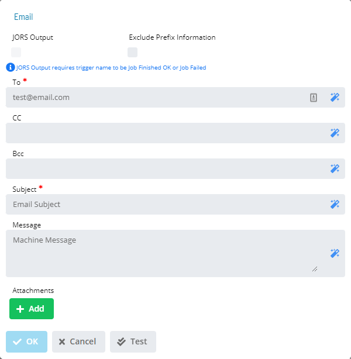

# Email (SMTP) dialog

The **Email** dialog provides the following fields for defining an SMTP
email notification:

- **To** (Required): Defines the SMTP email address(es) separated by a
    semi-colon (;). The maximum for this field is 3,000 characters.
- **Cc** (Optional): Defines additional SMTP email address(es)
    separated by a semi-colon (;) for sending carbon copies. Separate
    email address(es) with a semi-colon (;). The maximum for this field
    is 3,000 characters.
- **Bcc** (Optional): Defines additional SMTP email address(es) for
    sending blind carbon copies. Separate email address(es) with a
    semi-colon (;). The maximum for this field is 3,000 characters.
- **Subject** (Optional): Defines the message's subject.
- **JORS Output**: Select this checkbox to include JORS output files
    as attachments to the email for job triggers.
- **Exclude Prefix Information**: Select this checkbox to exclude the
    prefix information from the email message (e.g., Schedule Date,
    Machine Name, Schedule Name, Job Name \[and Internal Job Number\],
    trigger type, and triggering status change event).
- **Message**: Defines a user-defined message.
- **Attachments**: Contains the attachments to be included with the
    message. Wild cards are not allowed for filenames.
