# Updating SAP R3 Job Details

In **Admin** mode, SAP BW job type properties can be updated or defined.

For conceptual information, refer to [SAP R3 Job Details](../../../job-types/sap.md) in the **Concepts** online help.
:::note
Only those with the appropriate permissions will have access to the **Lock** button and can update job properties. For details about privileges, refer to [Required Privileges](Accessing-Daily-Job-Definition.md#Required) in the **Accessing Daily Job Definition** topic.
:::

:::note
If you do not have the Machine Privilege, then you will not be able to edit the daily job definition.
:::

:::note
Changes made to the job properties in the **Daily Job Definition** will take place immediately. If the job has already run, the changes will take effect the next time the job runs.
:::

:::note
All required fields are designated by a **red asterisk**.
:::

:::note
  
A loading animation will appear when waiting for results from SAP Business Warehouse system.
:::

## Updating SAP R3 Job Task Details

To perform this procedure:
Click on the **Processes** button at the top-right of the **Operations Summary** page. The **Processes** page will display.
Ensure that both the **Date** and **Schedule** toggle switches are enabled so that you can make your date and schedule selection, respectively. Each switch will appear green when enabled.

Select the desired **date(s)** to display the associated schedule(s).
Select one or more **schedule(s)** in the list.
Select one **job** in the list. A record of your selection will display in the [status bar](SM-UI-Layout.md#Status) at the bottom of the page in the form of a breadcrumb trail.

Click on the job record (e.g., 1 job(s)) in the status bar to display the **Selection** panel.

:::note
As an alternative, you can right-click on the job selected in the list to display the **Selection** panel.
:::

.png> "Job Summary Tab in Operations")  
Click the **Daily Job Definition** button  at the top-left corner of the panel to access the **Daily Job Definition** page. By default, this page will be in **Read-only** mode.
Click the **Lock** button  at the top-right corner to place the page in **Admin** mode. The button will switch to display a white lock unlocked on a green background  when enabled.

:::note
The **Lock** button will not be visible to users who do not have the appropriate permissions.
:::
Expand the **Task Details** panel to expose its content.
Select from the **Machines or Machine Group** drop-down list the **machine** where the LSAM is installed. If you wish instead to specify a machine group, then toggle the **Machines** switch to _Machine Group_ then select the **machine group** from the drop-down list. When toggled to Machine Group, the button will appear green .

**In the SAP R3 Definition frame:**

- **Job Name**: Defines the name of the job as defined in the SAP R/3 and SAP CRM system.
- **Job Number**: Defines the SAP R/3 and SAP CRM Job number (Job ID) as defined in the SAP system.
- **Start SAP Job**: Configures SAP start criteria for the job.
  - **A.S.A.P.**: Configures the job to start as soon as a
    background process is available.
  - **Immediately**: Configures the job to start as soon as it
    qualifies to run in OpCon. The job
    does not wait for an available SAP background process before
    running. If all background processes are in use, an immediately
    started job fails.
- **Exec. Target**: Defines the name of the SAP Application Server on
  which the job processes.

### Select SAP Job

Click on the search button next to **Job Name** to open the SAP Query dialog.  
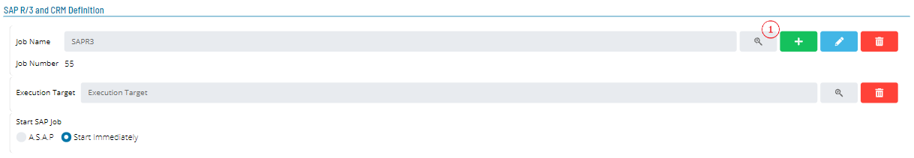

#### In the SAP Query dialog:

- **Machine**: Defines the SAP R3 LSAM Machine name.
- **Language**: Defines the two-character language abbreviation (e.g., enter EN for English).
- **Job Name**: Defines text matching the name of the desired job name in the SAP Business Warehouse system. If unsure of the whole job name, use wildcards (\*) to expand the search.
- **User ID**: Defines Username for SAP Credentials.
- **Password**: Defines Password for SAP Credentials.

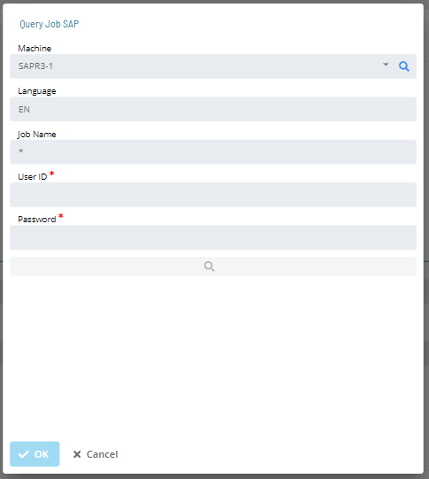

Enter SAP Credentials and click on the search button to initiate a request to the SAP R3 system to retrieve all job names matching the search criteria.  

Select a job from the list and click **OK** to assign it to the daily job.

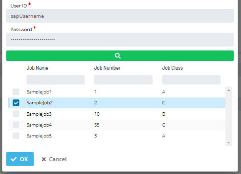

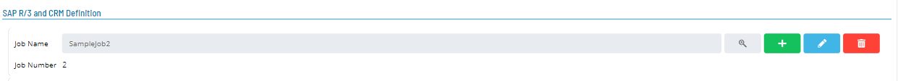

### Create SAP Job

Click on the Add button next to **Job Name** to open the Create SAP Job Dialog.

#### In the Create SAP Job dialog:

- **Job Name**: Defines the name of the job being created.
- **Job Class**: Defines the class of SAP Job A, B, or C.
- **Spool Recipient**: Defines the spool recipient for the SAP job.
- **Credentials Button**: Open SAP Login Dialog to define SAP Credential.  
  :::note
  Credentials need to be entered before creating SAP Job.  
  Credentials will be used for all SAP queries.
  :::
- **List of Steps**: Enter Credentials to add, edit, and delete steps to SAP job.  
  Steps could be **Abap Program**, **External Command**, and **External Program**.
- **Step Details**: Defines the details for the selected Job Step.  
  Enter Credentials and select item from **List of Steps** to define details.

#### Enter Credentials

Click on the Credentials button under **Credentials Definition** to open the SAP Login Dialog.
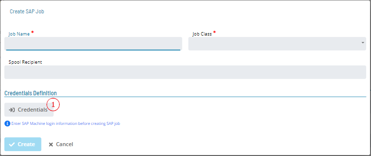

#### In the SAP Login dialog:

- **Machine**: Defines the SAP R3 LSAM Machine name.
- **User ID**: Defines Username for SAP Credentials.
- **Password**: Defines Password for SAP Credentials.
- **Language**: Defines the two-character language abbreviation (e.g., enter EN for English).

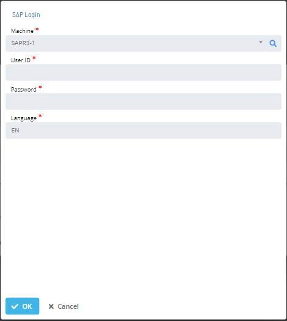  
**Create SAP Job Dialog** after entering credentials.
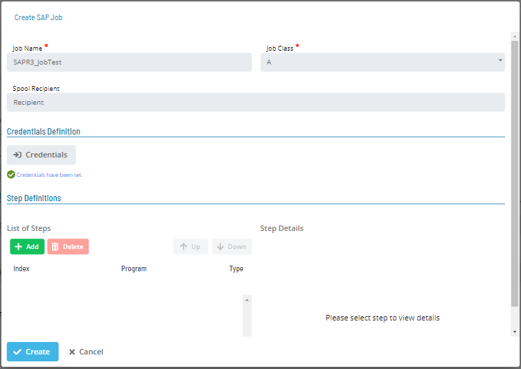

### Edit SAP Job

Open Edit SAP Job dialog by clicking on the edit button.
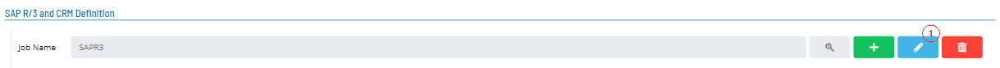
Open credentials dialog to enter credentials.
:::note
Required to enable **Query Button**
:::  
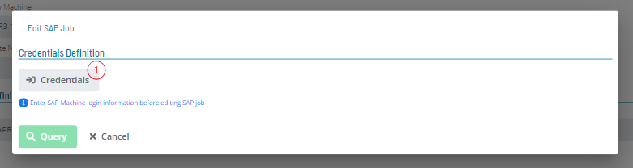

#### In the SAP Login dialog:

- **Machine**: Defines the SAP R3 LSAM Machine name.
- **User ID**: Defines Username for SAP Credentials.
- **Password**: Defines Password for SAP Credentials.
- **Language**: Defines the two-character language abbreviation (e.g., enter EN for English).

Click on query button after entering credentials to send request to SAP Business Warehouse system to search for job.  
  
Wait for results from SAP Business Warehouse system, your job details should show up in the edit job dialog.
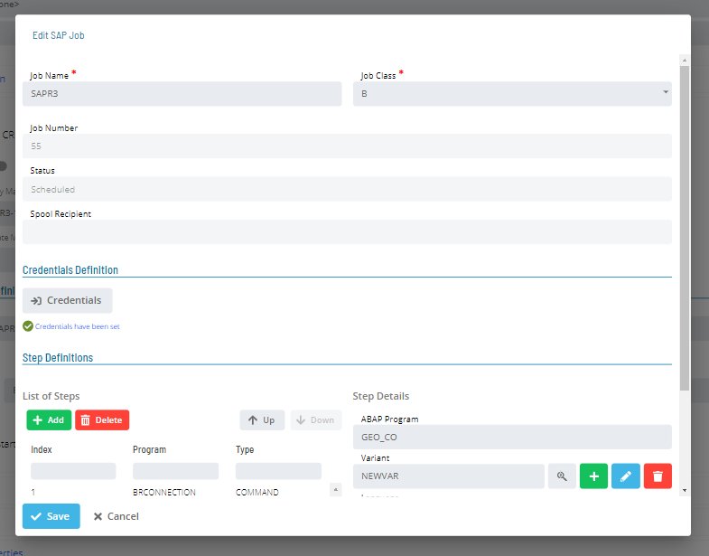  
Make any changes and click **Save** to continue.

### Delete SAP Job

Open Delete SAP Job dialog by clicking on the delete button.
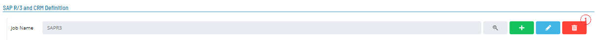

- **Machine**: Defines the SAP R3 LSAM Machine name.
- **Language**: Defines the two-character language abbreviation (e.g., enter EN for English).
- **User ID**: Defines Username for SAP Credentials.
- **Password**: Defines Password for SAP Credentials.
  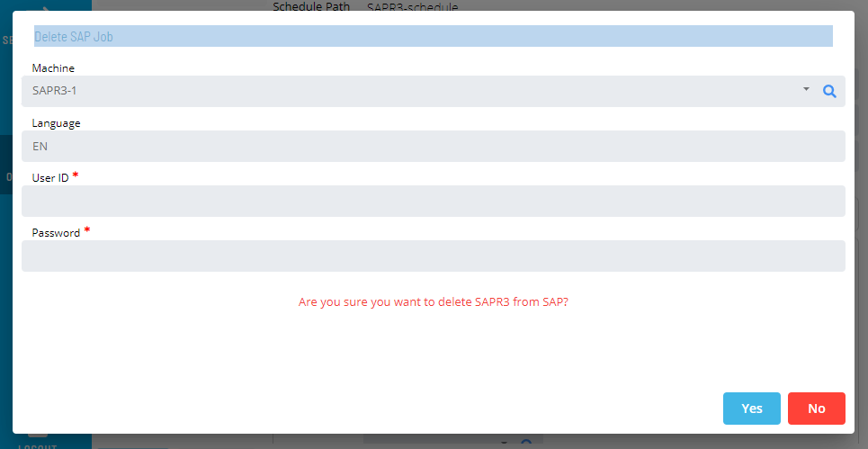
  Enter Credentials and click **Yes** button to delete job.

### Add Steps to SAP Job

Click on the Add button under **List of Steps** to open the Add SAP Step Dialog.
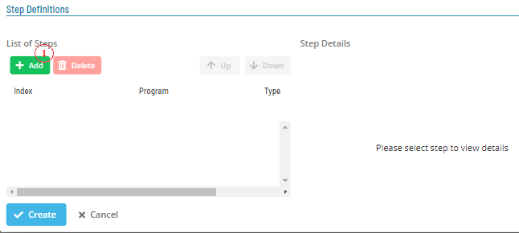

#### Add SAP Step Dialog

- **Abap Program**
  - **ABAP Program Selector**: Defines text matching the name of the desired **Abap Program** in the SAP Business Warehouse system. If unsure of the whole job name, use wildcards (\*) to expand the search.  
    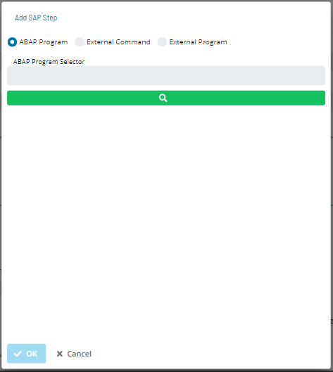
  - Click on the search button to initiate a request to the SAP R3 system to retrieve all **Abap Programs** matching the search criteria.  
    
  - Select **Abap Program** and click **OK** to add to step SAP Job.  
    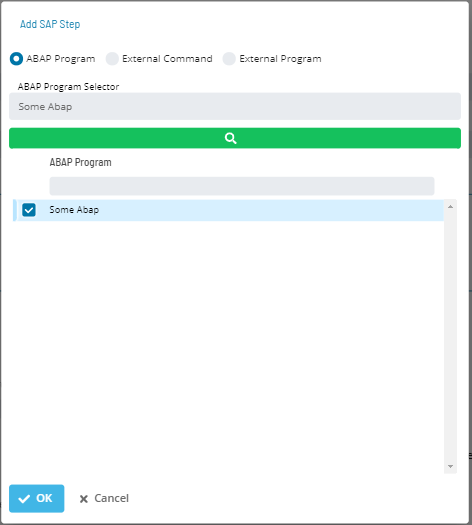  
    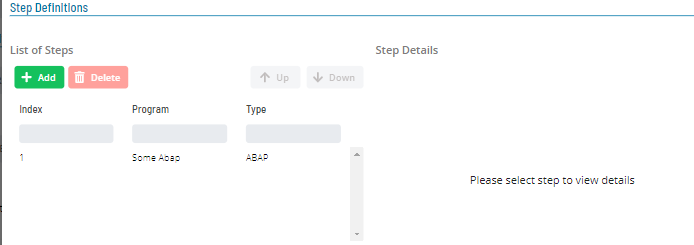
- **External Command**
  - **External Command Selector**: Defines text matching the name of the desired **External Commmand** in the SAP Business Warehouse system. If unsure of the whole job name, use wildcards (\*) to expand the search.  
    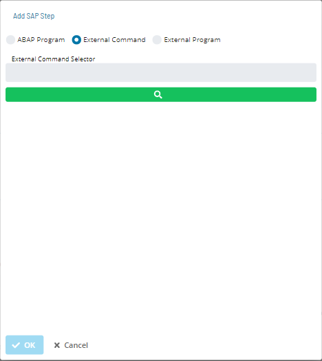
  - Enter External Command name OR Click on the search button to initiate a request to the SAP R3 system to retrieve all **External Commands** matching the search criteria.  
    
  - Select **External Command** and click **OK** to add step to SAP Job.  
    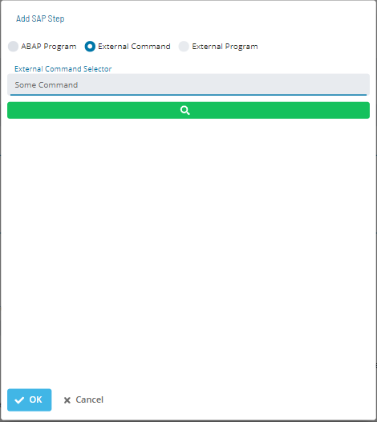  
    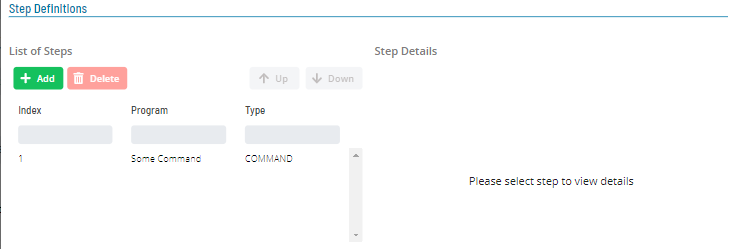
- **External Program**
  - **External Program Name**: Defines text matching the name of the desired **External Program** in the SAP Business Warehouse system.  
    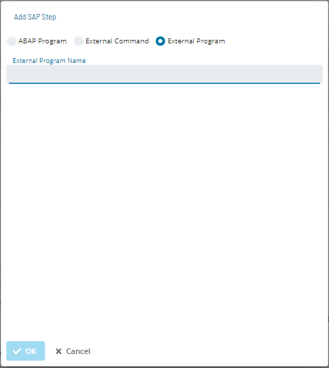
  - Enter **External Program Name** and click **OK** to add step to SAP Job.  
     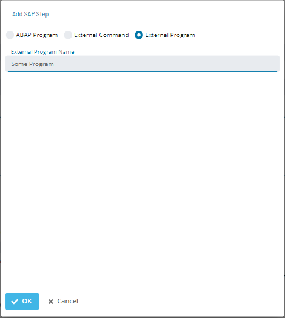  
     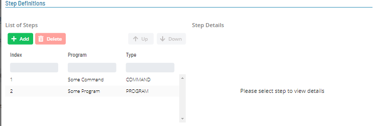

:::note
  
Use the up and down button to change the order of the steps
:::

### Abap Program Details

- Select **Abap Program** from list of steps
  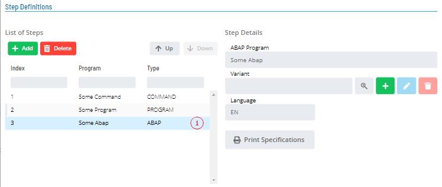
- **ABAP Program**: Defines the name of the Abap Program.
- **Variant**: Defines Variant for the Abap
  - **Search Variant Button**: Initiate a request to the SAP R3 system to retrieve all variants for selected abap step.
    
  - **Add Variant Button**: Open add variant dialog to create new variant for selected abap step.
    
  - **Edit Variant Button**: Open edit variant dialog to edit variant details for selected abap step.  
    **search and select variant or create new variant to enable button**.  
     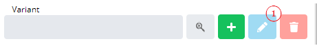
  - **Delete Variant Button**: Remove current variant from selected abap step.  
    **search and select variant or create new variant to enable button**.  
    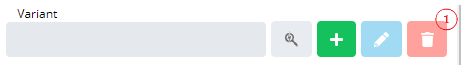
- **Language**: Defines the two-character language abbreviation (e.g., enter EN for English).
- **Print Specification Button**: Open Print Specifications Dialog to define print details.
  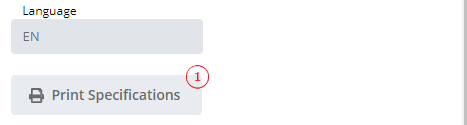

### Abap Variants

#### Search Variant Dialog

To open search variant dialog  
  
Click on the search button to initiate a request to the SAP R3 system to retrieve all **Variants** for the selected abap step.
  
Select **Variant** and click **OK** to apply to abap step  
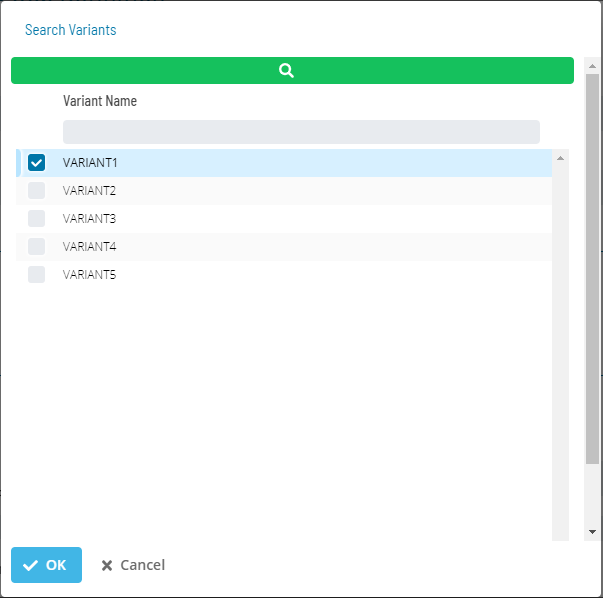  
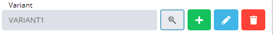

#### Add Variant Dialog

To open create variant dialog  
  
Wait for SAP Business Warehouse system to return **Variant Parameters**
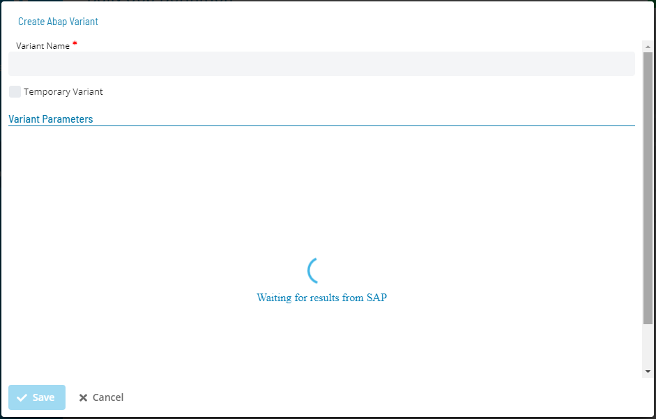

- **Variant Name**: Define the name for the variant being created.
- **Temporary Variant**: Create the variant in local database.
  - Temporary Variant will be created when the daily job is saved.
  - Temporary Variant will be deleted when the daily job or SAP job is deleted.
- **Variant Parameters**: Solution manager will send a request to SAP Business Warehouse system for parameter's when create variant dialog is opened.

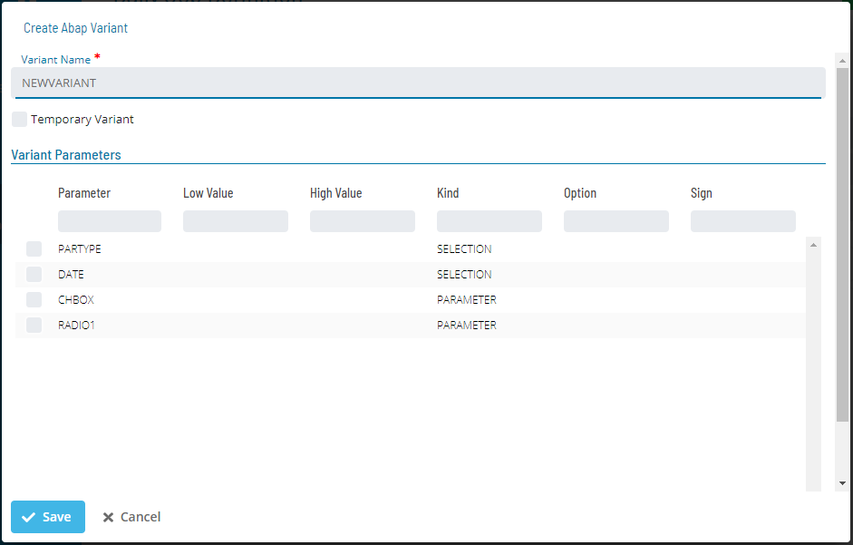

Select a variant parameter to update it's values
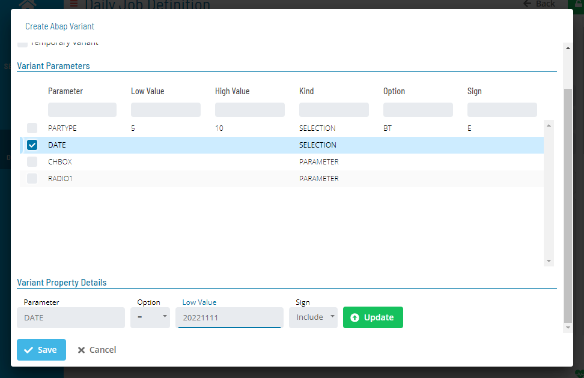
Click on the update button to update the selected parameter  

#### Edit Variant Dialog

To open edit variant dialog, select or create a variant to enable button.  

Please wait for **Variant Parameters** to be returned
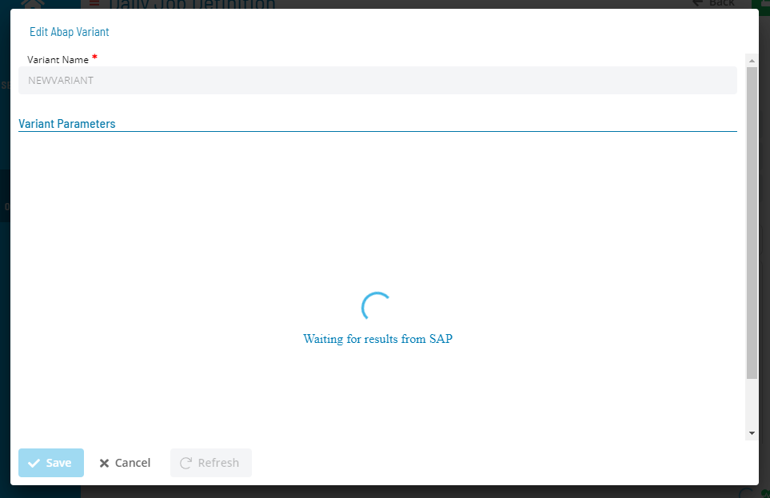

- **Variant Name**: Name of variant being updated, cannot be changed.
- **Refresh Button**: Send request to check and load new parameter values.

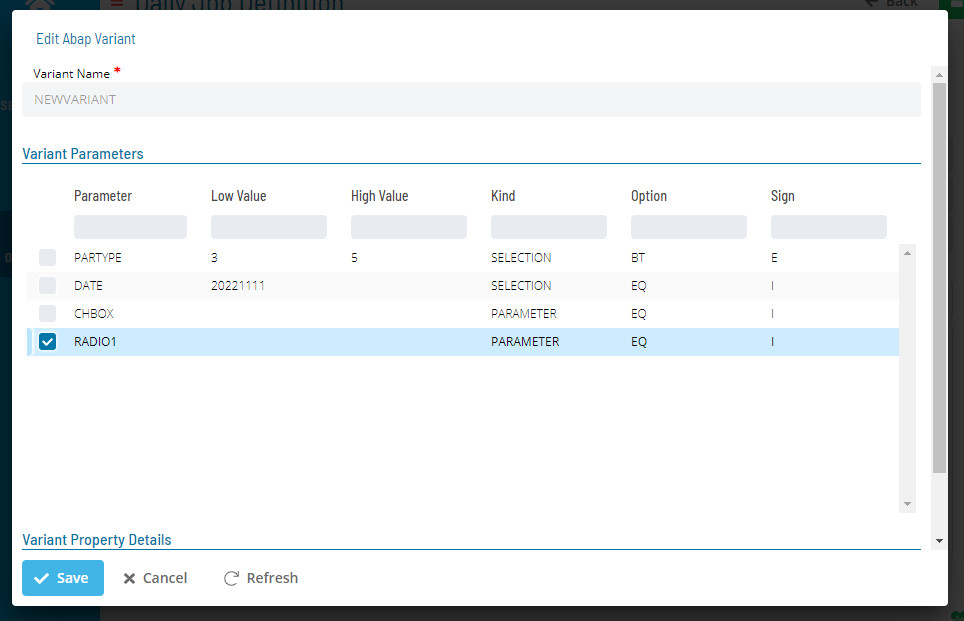

Select a variant parameter to update it's values.
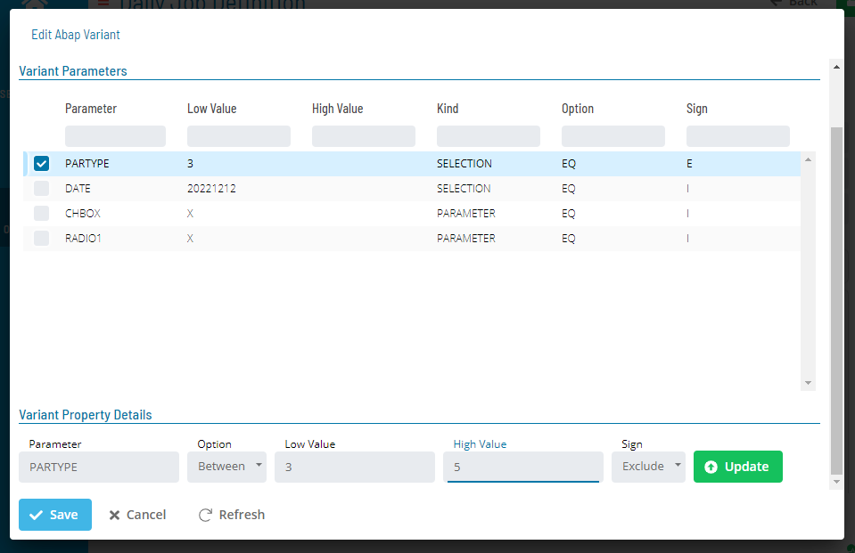
Click on the update button to update the parameter.  

#### Delete Variant Dialog

- To remove variant from **Abap Program**, select or create a variant to enable button.  
  
  :::note
  This will only remove the variant from the abap step and will not permanently delete the variant from SAP Business Warehouse system.
  :::

### Abap Print Specifications

- Open Print Specifications Dialog  
  

#### General Attribute Tab

- **Output Device**: Define the output device, click on search button to query SAP Business Warehouse system for output devices.
  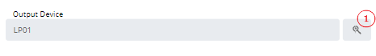
- **Number of Copies**: Define number of copies to print.
- **Time of Printing**: Define when to print.
- **Print Format**: Define the format for printing, click on search button to query SAP Business Warehouse system for print formats.
  :::note
  Output device must first be selected to enable query button.
  :::
  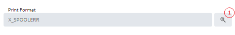  
  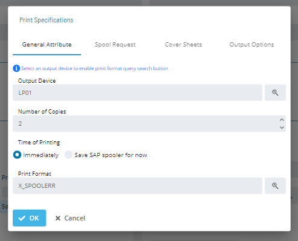

#### Spool Request Tab

- **Name**: Define spool request name
- **Title**: Define spool request title
- **Authorization**: Define spool request authorization  
  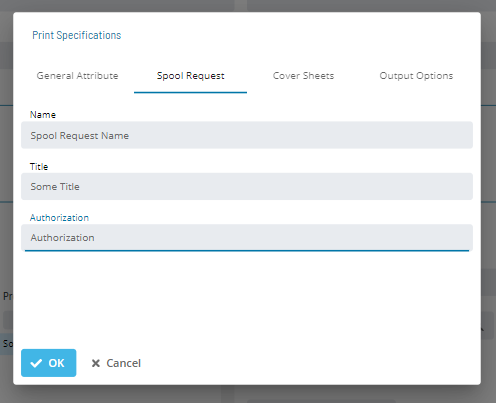

#### Cover Sheets Tab

- **SAP Cover page**: Define if cover page should be printed
- **Selection Cover Sheet**: Define Selection cover sheet
- **Recipient**: Define Recipient field
- **Department**: Define Department field  
  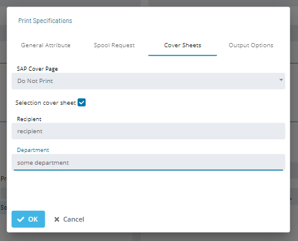

#### Output Options Tab

- **Spool Retention Period**: Define when to delete after printing
- **Delete Immediately After Printing**: Enable to delete immediately after printing
- **New Spool Request**: Enable to create new spool request  
  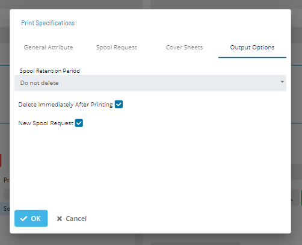

### External Command Details

- **Command**: Name of the selected external command
- **Parameters**: Defines the parameters for the external command
- **Operating System**: Defines the operating system for the external command
- **Target Server**: Defines the target server for the external command
- **Log external output to job log**: Enable to log external output to job log
- **Log external errors to job log**: Enable to log external errors to job log
- **Job awaiting external termination**: Enable to wait for external termination
- **Active trace**: Enable to activate trace  
  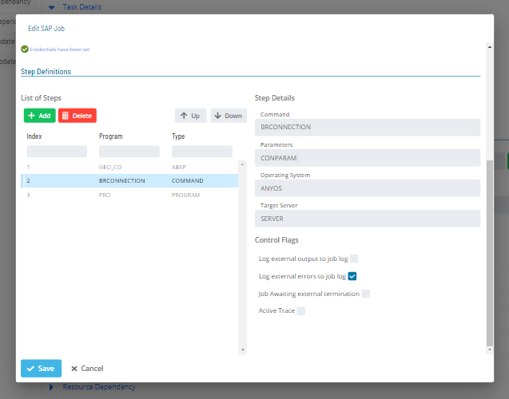

### External Program Details

- **Program**: Name of the selected external program
- **Parameters**: Defines the parameters for the external program
- **Target Server**: Defines the target server for the external program
- **Log external output to job log**: Enable to log external output to job log
- **Log external errors to job log**: Enable to log external errors to job log
- **Job awaiting external termination**: Enable to wait for external termination
- **Active trace**: Enable to activate trace  
  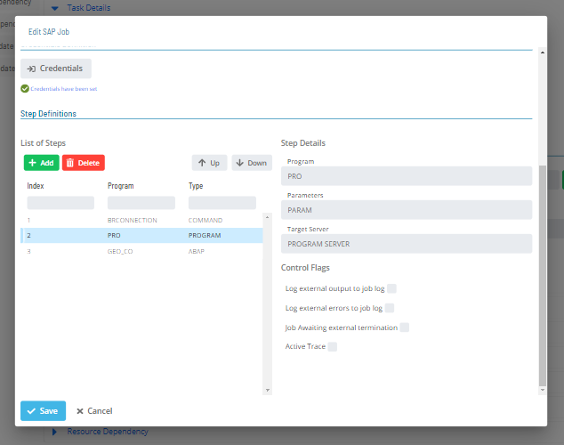

### Select Execution Target

Click on the search button next to **Execution Target** to open the SAP Query dialog.  
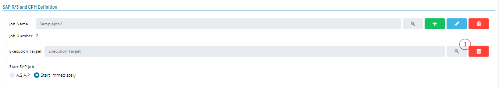

#### In the SAP Query dialog:

- **Machine**: Defines the SAP R3 LSAM Machine name.
- **Language**: Defines the two-character language abbreviation (e.g., enter EN for English).
- **User ID**: Defines Username for SAP Credentials.
- **Password**: Defines Password for SAP Credentials.

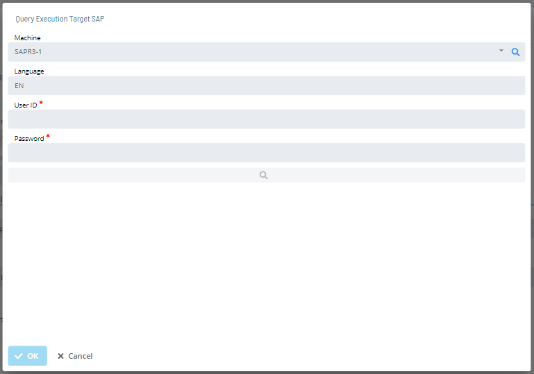

Enter SAP Credentials and click on the search button to initiate a request to the SAP R3 system to retrieve all execution targets.

Select a target from the list and click **Ok** to assign it to Exec. Target in the SAP R3 Daily Job Definition.

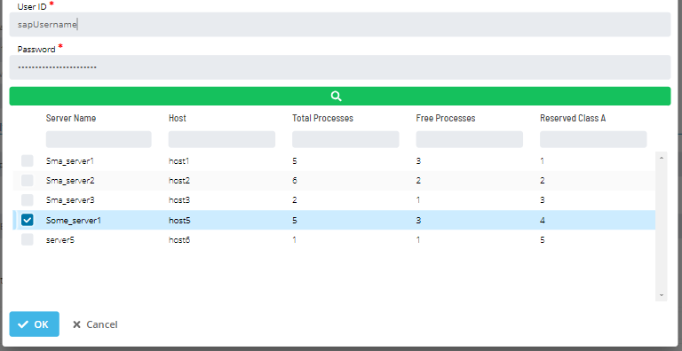

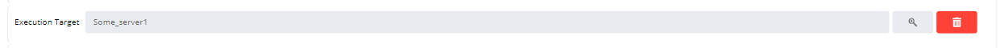

### Remove Execution Target

To remove **Execution Target** press the **red trashcan icon**.
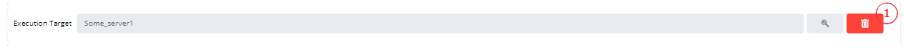

:::note
Click the **Save** button to update any changes made to daily job
:::
:::note
Click the **Undo** button if you wish to undo your changes made to daily job.
:::
