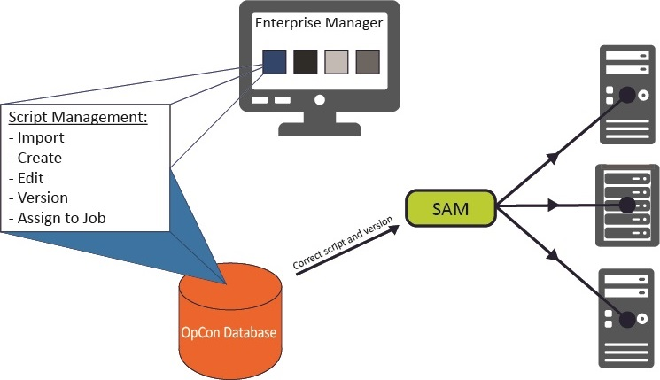
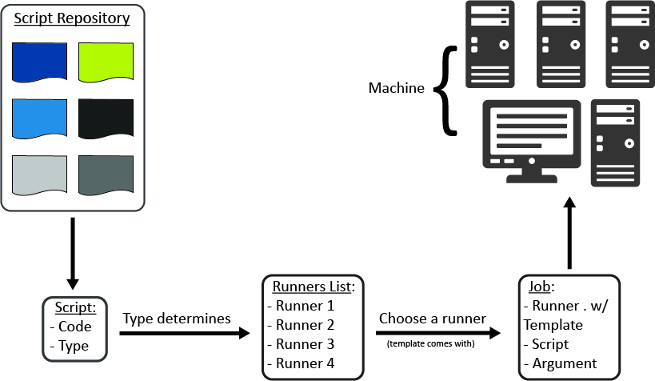

# Embedded Scripts

Embedded Scripts in OpCon provides a way for users to centrally manage
scripts for distribution to Agents. Centralized script storage is
important because it:

- Eliminates script maintenance across multiple machines
- Provides a way to run different versions of a script across
    different machines
- Secures script access and makes it possible to audit script changes
- Provides version control

Embedded Scripts Overview

## Understanding the Process Flow

The process flow for using Embedded Scripts with OpCon begins with
defining scripts in the database. Each script is associated with a
script type. The script type is associated with one or more runners. The
runner is the local program configuration responsible for executing a
script of a specific type on remote machines. At runtime, the runner,
type, and script information are all passed to the Agent for execution.

## Reasons to Use Embedded Scripts

The use of Embedded Scripts reduces administration and increases
security in the automation environment. The following scenarios
demonstrate how Embedded Scripts can provide benefits to a business:

- Maintaining the script inside OpCon means that you no longer have to
    edit the script in different environments. Without this feature, the
    process is more complex because you would have to edit the same
    script on many machines or copy a source script to those machines
    before it could be executed.
- With one account in OpCon, you can maintain all of your automation
    scripts. This means that less people have to have direct logins to
    the Agent machines.
- The built-in auditing in OpCon automatically tracks every change to
    the script whether it is versioned or not. This is especially
    beneficial in an environment without version control software.
- Having the ability to select a script version for a job provides
    these benefits:
  - Assigning a specific version ensures the job always uses that
        approved version of the script.
  - Selecting LATEST instead of a specific version ties a job to the
        highest version of a script. This is useful for test jobs to
        make sure new versions of the script work well before assigning
        the version to a production job.
