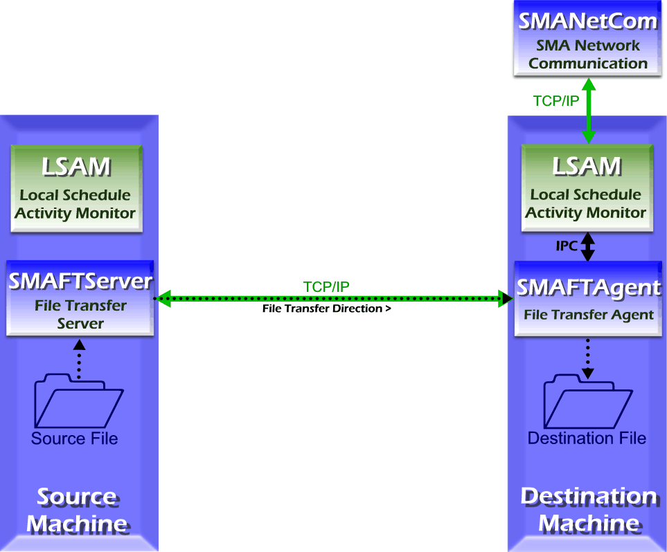

# File Transfer Jobs

The SMA File Transfer (SMAFT) system reliably transfers files across multiple platforms via an OpCon job. The receiving and sending SMAFT Components (SMAFTAgent and SMAFTServer) are installed with FT-enabled LSAMs: Microsoft, IBM i, MCP, OS 2200 and BIS, UNIX, and z/OS. The source and destination machines
must have these components for a file transfer.

:::note
SMAFT for Windows needs a .NET version installed to work.
:::

File Transfer Job

After receiving instructions from the resident LSAM, the SMAFT Component on the machine determines the best method for transporting the file with the SMAFT Component on the other machine. After negotiating the file transfer settings between the SMAFT Components, the file is transferred.

:::note
No matter which machine the job starts on, the file transfer port for that machine must be open on the firewall. For more information, refer to [File Transfer Settings](../objects/machines.md#file).
:::

## Configuration

Before attempting a transfer, configure the machine definitions in OpCon plus the source and destination machines' LSAMs.

In the source and destination machines' LSAM configuration files, define the parameters for file transfers. Normally, these settings are commingled with the LSAM's Job Output Retrieval System (JORS) parameters.

- For IBM i LSAM file transfer configuration information, refer to [The SMA File Transfer Process](https://help.smatechnologies.com/opcon/agents/ibmi/latest/Files/Agents/IBM-i/SMA-File-Transfer.md#The) in the in the **IBM i LSAM** online help.
- For MCP LSAM file transfer parameters, refer to the settings in the section for the [Optional Modules (OPT)](https://help.smatechnologies.com/opcon/agents/mcp/latest/Files/Agents/MCP/Optional-Modules-(OPT).md#MCP_LSAM_Configuration_Settings:_Optional_Modules:_File_Transfer) table in the **MCP LSAM** online help.
- For Microsoft LSAM file transfer parameters, refer to [JORS Settings](https://help.smatechnologies.com/opcon/agents/windows/latest/Files/Agents/Microsoft/JORS-Settings.md) in the **Microsoft LSAM** online help.
- For UNIX LSAM file transfer parameters, refer to [JORS and SMAFT Parameters](https://help.smatechnologies.com/opcon/agents/unix/latest/Files/Agents/UNIX/JORS-and-SMAFT-Parameters.md) in the **UNIX LSAM** online help.
- For OS 2200 and BIS file transfer configuration information, refer to [JORS and File Transfer     Configuration](https://help.smatechnologies.com/opcon/agents/os2200/latest/Files/Agents/OS-2200/Configuration.md#JORS_and_File_Transfer_Configuration) in the **OS 2200 LSAM** online help.
- For z/OS LSAM file transfer configuration information, refer to [Standalone File     Transfer](https://help.smatechnologies.com/opcon/agents/zos/latest/Files/Agents/zOS/Standalone-File-Transfer.md) in the **z/OS LSAM** online help.

In the job definition, adjust the Settings for the destination machine to correspond with the source machine's LSAM file transfer settings (or vice versa). Under the category File Transfer Settings, define the "File Transfer" type and the "File Transfer Port Number". Once configuration is complete (and verified), a File Transfer Job can be defined. For additional information on File Transfer, refer to [File Transfer Job Details](../job-types/file-transfer.md).

## Logging

Each LSAM logs file transfer information differently.

- For the IBM i LSAM, the SMAFT Agent writes all processing information to the SMAFT Agent logging system, and the SMAFT Server writes all processing information to the SMAFT Server logging system. Logging behavior is defined in the SMA File Transfer Menu. For information on these settings, refer to [SMA File Transfer Menu](https://help.smatechnologies.com/opcon/agents/ibmi/latest/Files/Agents/IBM-i/SMA-File-Transfer.md#SMA6) in the **IBM i LSAM** online help.
- For the MCP LSAM, the SMAFTAgent logs general information messages to the PRT_FTAGENT print file when SW2 is set for the LSAM. For information on setting debug switches, refer to [Problem Resolution and Debugging](https://help.smatechnologies.com/opcon/agents/mcp/latest/Files/Agents/MCP/Problem-Resolution-and-Debugging.md) in the **MCP LSAM** online help.
- For the Microsoft LSAM, the SMAFTAgent writes all processing information to the SMAFTAgent.log file in the <Output Directory\>\\MSLSAM\\Log\\ directory. Logging behavior is defined in the LSAM's Debug Settings. For information on these settings, refer to [Debug Options](https://help.smatechnologies.com/opcon/agents/windows/latest/Files/Agents/Microsoft/Debug-Options.md) in the **Microsoft LSAM** online help.
- For the UNIX LSAM, the SMAFTAgent logs general information messages to the UNIX LSAM logfile and logs error messages to the UNIX LSAM errfile. The UNIX LSAM itself controls the maintenance of logs. For information on these logs, refer to [JORS and SMAFT Parameters](https://help.smatechnologies.com/opcon/agents/unix/latest/Files/Agents/UNIX/JORS-and-SMAFT-Parameters.md) in the **UNIX LSAM** online help.
- For the OS 2200 LSAM, the SMAFT Agent writes all processing information to the SMAFT log file, and the SMAFT Server (JORS) writes all processing information to the SMAJOR log file. Logging behavior is defined in the under the Debug Mode in the Advanced Options of the LSAM's configuration. For information on these settings, refer to [Configuration Settings -- Advanced Options](https://help.smatechnologies.com/opcon/agents/os2200/latest/Files/Agents/OS-2200/Configuration.md#Advanced_Options) in the **OS 2200 LSAM** online help.
- For the z/OS LSAM, file transfer is run as a job; therefore, the log for the job contains the logging information.
