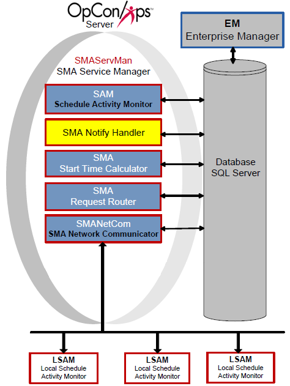

# SMA Notify Handler

The SMA Notify Handler component is responsible for reading the NOTIFY table in the OpCon database and writing the message to the appropriate location. For more information, refer to [Using Notification Manager](../Files/UI/Enterprise-Manager/Using-Notification-Manager.md) in the **Enterprise Manager** online help.



The SMA Notify Handler can send the following basic notifications after reading the NOTIFY table:

- Windows Event Log
- Email (SMTP) (For more information on configuring notifications for SMTP, refer to [Configuring SMTP Notifications](../notifications/Notification-Configuration.md#Configur3) in the **Concepts** online help.)
- SNMP Trap (For more information on configuring notifications for SMTP, refer to [Configuring SNMP Notifications](../notifications/Notification-Configuration.md#Configur) in the **Concepts** online help.)
- Unisys Single Point of Operations (SPO) AL and CO Reports (For more information on configuring notifications for SMTP, refer to [Configuring SPO Notifications](../notifications/Notification-Configuration.md#Configur2) in the **Concepts** online help.)
- Text Messages (SMS)
- OpCon Events
- Command

## Configuration

SMA Notify Handler configuration determines basic application and logging behavior.

All of the SMA Notify Handler's configuration settings exist in the Enterprise Manager's Server Options. For more information, refer to [Managing Server Options](../Files/UI/Enterprise-Manager/Managing-Server-Options.md) in the **Enterprise Manager** online help.

### PowerShell Helper Scripts

The following PowerShell scripts are available to help configure SMA Notify Handler for Outlook's MSAL SMTP authentication:

- [Download Create-AppRegistration.ps1](../../../docs/Resources/Scripts/NotifyHandler/Create-AppRegistration.ps1)
- [Download Grant-MailboxAccess.ps1](../../../docs/Resources/Scripts/NotifyHandler/Grant-MailboxAccess.ps1)

> **Note**: Both scripts require PowerShell 5.1 or later. If you encounter module installation issues, you may need to use the `-AllowClobber` parameter.

Customers may use these scripts to aid with configuring SMA Notify Handler for [Outlook's MSAL SMTP auth update](https://learn.microsoft.com/en-us/exchange/clients-and-mobile-in-exchange-online/deprecation-of-basic-authentication-exchange-online).

### Preface on issues installing modules

On some systems, users may see error messages like 
```
The ExchangeOnlineManagement module is required but not installed. Would you like to install it now? (Y/N): y
Installing ExchangeOnlineManagement module...
PackageManagement\Install-Package : The following commands are already available on this
system:'Find-Package,Install-Package,Uninstall-Package'. This module 'PackageManagement' may override the existing
commands. If you still want to install this module 'PackageManagement', use -AllowClobber parameter.
At C:\Program Files\WindowsPowerShell\Modules\PowerShellGet\1.0.0.1\PSModule.psm1:1809 char:21
+ ...          $null = PackageManagement\Install-Package @PSBoundParameters
+                      ~~~~~~~~~~~~~~~~~~~~~~~~~~~~~~~~~~~~~~~~~~~~~~~~~~~~
    + CategoryInfo          : InvalidOperation: (Microsoft.Power....InstallPackage:InstallPackage) [Install-Package],
   Exception
    + FullyQualifiedErrorId : CommandAlreadyAvailable,Validate-ModuleCommandAlreadyAvailable,Microsoft.PowerShell.Pack
   ageManagement.Cmdlets.InstallPackage

Done installing ExchangeOnlineManagement module.
Import-Module : The specified module 'ExchangeOnlineManagement' was not loaded because no valid module file was found
in any module directory.
```

If this occurs, you may pass the _AllowClobber_ argument to the *Create-AppRegistration.ps1* and/or *Grant-MailboxAccess.ps1* scripts like so
```powershell
.\Create-AppRegistration.ps1 -AllowClobber
```

This will pass the _AllowClobber_ argument to the Install-Module command and overwrite the existing module.

### Preface on issues with OAuth window opening in Internet Explorer

On some systems, old versions of Internet Explorer might still be set as the system default to open web pages requested from powershell. Some older versions of the browser do not have the necessary javascript version to run OAuth. Either find a way to change the default.

You can also uninstall the browser like so
```powershell
dism /online /Remove-Capability /CapabilityName:Browser.InternetExplorer~~~~0.0.11.0
```


### App Registration

SMANotifyHandler will need to be registered as an Enterprise app in your organizations Entra tenant. *Create-AppRegistration.ps1* will automate this process and must be ran by an administrator. The script will need to open a browser for MFA.
After this, it will generate a file app-registration-details.json :warning: this file will contain the app registration secret in plain text, secure or delete this when you are done with all configuration steps!

### Granting Users Access

Next for each email address that SMANotifyHandler will send from, run *Grant-MailboxAccess.ps1*. The script will prompt you for the email address you are wanting to associate with the Service Principal created by *Create-AppRegistration.ps1*. It will load the app-registration-details.json created earlier.

### (Optional) Outlook OAUTH2.0 Configuration

> **Prerequisites**: 
> - Azure AD tenant with administrative access
> - Exchange Online environment
> - PowerShell 5.1 or later
> - Exchange Online PowerShell module

The values from this App Registration that you need for Notify Handler's configuration are:
  - Application (client) ID
  - Directory (tenant) ID
  - Client Secret Value

1. Go to [Azure Portal](https://portal.azure.com) 
2. Define an Application Registration. 
    1. Name the app registration "SMANotifyHandler" 
    2. Select *Single Tenant*
    3. leave *Redirect URI* blank.
3. Then go to the SMANotifyHandler's overview 
    1. Click on *Client Credentials* to add a new *Client Secret*. Save this value for later for your SMTP configuration. 
    2. Then on the sidebar, go to Manage > API permissions. *Add a Permission* 
        1. Select *APIs my organization uses* 
        2. Select *Office 365 Exchange Online* 
        3. Select *Application permissions* 
        4. Click on SMTP and enable *SMTP.SendAsApp* 
        5. *Grant admin consent*.
4. Setup the *Service Principal* for the App Registration. [Microsoft provides some instructions](https://learn.microsoft.com/en-us/exchange/client-developer/legacy-protocols/how-to-authenticate-an-imap-pop-smtp-application-by-using-oauth#register-service-principals-in-exchange).
5. Enter the Application ID, Tenant ID, and Client Secret into the SMTP configuration on [Solution Manager's Server Options page](../Files/UI/Solution-Manager/Library/ServerOptions/Managing-SMTP-Settings.md)

The commands in the article need to be ran in PowerShell:

```powershell
# Install and import the Exchange Online PowerShell module
Install-Module -Name ExchangeOnlineManagement
Import-module ExchangeOnlineManagement 

# Connect to Exchange Online
Connect-ExchangeOnline -Organization <tenantId>
Connect-AzureAd

# Get the service principal details
$AADServicePrincipalDetails = Get-AzureADServicePrincipal -SearchString SMANotifyHandler

# Create the service principal
New-ServicePrincipal -AppId $AADServicePrincipalDetails.AppId `
                    -ObjectId $AADServicePrincipalDetails.ObjectId `
                    -DisplayName "Serviceprincipal for SMANotifyHandler $($AADServicePrincipalDetails.Displayname)"

# Get the created service principal
$EXOServicePrincipal = Get-ServicePrincipal -Identity "Serviceprincipal for SMANotifyHandler $($AADServicePrincipalDetails.Displayname)"

# Add mailbox permissions for the Sender of the SMANotifyHandler notifcations
Add-MailboxPermission -Identity "john.smith@contoso.com" `
                      -User $EXOServicePrincipal.Identity `
                      -AccessRights FullAccess
```

### Processing

When processing notifications:

- The SMA Notify Handler resolves tokens before sending any notifications. Tokens can resolve to any valid property in OpCon.
- For all Schedules, SMA Notify Handler looks up the Schedule Name for the notification from the Daily tables to ensure that all notifications containing a Schedule Name will contain the unique schedule name instance for the customer to follow up on if necessary.
- Any OpCon Events are passed in the SAM's MSGIN directory for processing. SMA Notify Handler automatically supplies the user name and password.
- For all notification types with message or text fields, SMA Notify Handler inserts a Notification ID as the first few characters of the message. This ID provides a way for users to look up the source of a notification.
- Email and Text Messaging SMTP server usage:
  - SMTPSERVER and SMTPSERVER2 will be used for email notifications and only used for SMS if SMTPSERVER3 and SMTPSERVER4 are not configured.
  - SMTPSERVER3 and SMTPSERVER4 will only be used for SMS notification if they are configured.
  - SMTPSERVER2 is used as the alternative to SMTPSERVER if it is configured and a notification fails on the primary.
  - SMTPSERVER4 is used as the alternative to SMTPSERVER3 if it is configured and a notification fails on the primary.
- Network Message Processing:
  - SMA Notify Handler uses Msg.exe to send network messages. If that message fails, SMA Notify Handler logs an error and cannot successfully send the message.
  - When using MSG.exe, SMA Notify Handler always uses asterisk (\*) for the user name and assumes the "Recipients" defined are either Host Names or IP Addresses.
  - For a successful message, the Authentication User (UNC Access) and Authentication Password (UNC Access) must be defined in the Server Options. The user must be an Administrator on the SAM application server and on every machine to which it will send messages. For more information, refer to [Authentication User (UNC Access)](../administration/server-options.md#Authentication_User_(UNC_Access)) and [Authentication Encrypted Password (UNC Access)](../administration/server-options.md#Authentication_Encrypted_Password_(UNC_Access)) in the **Concepts** online help.
