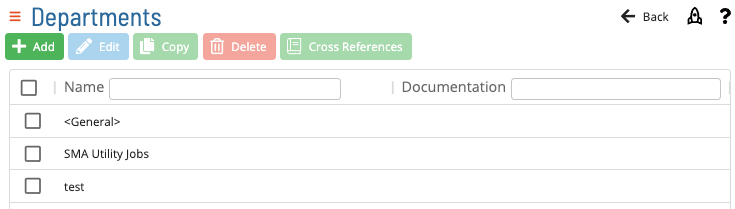
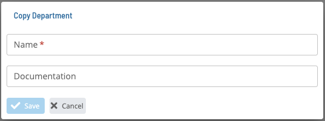
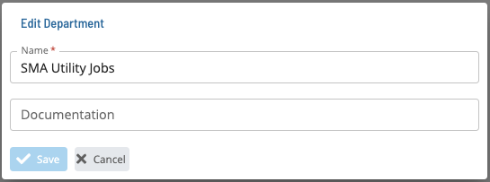
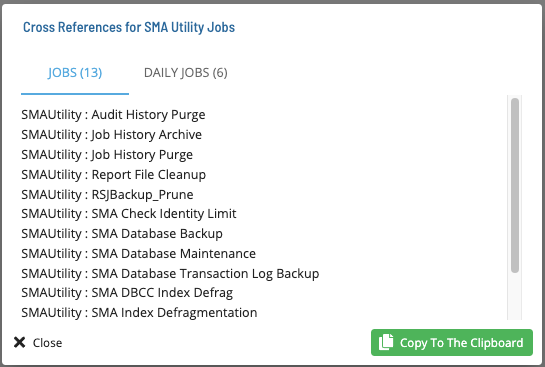

# Departments

Clicking the **Add**, **Copy** or **Edit** button bring up the following dialogs, respectively:

Click the Cross References button to see the list of master and daily jobs that use a particular Department.

