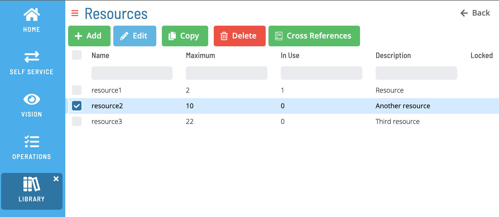
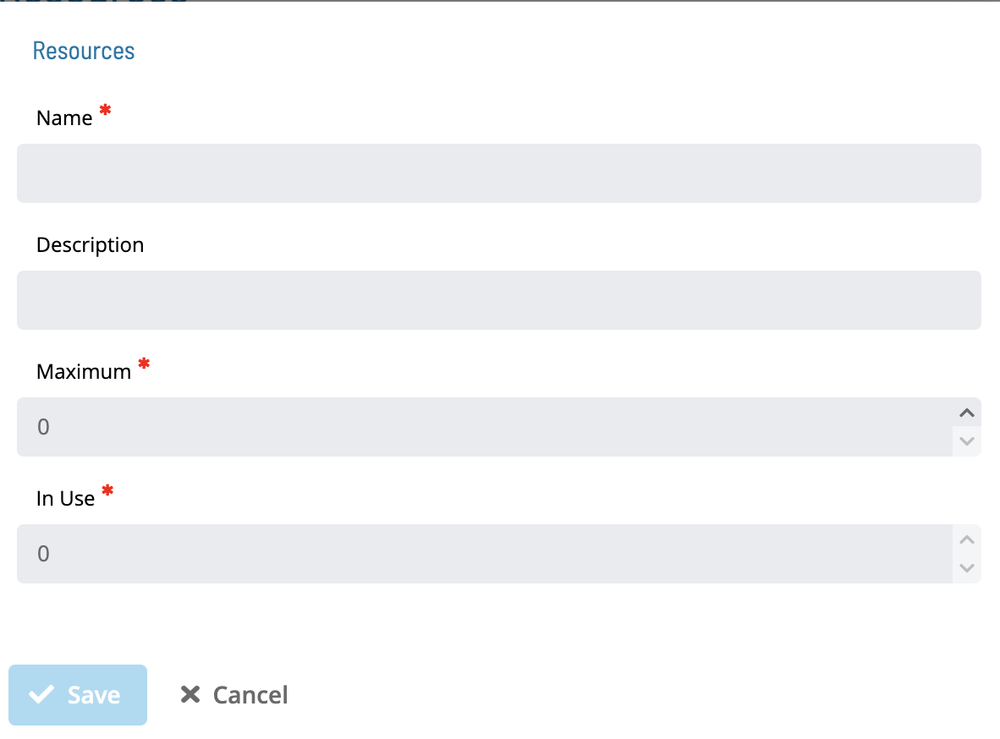
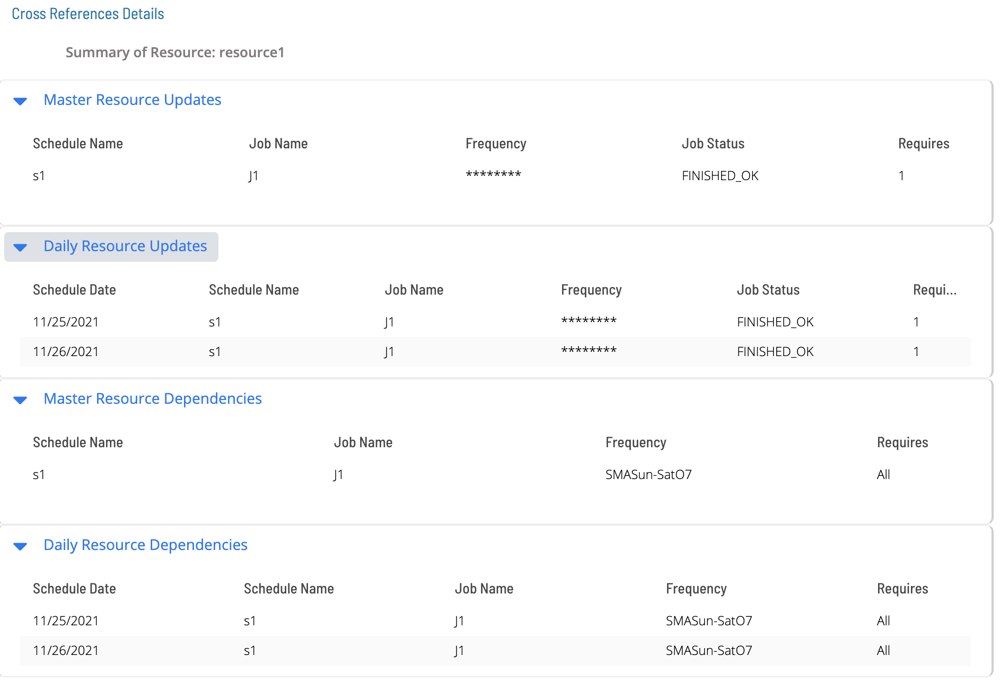

# Resources

Available Resources in OpCon are shown in the following Grid under Library -> Resources.

Clicking the **Add** or **Edit** button bring up the following screen:

:::note
The **Name** field is unique across Resources _and_ Thresholds
:::

Click the Cross References button to see the list of master and daily jobs that use a particular resource:

