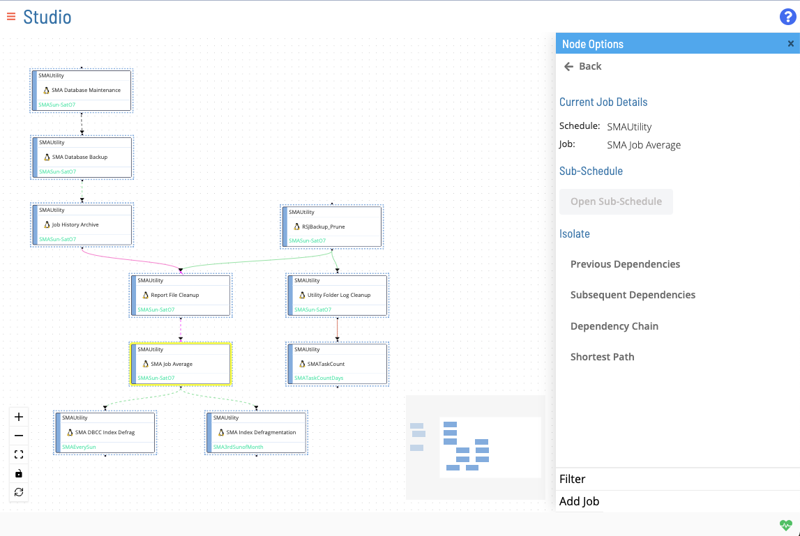
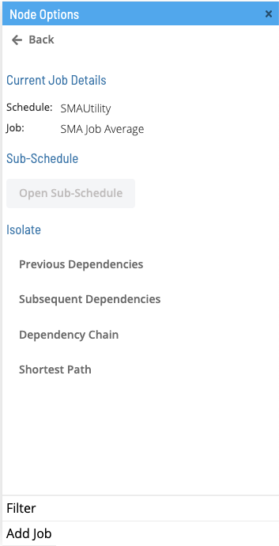
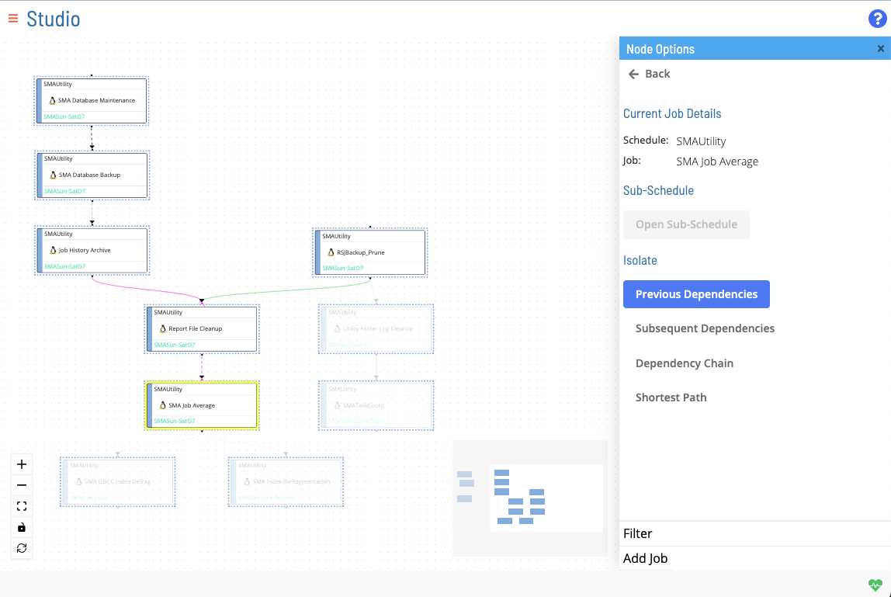
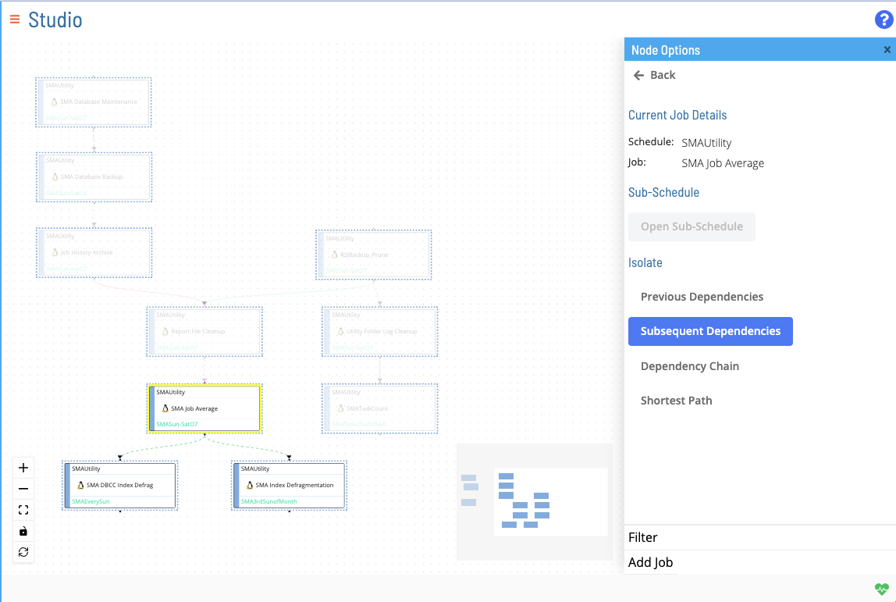
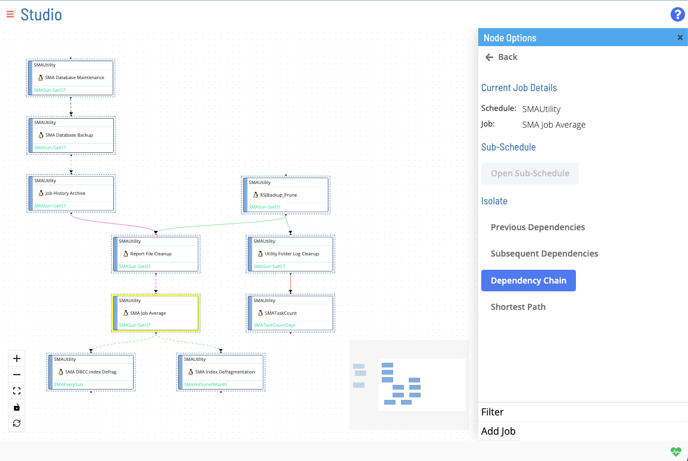
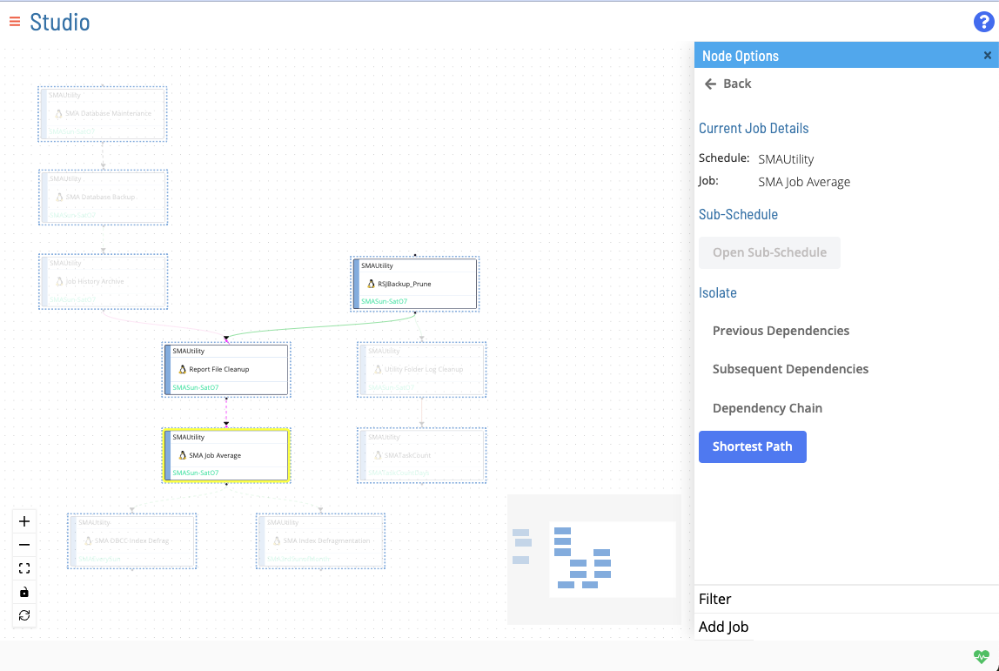

# Isolate Dependency Chain

Right-clicking a node will open up the **Node Options** menu in the right panel. This right panel view will show different options relating to the selected node, including isolating dependencies. These isolation options allow the user to configure the display of nodes and dependencies from a given start node.

## Previous Dependencies

This menu option displays all preceding jobs in a dependent chain.

## Subsequent Dependencies

This menu option displays all subsequent jobs in a dependent chain.

## Dependency Chain

This menu option displays an entire dependency chain (i.e., its preceding jobs and subsequent jobs).

## Shortest Path

This menu option shows the shortest path among all of the dependency chains to the job selected (i.e., it's shortest terminal previous dependency path).

