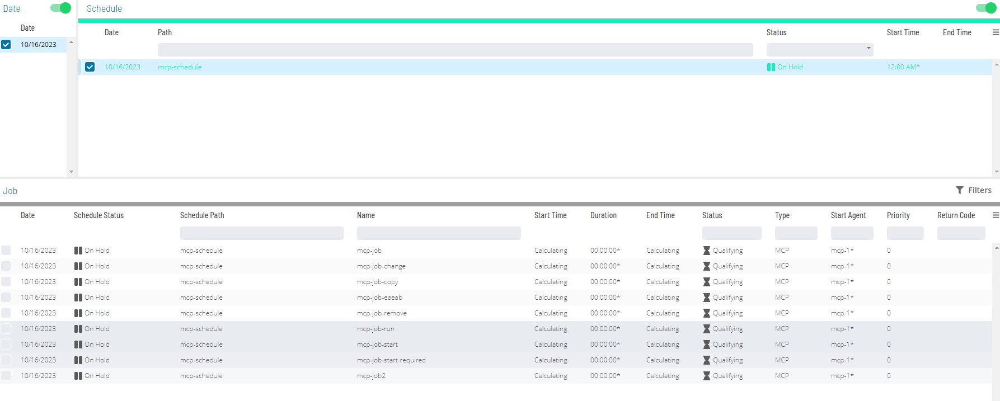
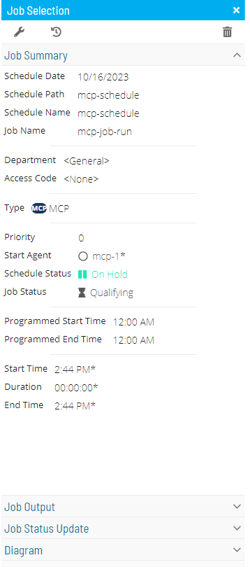
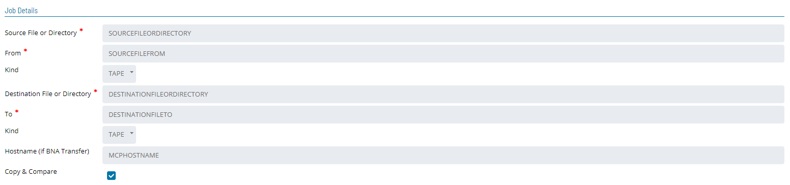
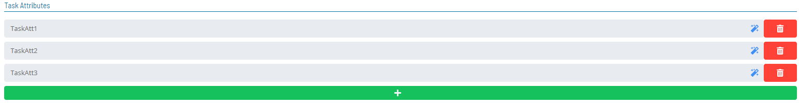
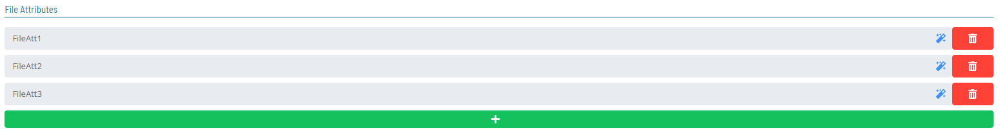
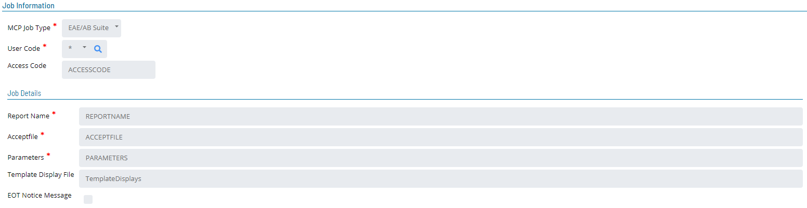
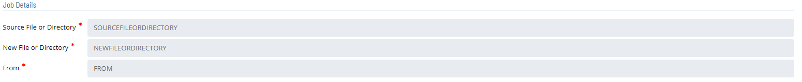
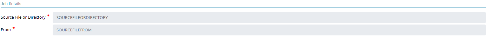
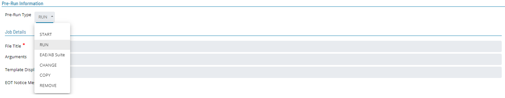
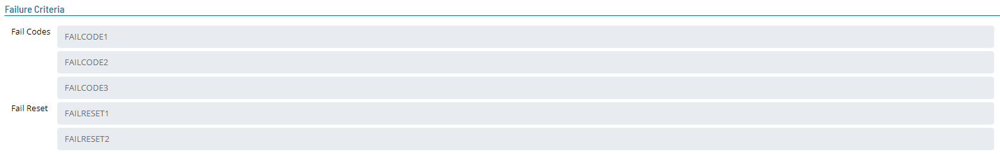

# Updating MCP Job Details

In **Admin** mode, MCP job type properties can be updated or defined.

For conceptual information, refer to [MCP Job Details](../../../job-types/mcp.md) in the **Concepts** online help.

- [Update Job Type: START Job](#updating-job-type-start)
- [Update Job Type: RUN Job](#updating-job-type-run)
- [Update Job Type: EAE/AB Suite Job](#updating-job-type-eaeab-suite)
- [Update Job Type: CHANGE Job](#updating-job-type-change)
- [Update Job Type: COPY Job](#updating-job-type-copy)
- [Update Job Type: REMOVE Job](#updating-job-type-remove)

:::note
Only those with the appropriate permissions will have access to the **Lock** button and can update job properties. For details about privileges, refer to [Required Privileges](Accessing-Daily-Job-Definition.md#Required) in the **Accessing Daily Job Definition** topic.
:::

:::note
If you do not have the Machine Privilege, then you will not be able to edit the daily job definition.
:::

:::note
Changes made to the job properties in the **Daily Job Definition** will take place immediately. If the job has already run, the changes will take effect the next time the job runs.

:::

To perform this procedure:

Click on the **Processes** button at the top-right of the **Operations
Summary** page. The **Processes** page will display.

Ensure that both the **Date** and **Schedule** toggle switches are
enabled so that you can make your date and schedule selection,
respectively. Each switch will appear green when enabled.

Select the desired **date(s)** to display the associated schedule(s).

Select one or more **schedule(s)** in the list.

Select one **job** in the list. A record of your selection will display
in the [status bar](SM-UI-Layout.md#Status) at the bottom of the
page in the form of a breadcrumb trail.

Right-click on the job selected in the list to display the **Selection** panel.
:::

Click the **Daily Job Definition** button 
at the top-left corner of the panel to access the **Daily Job
Definition** page. By default, this page will be in **Read-only** mode.

Click the **Lock** button 
at the top-right corner to place the page in **Admin** mode. The button
will switch to display a white lock unlocked on a green background

when enabled.

:::note
The **Lock** button will not be visible to users who do not have the appropriate permissions.
:::

Expand the **Task Details** panel to expose its content.

:::note
All required fields are designated by a red asterisk.
:::

Select a **User Id** to use when running the job. Either use the default
value of "0/0" or assign it to an available batch user. Keep in mind
that user information must be defined as a Batch User ID in
OpCon Administration.

Select from the **Machines or Machine Group** drop-down list the
**machine** where the LSAM is installed. If you wish instead to specify a machine group, then toggle the **Machines** switch
to _Machine Group_ then select the **machine group** from the drop-down
list. When toggled to Machine Group, the button will appear green
.

## Updating MCP Job Task Details

### Updating Job Type START

- **File Title:** Enter the WFL or the program to execute
  - The maximum number of characters for File Title is 96.
  - Do not begin the WFL or program text with START or RUN. This causes the job to fail.
  - The File Title can not container lowercase characters.
- **Arguments** Enter the parameters and/or task attribute(s) to be passed to the task.
  - The maximum number of characters for Arguments is 200.
  - Valid arguments include string, numbers, and booleans.
  - Parenthesis are allowed to be around all the arguments.
  - Separate arguments with a (,).
- **Template Display File** Enter the file used in lieu of a job-specific displays file.
  - Allows customers to use a single set of definitions for multiple OPCON jobs.
- **EOT Notice Message** Enable to treat each end-of-task notification for this job as a display message.
  - Enabling this setting allows the user to setan Automated Response to trigger action on task completion without having to wait for job to fully complete.
- **Task Attributes** Enter Task attribute used to modify, override, or elaborate existing task attibutes that apply to the MCP program or WFL.
  - The maximum number of characters for each Task Attribute is 300.
  - Any single given task attribute must fit within a single line and can not be continued from one line to the next.
  - There can be up to 10 task attributes. If a user needs to define more than 10 task attributes, the additional ones may be appeneded to any existing task attribute by preceding the next task attribute with a semicolon. For example: SW1=TRUE;SW2=TRUE.

### Updating Job Type RUN

- **File Title:** Enter the WFL or the program to execute
  - The maximum number of characters for File Title is 96.
  - Do not begin the WFL or program text with START or RUN. This causes the job to fail.
  - The File Title can not container lowercase characters.
- **Arguments** Enter the parameters and/or task attribute(s) to be passed to the task.
  - The maximum number of characters for Arguments is 200.
  - Valid arguments include string, numbers, and booleans.
  - Parenthesis are allowed to be around all the arguments.
  - Separate arguments with a (,).
- **Template Display File** Enter the file used in lieu of a job-specific displays file.
  - Allows customers to use a single set of definitions for multiple OPCON jobs.
- **EOT Notice Message** Enable to treat each end-of-task notification for this job as a display message.
  - Enabling this setting allows the user to setan Automated Response to trigger action on task completion without having to wait for job to fully complete.
- **Task Attributes** Enter Task attribute used to modify, override, or elaborate existing task attibutes that apply to the MCP program or WFL.
  - The maximum number of characters for each Task Attribute is 300.
  - Any single given task attribute must fit within a single line and can not be continued from one line to the next.
  - There can be up to 10 task attributes. If a user needs to define more than 10 task attributes, the additional ones may be appeneded to any existing task attribute by preceding the next task attribute with a semicolon. For example: SW1=TRUE;SW2=TRUE.
- **File Attributes** Enter a subset of Task Attributes used to define, enhance, or override default attributse for files used by the MCP program.
  - The maximum number of characters for each Task Attribute is 300.
  - Any single given task attribute must fit within a single line and can not be continued from one line to the next.
  - There can be up to 10 task attributes. If a user needs to define more than 10 task attributes, the additional ones may be appeneded to any existing task attribute by preceding the next task attribute with a semicolon. For example: SW1=TRUE;SW2=TRUE.
    
    
    

### Updating Job Type EAE/AB Suite

- **Report Name**: Defines the name of the EAE/AB Suite report to execute.
  - Tokens are supported in this field.
  - The report name cannot exceed 256 characters.
- **Acceptfile**: Defines the filename that the LSAM will create with the arguments in the Parameters field for the EAE/AB Suite command.
  - Tokens are supported in this field.
  - The Acceptfile name cannot exceed 256 characters.
  - Following completion (or failure) of the job, the Acceptfile is saved as a permanent file in the directory, \*SMA/LINC17/FILES/=.
    - SMA Technologies recommends that this directory be cleaned up at regular intervals.
    - A utility called SMA/WFL/CLEANUP/LINC17/FILES is provided in the MCP LSAM release container and may be scheduled via OpCon to perform this maintenance.
- **Parameters**: Defines all the parameters to run the EAE/AB Suite report.
  - Tokens are supported in this field.
  - The Parameters cannot exceed 256 characters.
- **Template Display File**: Defines the file used in lieu of a job-specific displays file, and it allows the customer to use a single set of definitions for multiple OpCon jobs rather than create a job-specific displays file for each OpCon job. For more information, refer to [Automated Response](https://help.smatechnologies.com/opcon/agents/mcp/latest/Files/Agents/MCP/Automated-Response.md#Automate).
- **EOT Notice Message**: Defines whether to treat each end-of-task notification for this job as a display message. For more information, refer to [Automated Response](https://help.smatechnologies.com/opcon/agents/mcp/latest/Files/Agents/MCP/Automated-Response.md#Automate).
  - Enabling this setting permits the user to set up an Automated Response to trigger action upon end of task without having to wait for the job to fully complete.
    

### Updating Job Type COPY

The COPY type jobs use the following fields:

- **Source File or Directory** (Required): Specifies the filename (**Example**: (UC)MYUSER/FILES) or the directory (**Example**: (UC)MYUSER/=) that will be copied.
  - The maximum number of characters for the **Source File or Directory** field is 256.
  - Tokens are supported in this field.
- **From** (Required): Specifies the place where the source file is. It can be a Family Disk name or a tape name.
  - The maximum number of characters for the **From** field is 40.
  - Tokens are supported in this field.
- **Kind** (Required): Specifies the kind of the device for the source file.
  - The Device choices are PACK or TAPE (default).
- **Destination File or Directory**: Specifies the new filename (**Example**: (UC)MYUSER/SAVED/FILES) or the directory (**Example**: (UC)MYUSER/SAVED/=) for the copied file.
  - The maximum number of characters for the **Destination File** or **Directory field** is 256.
  - Tokens are supported in this field.
- **To** (Required): Specifies where the destination file will be placed. It can be a Family Disk name or a tape name.
  - The maximum number of characters for the **To** field is 40.
  - Tokens are supported in this field.
- **Kind** (Required): Specifies the kind of the device for the destination file.
  - The Device choices are PACK or TAPE (default).
- **Hostname (if BNA Transfer)** (Optional): Specifies the Unisys MCP hostname to where the file will be copied. If blank, the application assumes that this is not a BNA Transfer copy.
  - The maximum number of characters for the **Hostname** field is 256.
  - Tokens are supported in this field.
- **Copy & Compare** (Optional): Specifies to use the "COPY & COMPARE" feature if the check box is marked to copy the file.

### Updating Job Type CHANGE

The CHANGE type jobs use the following fields:

- **Source File or Directory** (Required): Specifies the filename (**Example**: (UC)MYUSER/FILES) or the directory (**Example**: (UC)MYUSER/=) that will be changed.
  - The maximum number of characters for the **Source File** or **Directory** field is 256.
  - Tokens are supported in this field.
- **New File or Directory** (Required): Specifies the new filename (**Example**:: \*(UC)MYUSER/SAVED/FILES) or the directory (**Example**: \*(UC)MYUSER/SAVED/=) for the new file.
  - The maximum number of characters for the **New File** or **Directory** field is 256.
  - Tokens are supported in this field.
- **From** (Required): Specifies the place where the source file is. It can be a Family Disk name or a tape name.
  - The maximum number of characters for the **From** field is 40.
  - Tokens are supported in this field.

### Updating Job Type REMOVE

The REMOVE type jobs use the following fields:

- **Source File or Directory** (Required): Specifies the filename (**Example**: (UC)MYUSER/FILES) or the directory (**Example**: \*(UC)MYUSER/FILES/=) that will be removed.
  - The maximum number of characters for the **Source File** or **Directory** field is 256.
  - Tokens are supported in this field.
- **From** (Required): Specifies the place where the source file is. It can be a Family Disk name or a tape name.
  - The maximum number of characters for the **From** field is 40.
  - Tokens are supported in this field.

:::note
Effective with MCP LSAM 16.02, the user will be able to modify the \*SMA/WFL/REMOVEJOB WFL to elect to have the WFL complete OK even if there are no files deleted. Security errors and locked files will still cause the REMOVEJOB WFL to be reported as failed in this case.

To implement the alternate behavior, modify a working copy of \*SMA/WFL/REMOVEJOB to comment out sequence #26600, and un-comment sequence 26650. Because the default behavior is to fail the REMOVE MCP job if there are no files to remove, it will be necessary to re-implement this modification each time the MCP LSAM is upgraded if the alternate behavior is desired.
:::

## Pre-Run Information

The primary purpose of a Prerun is to test any required preconditions for job execution. If the Prerun job terminates with an error, it is rescheduled at a user-defined interval. The Prerun job continues to execute at the user-defined interval until it succeeds. After the Prerun job completes successfully, the job defined in the Job Description is allowed to process.

## Failure Criteria

- **Fail Codes** Enter words to compare to the MCP console display. if the words match the display, the LSAM follows the failure logic established in the configuration.
  - The entry must begin with the first word of the MCP console display, follow ed by any additional words included in the search of the display.
  - Finish the entry with an asterisk (\*) as a wildcard for the remainder of the words in the display.
  - Use of Fail Codes is an alternative solution to programming a WFL to ABORT if a program ISNT COMPLETEDOK. Use of Fail Codes is restricted to WFL jobs only, it cannot be used for programs.
- **Fail Reset** Enter words to compare to the MCP console display. If the words match the display. the LSAM follows the failure logic established in the configuration.

