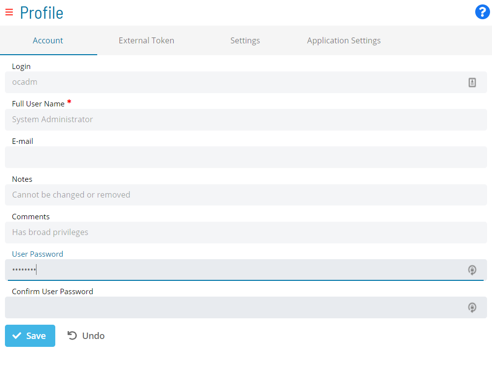

# Accessing and Updating Profile Settings

 
 

The user currently logged into the application can access the **Profile** page from the [Navigation menu](SM-UI-Layout.md#Navigati) and configure settings from one of these tabs:

- [Account](Configuring-Account-Settings.md)
- [External Token](Generating-External-Tokens.md)
- [Settings](Configuring-Settings.md)
- [Application Settings](Configuring-Application-Settings.md)
