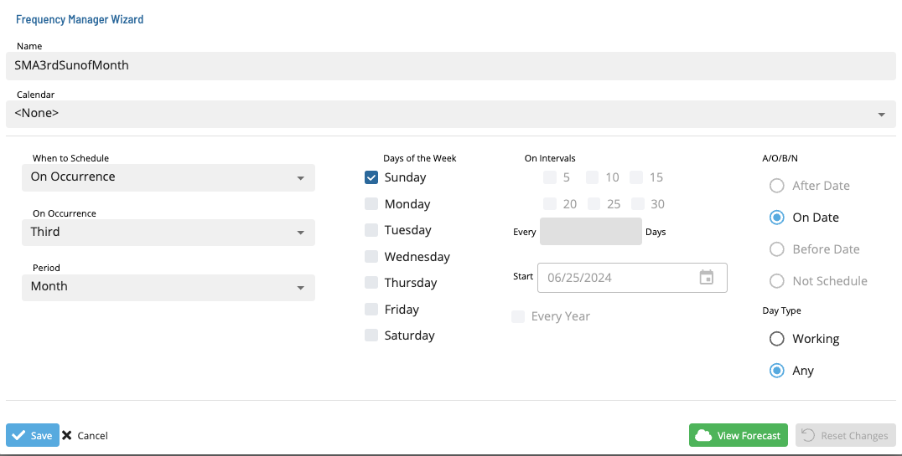

# Editing Frequencies

To edit a frequency:

1. Select a frequency and click the **Edit** button. The **Frequency Manager Wizard** dialog displays.
2. Make the desired changes to the frequency.
3. To view a forecast of the changes, click the **Forecast** button.
4. To reset the changes, click the **Reset** button.
5. Click **Save** to save the changes or **Cancel** to discard the changes.

