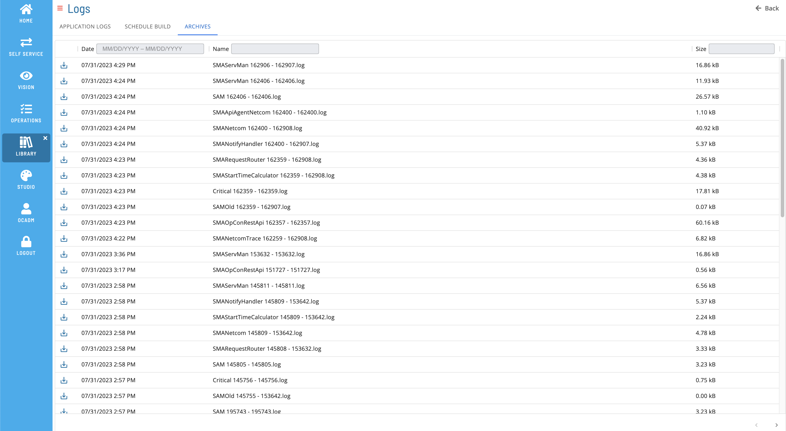

# List Archive Files

The **Archives** tab allows you to view list of archived log files.

### Filtering & Sorting

You can filter and sort log files by using the column headers in the list. You can also filter by entering text in the **Name** or **Size** field, case insensitive. You can also filter by entering a date range in **Date** field to filter by dates.

### Log File Details

Click a row to open the Log File Details Page and see more detailed information about the selected log file.

### Download File

Click the download  button to download a copy of the log file.
