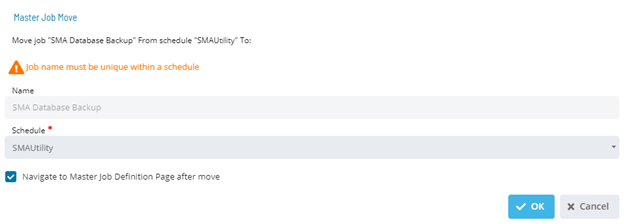

# Moving Master Jobs

## Required Privileges

In order to move a master job, you must have at least all of the following privileges:

- **Departmental Function Privilege**: User must be at least in a role
  that has All Function Privileges, Add Jobs To Master Schedules or All Job Master Functions.

---

## Moving a Job

To move a job, go to **Library** > **Master Jobs**.

Select a job and select **Move**. The Master Job Move dialog is displayed:

1. Select a **Schedule**.

1. Select **OK** to move the job or **Cancel** to cancel the operation.
