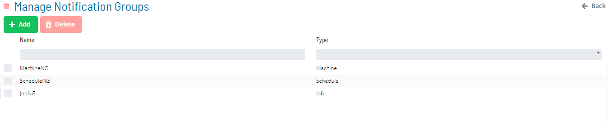
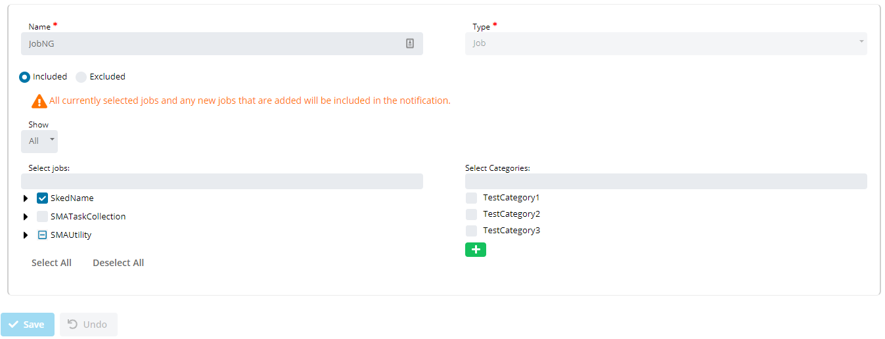
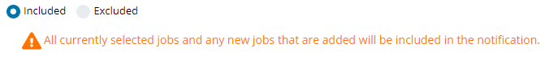
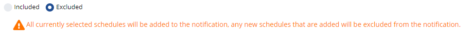
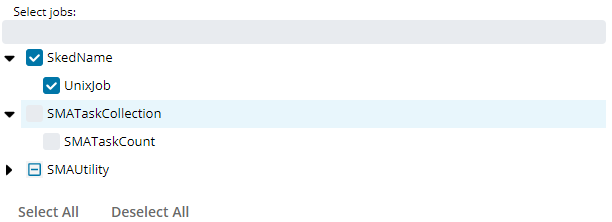
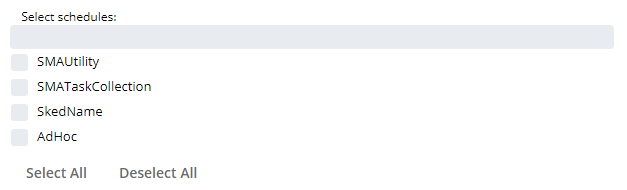
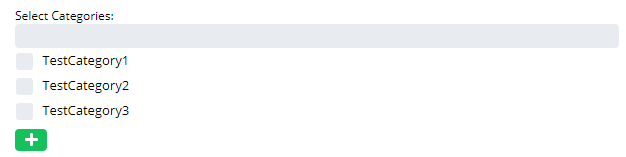
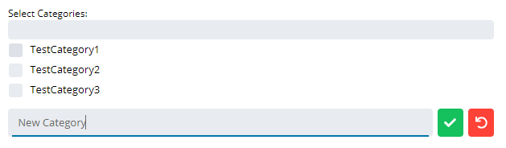

# Notification Groups

Available Notification Groups in OpCon are shown in the following Grid under Library -> Triggers -> Manage Notification Groups.

Clicking the **Add** button or **Selecting a record in the grid** will enable the bottom panel:

:::note
The **Name** field must be unique when adding a notification group.
:::

When Included is selected all items selected in the list will be included in the notification as well as all new Jobs, Machines and Schedules depending on the type on group selected. 

When Excluded is selected all items selected in the list will be included in the notification and  all new Jobs, Machines and Schedules depending on the type on group selected will be excluded from the notification. 

If the group type is **Job** or **Machine**, a tree view will show all items available for the notification group.

If the group type is **Schedule**, a check list will show all schedules available for the notification group.

The **Categories** check list shows all categories available for the Notification Group.

Click on the **Add** button to quickly add a new category to the list.

