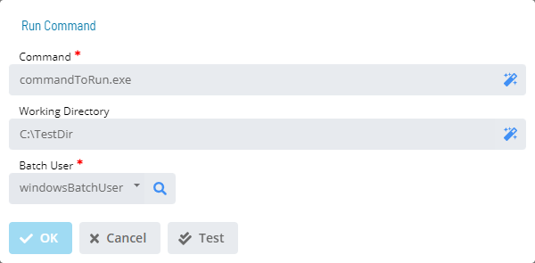

# Run Command

The **Run Command** dialog provides the following fields for defining a
command to run for the selected trigger:

- **Command** (Required): Defines the full path and name of the
    program to run. The maximum for this field is 4000 characters.
- **Working Directory** (Optional): Defines the working directory used
    by the program. The maximum for this field is 255 characters.
- **Batch User** (Required): Defines the user with permissions to run
    the program.
