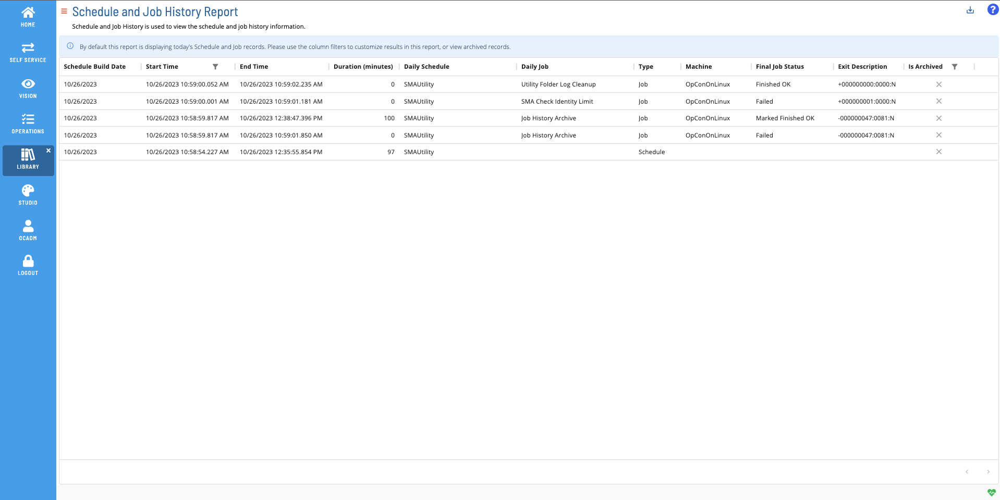
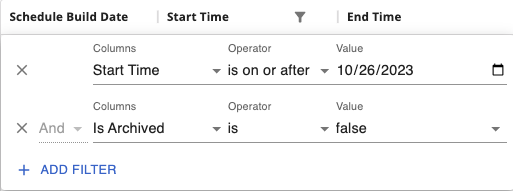
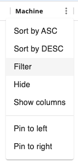

# Schedule and Job History Report

The **Schedule and Job History Report** is used to view the schedule and job history information.

### Filtering & Sorting

Because this report contains large amounts of data, 2 filters will be applied by default. The first filters the start time to only the current day, and the second filters the request to only pull non-archived records. You can adjust these or add filters to other columns in the filters panel (shown below). You can open the filters panel by either selecting the filter icon in the header or columns that have an active filter, or by clicking on the menu (three dots) in the header of any column, and selecting 'Filter' (also shown below). Both of the default filters are required for this report, but can be adjusted.

  

### Exporting to CSV

Click the export  button to download the report as a CSV. Any active filters will be applied when exporting the report.
