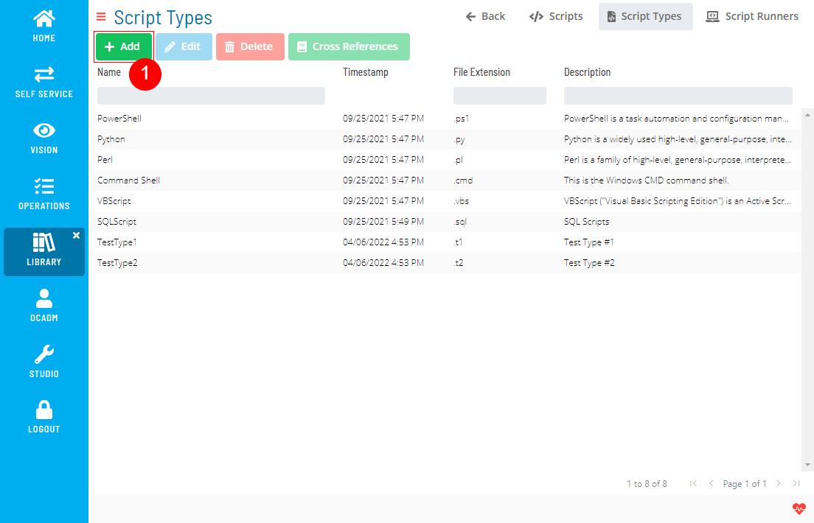
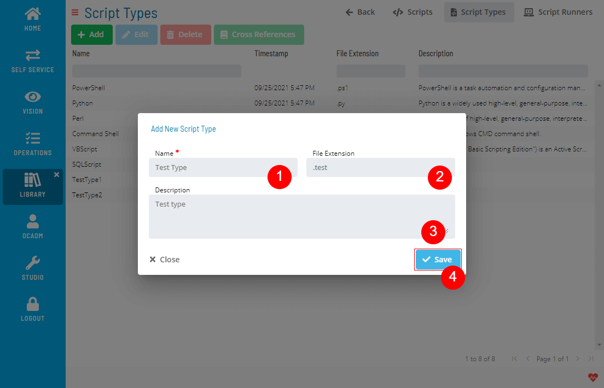
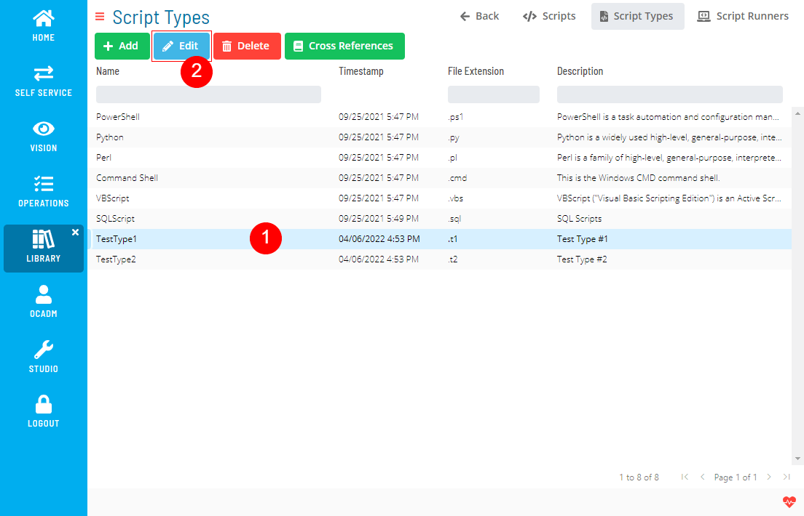
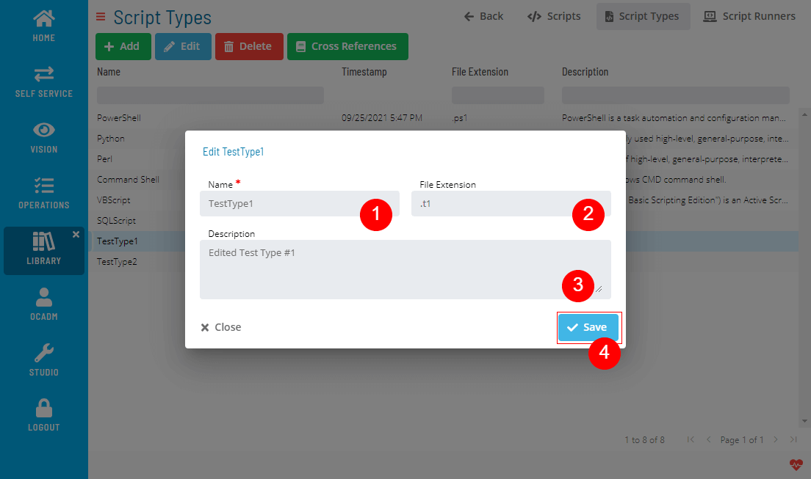
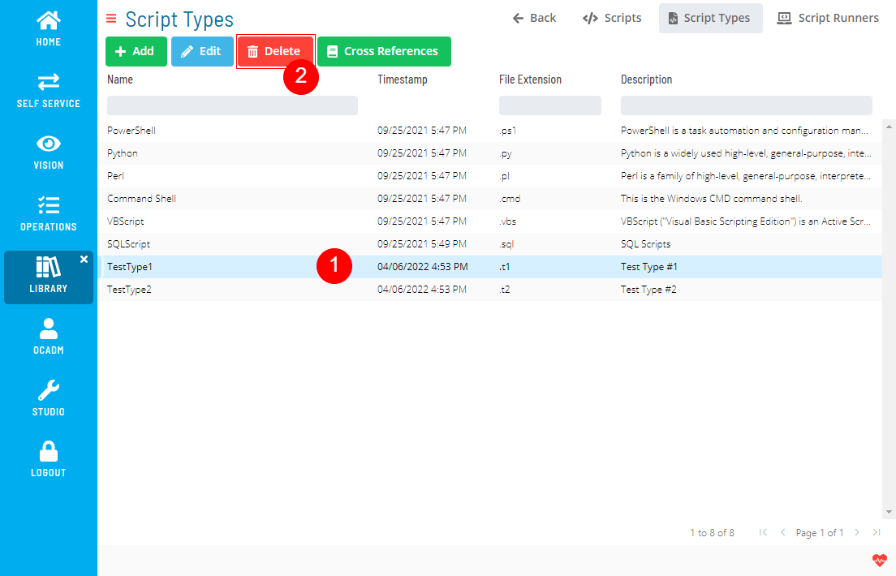
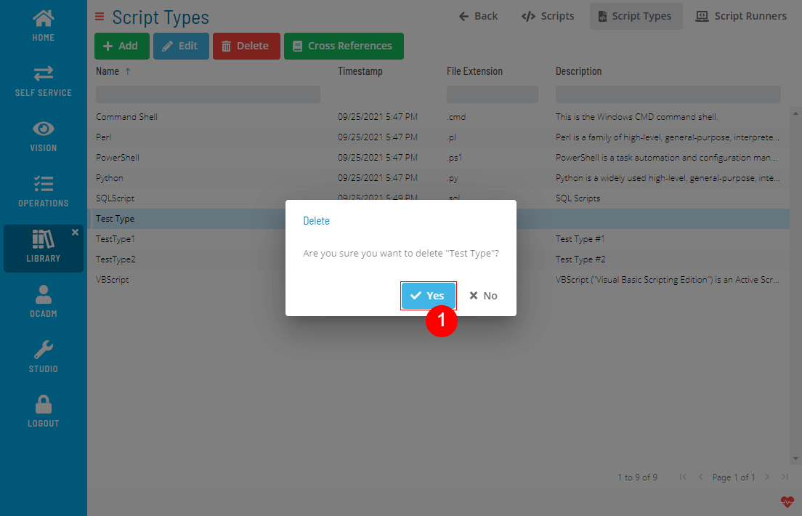
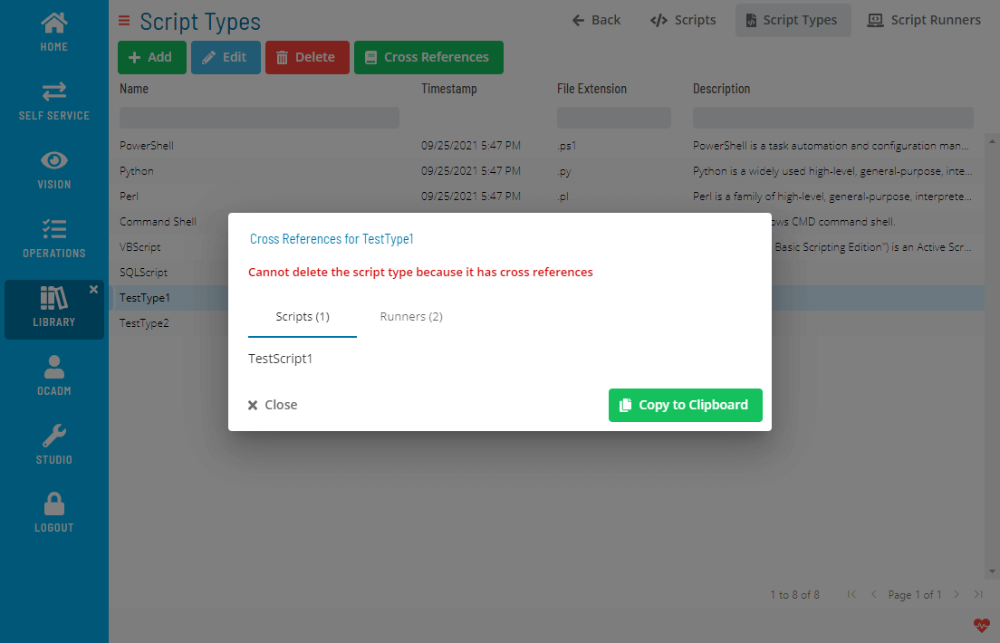
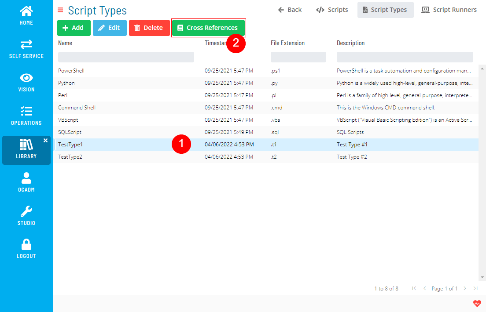
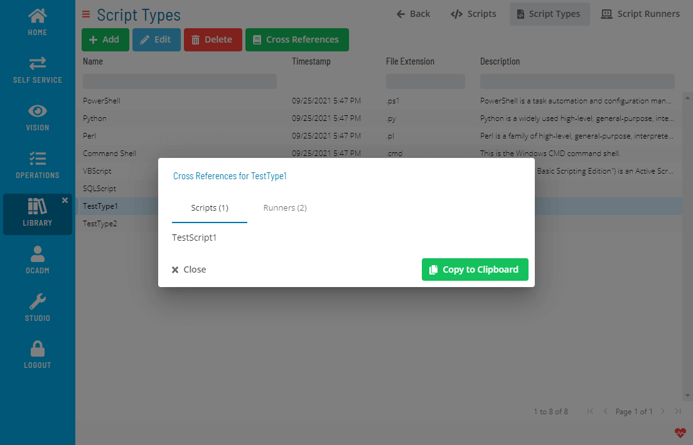

# Managing Script Types

The **Script Types** module allows you to add, edit, delete, and check cross-references for script types.

### Creating Script Types

1. Click the Add button above the list
   
2. Fill out the Script Type form
   

### Editing Script Types

1. Select a Script Type and click the Edit button above the list
   
2. Fill out the Script Type form
   

### Deleting Script Types

1. Select a Script Type and click the Delete button above the list
   

2. Click Yes to confirm the delete operation
   

Delete operation is not allowed if Script Type has any cross-references.

### Checking Cross References

1. Select a Script Type and click the Cross References button above the list
   
2. A dialog will show the Cross References
   

.png "More Info icon")
Related Topics

- [Managing Scripts](Managing-Scripts.md)
- [Managing Script Versions](Managing-Script-Versions.md)
- [Managing Script Runners](Managing-Script-Runners.md)