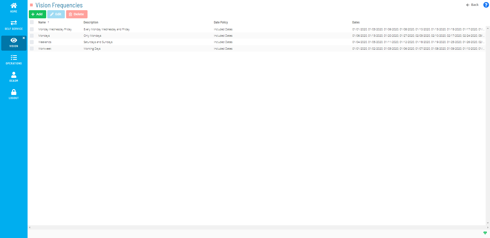

# Managing Vision Frequencies

Vision Frequencies define which days cards are displayed for monitoring
in the Vision module. At least one frequency must be defined for tag
cards while frequency definition is optional for group cards as they
inherit them from children cards. Multiple frequencies can be associated
with a card. The first matching frequency in the priority order will be
used to apply SLAs and Triggers in case multiple match a particular day.

The following fields apply for setting Vision Frequencies:

**Frequency**: This field allows you to select an existing frequency or
define a new frequency. If creating a new frequency, the Vision
Frequency page will display where you can define the new frequency.

- **Name**: This field allows you to define the frequency name.
- **Description**: *(Optional)* This field allows you
    to enter a description for the frequency.
- **Date Policy**: This field allows you to select the whether to
    include or exclude dates, using the following options:
  - **Include Selected Dates**: This option allows you to specify
        which dates the Vision card will be displayed. These dates will
        show up with a green highlight on the calendar(s).
    - Use the 
            button to add dates to the calendar(s).
    - Use the 
            button to remove dates from the calendar(s).
  - **Exclude Selected Dates**: This option allows you to specify
        which dates the Vision card will not be displayed. These dates
        will show up with a red highlight on the calendar(s).
    - Use the 
            button to add dates to the calendar(s).

    - Use the 
            button to remove dates from the calendar(s).

**SLA**: This frame allows you to define the SLA (service level
agreement) for a frequency. The SLA specifies which days to monitor the
expected start time and/or expected end time. When a card has an SLA
requirement defined, a triangular icon may appear next to the Start Time
or End Time on a card to tell the user that the SLA is broken or is
about to break based on current estimations. For more information on the
SLA icon, refer to [Vision Card Colors](Viewing-Cards-in-Vision-Live.md#Vision)
in the **Solution Manager** online help.

- **Requirement**: This field allows you to select the time
    expectation requirement, using the following options:
  - **Expected Start Time**: This option specifies the time defined
        for the SLA is the expected start time.
  - **Expected End Time**: This option specifies the time defined
        for the SLA is the expected end time.

**Time**: This field allows you to set the time the SLA will monitor.

**Day**: This field allows you to select the day offset the SLA will
monitor, using the following options:

**-5**: This option specifies the SLA time defined to be verified will
apply five days before the current day.

**-4**: This option specifies the SLA time defined to be verified will
apply four days before the current day.

**-3**: This option specifies the SLA time defined to be verified will
apply three days before the current day.

**-2**: This option specifies the SLA time defined to be verified will
apply two days before the current day.

**Previous**: This option specifies the SLA time defined to be verified
will apply one day before the current day.

**Current**: This option specifies the SLA time defined to be verified
will apply the current day.

**Next**: This option specifies the SLA time defined to be verified will
apply one day after the current day.

**+2**: This option specifies the SLA time defined to be verified will
apply two days after the current day.

**+3**: This option specifies the SLA time defined to be verified will
apply three days after the current day.

**+4**: This option specifies the SLA time defined to be verified will
apply four days after the current day.

**+5**: This option specifies the SLA time defined to be verified will
apply five days after the current day.

While the frequency defines what day a card is visible, the SLA Day
determines which day should be monitored for the SLA to run.

:::tip Example
You want to monitor the instance of a card that is set to start at 8:00 a.m. one day and finish at 1:00 a.m. the next day.

You will need to define two SLAs:

- One SLA with the following settings:
  - **Requirement**: Expected Start Time
  - **Time**: 08:00
  - **Day**: Current
- Another SLA with the following settings:
  - **Requirement**: Expected End Time
  - **Time**: 01:00
  - **Day**: Next
:::

**Trigger(s)**: This frame allows you to define settings for triggering
the action(s) to be run.

- **Status**: This field defines the state of the card(s) required to
    cause the triggering of the action(s), using the following options:
  - **Unknown**: This option triggers the action(s) when the card
        status is unknown.
  - **Calculating**: This option triggers the action(s) when the
        card status is calculating.
  - **Failed**: This option triggers running the action(s) when the
        completed card status is failed.
  - **Partial Failed**: This option triggers running the action(s)
        when the card is running but at least one child card is failed.
  - **Finished OK**: This option triggers running the action(s) when
        the completed card status is Finished OK.
  - **Started Late (SLA)**: This option triggers running the
        action(s) when the card has started late based on the SLA Start
        Time Requirement defined for the frequency.
  - **Finished Late (SLA)**: This option triggers running the
        action(s) when the card has finished late based on the SLA End
        Time Requirement defined for the frequency.
  - **Estimated Late to Start (SLA)**: This option triggers running
        the action(s) when Vision estimates that the card will be late
        to start based on the SLA Start Time Requirement defined for the
        frequency. Estimation is based on the exact same mechanism as
        the Estimated Start Time calculation of jobs.
  - **Estimated Late to Finish (SLA)**: This option triggers running
        the action(s) when Vision estimates that the card will be late
        to finish based on the SLA End Time Requirement defined for the
        frequency. Estimation is based on the exact same mechanism as
        the Estimated Start Time and Estimated Run Time calculation of
        jobs.
- **Runnable(s)**: This frame allows you to define the action to
    perform when the trigger is launched.
  - **Action**: This field allow you to select an existing action or
        define a new action for the trigger. For more information on
        actions, refer to [Managing Vision         Actions](Managing-Vision-Actions.md) in the
        **Solution Manager** online help.
  - **Repeat After**: *(Optional)* This field allows
        you to select the number of minutes between running the action
        until the problem is resolved, using the following options:
    - **1 min**
    - **2 min**
    - **3 min**
    - **4 min**
    - **5 min**
    - **10 min**
    - **15 min**
    - **20 min**
    - **30 min**
    - **45 min**
    - **60 min**
  - **Instance**: This field allows you to select the remote
        instance to be used when triggering the action. The action will
        be submitted using the Vision Action User. For more information
        on Vision Action User, refer to [Managing Vision Remote         Instances](Managing-Vision-Remote-Instances.md)
         in the **Solution Manager** online help.

## Using the Vision Frequencies Admin Page

The **Vision Frequencies** page allows you to view all existing
frequencies as well as provide a central location for adding, editing,
and deleting frequencies.

Vision Frequencies Admin Page

The following procedures cover how to add, edit, and delete frequencies
from the Vision Frequencies page. For steps on how to add, edit and
delete frequencies at the card level, refer to the [Related Topics](#Related_Topics) at the bottom of this page.

**To add a Vision Frequency:**

1. Click the **Frequencies** button on the **Vision Live** page or the
    **Vision Settings** page.
2. Click the **Add** button.
3. Enter a *Name* for the frequency.
4. *(Optional)* Enter a *Description* for the
    frequency.
5. Select a *dates option* from the **Date Policy** drop-down.
6. Click the **+** button or the **−** button to define which dates to
    include or exclude. You can also select individual dates by clicking
    directly on the calendars.
7. Click the **Save** button.

**To edit a Vision Frequency:**

1. Click the **Frequencies** button on the **Vision Live** page or the
    **Vision Settings** page.
2. Select the existing **Frequency** you wish to edit.
3. Click the **Edit** button.
4. Modify any of the existing information or settings.
5. Click the **Save** button.

**To delete a Vision Frequency:**

1. Click the **Frequencies** button.
2. Select the existing **Frequency** you wish to delete.
3. Click the **Delete** button.
4. Click the **Yes** button.

.png "More Info icon")

Related Topics

- [Adding Vision     Frequencies](Adding-Vision-Frequencies.md)
- [Editing Vision     Frequencies](Editing-Vision-Frequencies.md)
- [Deleting Vision     Frequencies](Deleting-Vision-Frequencies.md)
:::
