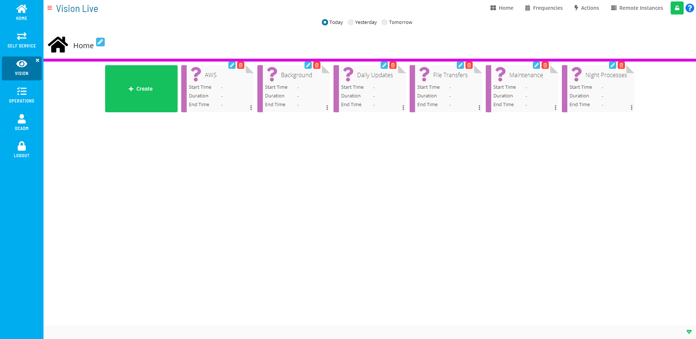

# Working in Admin Mode

Users in the «ocadm» role will see a Vision Live page that is similar to
the example graphic here.

Admin Mode Vision Live Page Display

Users in the «ocadm» role will have access to the Vision Frequencies,
Vision Actions, and Vision Remote Instances pages. Only users in the
«ocadm» role will have access to Vision Remote Instances.

Users not in the «ocadm» role must be granted the appropriate Vision
privileges to view or perform functions:

- Maintain Vision Actions
- Maintain Vision Frequencies
- Maintain Vision Workspaces
- View Vision Workspaces

:::note
For more information about Function Privileges including those pertaining to Vision, refer to [Function Privileges](../../../administration/privileges.md#function-privileges) in the **Concepts** online help.
:::

From this page, you can do any of the following:

- [Manage Vision Settings](Managing-Vision-Settings.md)
- [Manage Vision Frequencies](Managing-Vision-Frequencies.md)
- [Manage Vision Actions](Managing-Vision-Actions.md)
- [Manage Vision Remote     Instances](Managing-Vision-Remote-Instances.md)
- [View Cards in Vision     Live](Viewing-Cards-in-Vision-Live.md)
