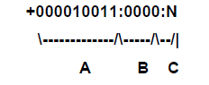

# Operations Machine Messages

Each LSAM returns different status messages while a job is running and when a job completes. The status messages described in this topic appear in the 20-character string following the OpCon job status in Schedule Operations. For a list of File transfer messages, refer to [Operations File Transfer Messages](Operations-File-Transfer-Messages.md).

## IBM i LSAM Messages

The table below presents LSAM status messages forwarded to the SAM. The message descriptions are displayed in Schedule Operations in the graphical interfaces following the job status.

| Status | Return Code | Meaning |
| :---: | --- | --- |
| 0 | SMA0030 | Job not found |
| 1 | SMA0001 | Job Description in run request is invalid |
| 1 | SMA0002 | Job Queue in run request is invalid |
| 1 | SMA0003 | Job Output Queue in run request is invalid |
| 1 | SMA0004(a) | User ID in run request is invalid |
| 1 | SMA0004(b) | SBMDBFCMD failed, unable to complete user authority check |
| 1 | SMA0004(c) | SBMDBFCMD failed, user not authorized to command |
| 1 | SMA0005 | Current Library in run request is invalid |
| 1 | SMA0006 | Job name is invalid. It should be alpha-numeric |
| 1 | SMA0007 | Job subsystem name cannot be determined |
| 1 | SMA0008 | Job Queue is held, job cannot run until queue is released |
| 1 | SMA0020 | Pre-run image in run request is invalid |
| 1 | SMA0021 | Run image in run request is blank |
| 1 | SMA0022 | Run image in run request is invalid (failed IBM i CMDCHK) |
| 1 | SMA0023 | Run job submission failed |
| 1 | SMA0024 | Job initial library list is invalid |
| 1 | SMA0025 | Unrecognized job type in OpCon job start request (TX1) |
| 1 | SMA0027 | FTP job user profile or password invalid |
| 1 | SMA0028 | FTP job sub-command source member file error |
| 1 | SMA0029 | FTP job invalid action type |
| 1 | SMA0042 | FTP job remote system name not supplied |
| 1 | SMA0044 | Tracked or Queued Job start request did not include Private Data with Job ID |
| 1 | SMA0045 | LSAM cannot find Job Tracking record for Tracked/Queued Job start request |
| 1 | SMA0052 | Tracked/Queued Job already released or cancelled by IBM i Operator |
| 1 | SMA0062 | OpCon transaction XML field code is invalid |
| 1 | SMA0067 | SMAFT job request received with no source IP address |
| 1 | SMA0073 | Job auxiliary data in XML fields is invalid, job request rejected |
| 1 | SMA0108 | Operator Replay failed: Invalid script name, not on file |
| 2 | SMA0010 | Maximum number of jobs in system exceeded |
| 3 | ACTIVE | Pre-run job is active, response to Type 2 message |
| 3 | ACTIVE HELD | Pre-run job is active but held, response to Type 2 message |
| 3 | SMA0033 | Pre-run job is active |
| 3 | SMA0040 | Pre-run job is active - $JOB:KILL command failed |
| 4 | SMA0034 | Pre-run job error |
| 4 | SMA0096 | Pre-run job already ended – job not found for Kill request |
| 4 | SMA0098 | Pre-run ended by user request ($JOB:KILL) |
| 5 | MSGW- | Active job in Message Waiting status, message text follows |
| 5 | ACTIVE | Run job is active, response to Type 2 message |
| 5 | ACTIVE HELD | Run job is active but held, response to Type 2 message 
| 5 | SMA0031 | Job waiting to run |
| 5 | SMA0035 | Run job is active |
| 5 | SMA0041 | Run job is active - $JOB:KILL command failed |
| 6 | SMA0036 | Run job is complete |
| 6 | SMA0100 | Operator Replay job completed OK |
| 7 | SMA0037 | Run job is error |
| 7 | SMA0064 | SMAFT Server get-file (IFS files) program SMAFTSR10 failed |
| 7 | SMA0064 | SMAFT Server get-file (IBM i save files) program SMAFTSR20 failed |
| 7 | SMA0064 | SMAFT Server get-file (DB2 files) program SMAFTSR30 failed |
| 7 | SMA0074 | SMAFT Agent unable to find transfer job index master record |
| 7 | SMA0075 | SMAFT Agent job did not find any transfer task definition fields |
| 7 | SMA0076 | SMAFT Agent job found invalid XML field code in job parameters file |
| 7 | SMA0077 | SMAFT Agent job detected a failure of the XML parser module |
| 7 | SMA0078 | SMA File Transfer job failed |
| 7 | SMA0079 | SMA File Transfer encryption or compression option not supported |
| 7 | SMA0080 | SMA File Transfer Destination file exists and option is do not overwrite |
| 7 | SMA0081 | SMAFT Agent put-file (IFS files) program SMAFTAR10 failed |
| 7 | SMA0082 | SMAFT Agent put-file (IBM i save files) program SMAFTAR20 failed |
| 7 | SMA0083 | SMAFT Agent put-file (DB2 files) program SMAFTAR30 failed |
| 7 | SMA0084 | SMAFT: IFS file type is invalid, only type STFM (stream file) is supported |
| 7 | SMA0085 | SMAFT value supplied for "If File Exists" parameter is not recognized |
| 7 | SMA0086 | SMAFT Agent cancels transfer request because file exists and option is do not overwrite |
| 7 | SMA0087 | SMAFT Agent failed during attempt to backup target file |
| 7 | SMA0088 | SMAFT Agent detected invalid character in record separator following hex escape sequence |
| 7 | SMA0089 | SMAFT Agent detected invalid character in record separator following octal escape sequence |
| 7 | SMA0090 | SMAFT Agent detected invalid character in record separator following an escape character |
| 7 | SMA0091 | SMAFT Agent detected invalid hexadecimal number value in record separator |
| 7 | SMA0092 | SMAFT Agent detected invalid octal number value in record separator |
| 7 | SMA0093 | SMAFT Agent detected invalid character number in record separator |
| 7 | SMA0094 | SMAFT Agent unable to clear target file that is subject to overwrite |
| 7 | SMA0095 | SMAFT Agent failed during creation of target file that did not exist |
| 7 | SMA0097 | Job run command has already ended – job not found for Kill request |
| 7 | SMA0099 | Run job ended by user request ($JOB:KILL) |
| 7 | SMA0101 | Operator Replay failed: Telnet host not recognized (getHostByName) |
| 7 | SMA0102 | Operator Replay failed: Cannot open socket to use with telnet (sock) |
| 7 | SMA0103 | Operator Replay failed: Cannot connect to telnet service (connect) |
| 7 | SMA0104 | Operator Replay failed: Failed to set socket attributes for telnet session (fcntl) |
| 7 | SMA0105 | Operator Replay failed: Bell character received = typed (Send) value error |
| 7 | SMA0106 | Operator Replay failed: Replay script timeout |
| 7 | SMA0107 | Operator Replay failed: Error in script control definitions |
| 7 | SMA0109 | Operator Replay failed: Script has no sequence records |
| 7 | SMA0135 | SMAFT Agent failed to grant authority to new backup file in SMABAK library |
| 7 | SMA0136 | SMAFT Agent detected non-numeric record length in pre-pended data before first received data record |
| 7 | SMA0137 | SMAFT Agent detected non-numeric record length embedded between variable records in received data |
| 7 | SMA0138 | SMAFT Agent unable to delete old backup copy of save file in SMABAK library |
| 9 | SMA0038 | Job completed with no error |
| 9 | SMA0039 | Job completed with status not equal 0 |

## MCP Machine Messages

The table below presents LSAM status messages forwarded to the SAM and supporting services. The message descriptions are displayed in Schedule Operations in the graphical interfaces following the job status. The 20-character status description field contains a five-character area reserved for the ClearPath MCP mix number followed by a 15-character description. All TX messages referenced in the table below indicate a message sent from SMANetCom to the LSAM.

| Message | Description |
| --- | --- |
| ADOPTED | Indicates a tracking request has been received by the LSAM. |
| ALREADY RUNNING | An OpCon job initiation request (TX1) was received for this job and the job is running on the ClearPath MCP. |
| ATTRIBUTE ERR | Assignment of task attributes was attempted on a job initiated with a RUN. One of the task attributes is erroneous. Refer to the system log for a display of the error message from the HANDLEATTRIBUTES procedure.  Verify the job definition details. |
| COMPLETED | The job completed successfully. |
| COMPLETED–ADOPT | A tracked job has completed successfully. |
| DS | The job terminated abnormally. |
| DS OUT OF QUEUE | The job was DS'ed while still queued. |
| F DS | The job experienced a fault and was terminated abnormally. |
| FAIL MSG | The WFL displayed a message that matched one of the Fail Codes, causing the job to be reported as failed in Schedule Operations. |
| FAILED –ADOPT | A tracked job has failed. (The HISTORY task attribute indicates job finished in error.)|
| JJJJJ/TTTTTCOMP OK | The task completed successfully. JJJJJ is the job number. TTTTT is the task number. |
| JJJJJ/TTTTTDS | The task terminated abnormally. JJJJJ is the job number. TTTTT is the task number. |
| JJJJJ/TTTTTFAILCODE | The task displayed a message that matched one of the Fail Codes, causing the task to be reported as failed in Schedule Operations. JJJJJ is the job number. TTTTT is the task number. |
| JJJJJ/TTTTTF DS | The task experienced a fault and was terminated abnormally. JJJJJ is the job number. TTTTT is the task number. |
| JJJJJ/TTTTTO DS | The system operator terminated the task abnormally. JJJJJ is the job number. TTTTT is the task number. |
| JJJJJ/TTTTTP DS | The task was terminated abnormally because of a program fault. JJJJJ is the job number. TTTTT is the task number. |
| JJJJJ/TTTTTQ DS | The task was terminated abnormally because of an improper job queue definition or a job queue error. JJJJJ is the job number. TTTTT is the task number. |
| JJJJJ/TTTTTRESETCODE | The task displayed a message that matched one of the Fail Reset codes, causing the task to be reported as Finished OK in Schedule Operations.  JJJJJ is the job number. TTTTT is the task number. |
| JJJJJ/TTTTTSNTX/SCRY | An OpCon task initiation request (TX1) was received by the LSAM, but the initiation attempt failed because of an invalid syntax used in the construction of the file title. JJJJJ is the job number. TTTTT is the task number. |
| JOB ARRAY FULL | This message is sent in response to an OpCon job initiation request (TX1). The message occurs when the number of active jobs, according to the OS handler (SMA/MCP/INTERFACE), has reached the maximum defined in the LSAM configuration file. OpCon attempts job initiation again. |
| JOB NOT ACTIVE | This message is sent in response to an OpCon job status request (TX2) or to an OpCon job completion acknowledgment (TX3). Although the job was found in the tracking file, the record is not available because the job is no longer active. |
| JOB NOT FOUND | This message is sent in response to an OpCon job status request (TX2) or to an OpCon job completion acknowledgment (TX3). The job was not found in the tracking file.  This can be the result of any number of situations (multiple SAMs connected to a single LSAM, delayed delivery of a TX1 for a job on which a JOB:TRACK event was sent to SAM, etc.). |
| JOB Q FULL | This message is sent in response to any OpCon job initiation request (TX1) that is received when the number of active jobs, determined by the COMM Handler (SMA/COMM), has reached the maximum. The maximum number is defined in the LSAM configuration file.  OpCon attempts job initiation again. |
| LSAMRESTARTING | This message is sent following a restart/recovery of the LSAM modules. The job was present in the LSAM arrays before the LSAM terminated. This is the initial status following an LSAM recovery. It is followed by a current status of the job. |
| MISSING OBJECT | The Details screen in the Enterprise Manager contains the RUN command, but the file named in the File Title is not present. Verify the USERCODE, FAMILY, and spelling. The usercode does not have a family assignment and the Job Details File Title does not include the family name of the program. |
| NO JOB TITLE | No file title was defined on the Details screen in the Enterprise Manager. Note: The PARAM/ATTR ERR message replaces NO JOB TITLE when the "Contemporary, XML" protocol is in use. |
| NO WFL FILE | The Details screen in the Enterprise Manager contains the START command, but the file named in the File Title is not present. Verify the user code, family, and spelling. The mix number of this status description belongs to the LSAM task that initiates the WFL compile. It is not the mix number for the WFL compile itself. The usercode does not have a family assignment and the Job Details File Title does not include the family name of the WFL. Note: The PARAM/ATTR ERR message replaces NO WFL FILE when the "Contemporary, XML" protocol is in use. |
| NOT CODE FILE | The Details screen in the Enterprise Manager contains the RUN command, but the File Title is not the name of an existing executable file. |
| NOT DSED | A "Kill" was requested for this job, but the job was not O-DSed. This message often occurs when the kill was attempted after the job's completion. |
| NOT FOUND-ARRAY | This message is sent in response to an OpCon job status request (TX2) or to an OpCon job completion acknowledgment (TX3) when an OpCon Job ID is not in the OS Handler (SMA/MCP/INTERFACE) tables. |
| NOT JOB FILE | The Details screen in the Enterprise Manager contains the START command, but the File Title is not the name of an existing WFL file. |
| NOT VALID | The job could not be located and the status is unknown. This message may be received following a restart/recovery of the LSAM modules. This message usually indicates the job has completed (normally or abnormally). |
| O DS | The system operator terminated the job abnormally. |
| P DS | The job was terminated abnormally because of a program fault. |
| PARAM/ATTR ERR | An OpCon job initiation request (TX1) was received by the LSAM, but the initiation attempt failed because of a parameter mismatch or invalid attribute (job name does not conform to the rules for entity names). If the START command was used, the mix number of this status description belongs to the LSAM task initiating the WFL compile, and not to the mix number for the WFL compile itself. A possible cause for this error is that the Details screen in the Enterprise Manager contains the START or RUN command, but the file named in the File Title is not present. Verify the USERCODE, FAMILY, and spelling. |
| PARAMETER ERR | The Details screen in the Enterprise Manager contains the RUN command, but a parameter is erroneous. Verify the parameter length and type. |
| PRERUN ACTIVE | The Prerun job is active. |
| PRERUN FAILED | The Prerun job failed. OpCon attempts job initiation again. |
| PRERUN WAITING | The Prerun job is in the waiting mix. |
| QUEUED | The job has been placed in a system queue. This is the first status for a WFL job that compiled successfully. When the job is released from the queue, the status changes to RUNNING. |
| RESTART H_ER nnn | Following a restart of the LSAM, the job's status could not be determined due to a GETSTATUS hard error "nnn". A description of the specific hard error may be found in the appropriate appendix of the MCP GETSTATUS/SETSTATUS Manual. |
| RESTART S_ER nnn | Following a restart of the LSAM, the job's status could not be determined due to a GETSTATUS soft error "nnn". A description of the specific soft error may be found in the appropriate appendix of the MCP GETSTATUS/SETSTATUS Manual. |
| RUNNING | This job is active. This message is also seen if a WFL has been DSed and is waiting for tasks to complete. |
| RUNNING –ADOPT | OpCon has received the tracking request and responded with a TX1 message. SMA/COMM has received the TX1 message and the job is running. |
| SCHEDULED | This job has been scheduled by the system. This message can be expected during periods of high processor usage. |
| SNTX/SECRTY ERR | An OpCon job initiation request (TX1) was received by the LSAM, but the initiation attempt failed because of an invalid syntax used in the construction of the file title. |
| TASK(S) FAILED | The job completed successfully, but one or more of the subordinate tasks within the WFL failed. |
| TASK FAILED JOB | The configuration option Fail Job if Task Fails has been set to Y. A subordinate task of the WFL has failed and consequently OpCon has reported the job as failed. |
| UNKNOWN ERROR | This message occurs when a specific reason for the job's failure could not be identified. In most cases, the WFL job has failed queue insertion. The mix number is the one most recently identified with the OpCon job. If the job has failed queue insertion, this is the mix number of the WFL compile. |
| USERCODE ERROR | The LSAM was unable to completely assume the identity (e.g., batch user privileges, family assignments, and so forth) of the usercode specified on the Details screen in the Enterprise Manager. Verify the spelling. |
| WAITING | The job is in the waiting mix. The mix number shown is the mix number of the waiting process, not necessarily the number of the parent WFL. This message is displayed momentarily even if Automated Response has been set up for the situation. When the task becomes active, again, a status of RUNNING is displayed. |
| WFL SYNTAX ERR | The WFL source file contains syntax errors. Correct the WFL source. The File Title field on the Details screen in the Enterprise Manager may contain extraneous characters, such as CR/LF, START, or RUN. The File Title field should contain only the file title of the process to be initiated; furthermore, if the job is being initiated using a RUN command, the appropriate task attributes should also be included. The WFL source file contains an "INCLUDE" statement that references a file that cannot be found. The WFL compile was DS'ed. |

## OS 2200 Job Messages

The table below presents OS 2200 LSAM status messages forwarded to the SAM. The messages are displayed in Schedule Operations of the graphical interfaces following the job status.

| Message | Description |
| --- | --- |
| <run's-termination-word\> | The run's condition word value at termination. Used to determine a successful or error termination. |
| <ST-failed-message\> | The "ST" failed message returned by the Exec when an "ST" statement is rejected. |
| *ASSIGN FAILED ON FILE-NAME FAC=ssssssssssss | This message is displayed when SAM has repeatedly tried to assign a file that should be available. The "sss" field contains the octal facility status code used to determine the cause of the reject. This message does not stop the processing and may be encountered repeatedly until the file becomes available. |
| *ASSUME ABORTED* | Displayed when a job has been submitted to the Exec, but has never started and is not detected in backlog. The job may have errored during the start process. The LSAM can only assume the job aborted during startup, without ever becoming active. This message is the result of LSAM's RSI (DEMAND) userid not allowed @@CONS RC commands, or the DEMAND session cannot be started. |
| AS <runid\> | Displayed once a job has started and the unique Exec Run-ID has been identified. |
| AWAITING ECL FILE | Displayed when a job's ECL file is exclusively assigned to another EXEC run. The job is not able to start until the LSAM is able to retrieve the ECL, the LSAM continues attempting to retrieve the file. |
| ECL FILE ERROR | Displayed when the ECL cannot be retrieved, often due to an empty file/element. |
| ECL FILE INVALID | Displayed when the ECL file identified for the job is not a valid file. |
| ECL NOT FOUND | Displayed when the ECL identified for the job is not found in the ECL file. |
| ECL READ ERROR | Displayed when a job's ECL cannot be read, often due to a corrupted ECL file/element. |
| FILE DEPEND NOT MET | Displayed when one or more file dependencies for the job are not satisfied. |
| JOB IN BACKLOG | The job has been detected in the Exec's backlog. May be due to the Exec's Batch Limit setting, or resources required by the job are not yet available. |
| PRERUN COMPLETED | The job's prerun has completed successfully, the actual job is started next. |
| RC= FINNED | Displayed when an "@@CONS RC" command for the job returns a "FINNED" response. Indicates the job terminated without providing status information to LSAM, or when the job fails to start, often due to an invalid account code rejected by the system console operator. |
| RC= NOT FOUND | Displayed when an "@@CONS RC" command for the job returns a "NOT FOUND" response. Indicates the job is no longer active, but termination status was not communicated to the LSAM, or when the job fails to start. |
| RSI RUN NOT ACTIVE | Displayed when the LSAM RSI (DEMAND) session is not active. This may be due to an invalid userid and password. The LSAM requires the job with a later start time. Investigate and correct the RSI issue to re-enable the LSAM to start jobs. Note: The LSAM attempts to use the @START command for jobs with the same ACCT/User-ID as the LSAM. |
| ST key Error - INVALID USERID | This error occurs when SECOPT1 is installed and the User ID used for starting an Exec job is invalid. |
| ST STMT SUBMITTED | Displayed when the "ST" (start) statement has been submitted to the Exec, but the job has not yet become active. |
| START CMD FAILED | Displayed when the "@START" command has failed for an unidentifiable reason. |
| START FILE PROBLEM | Displayed when the LSAM is unable to manipulate the job's tracking file. Additional information is displayed on the system console. |
| START STMT SUBMITTED | Displayed when the "@START" statement has been submitted to the Exec, but the job has not yet become active. |
| TRACKING FILE GONE | Displayed when a job terminates without providing termination status to the LSAM, causing the job's tracking file to be deleted. This indicates a job error termination, or an ECL issue involving the premature releasing of the tracking file. |

### OS 2200 LSAM Messages Displayed at System Console

The following messages are displayed by the LSAM at the Unisys OS 2200 system console:

| Message | Description |
| --- | --- |
| INIT ERROR STATUS = <xxxx\> | The program is unable to initialize a TIP connection. The <xxxx\> field contains the four-character TIP status code identifying the error Refer to Unisys TIP documentation for the meaning of the status code. |
| DEMAND SESSION NOT ESTABLISHED DUE TO: MISSING OR INVALID USERID/PASSWORD | The LSAM is unable to start a DEMAND run due to incorrect sign-on information. |
| DEMAND SESSION NOT ESTABLISHED DUE TO: DEMAND QUOTA EXCEEDED | The LSAM is unable to start a DEMAND run due QUOTA restrictions. |
| DEMAND SESSION NOT ESTABLISHED DUE TO: RESOURCES NOT AVAILABLE | The LSAM is unable to start a DEMAND run due to lack of system resources (e.g., exceeds the number of DEMAND runs allowed). |
| * INVALID REALTIME PRIORITY: RAISED TO REALTIME LVL 35 | The RealTime option has been activated on the program's XQT statement, but the priority provided is not valid (not between 02 and 35, inclusive). The program assumes the priority of 35. |
| * INVALID REALTIME PRIORITY: RAISED TO REALTIME LVL: <param-RT-level\> | The RealTime option has been activated on the program's XQT statement, but the priority provided is not valid (not between 02 and 35, inclusive). The program assumes the priority of 35. |
| * REALTIME OPTION SELECTED, BUT NON-NUMERIC LEVEL: <xx\>* ASSUMING REALTIME PRIORITY 35 | The RealTime option has been activated on the program's XQT statement, but the priority provided is not valid (not a number between 02 and 35, inclusive). The program assumes the priority of 35. The <xx\> field displays the invalid priority provided. |
| LSAM INITIALIZATION COMPLETE | The LSAM has properly initialized and is ready to process batch jobs. |
| LSAM on duty at <hh:mm\> ON <mm/dd/yyyy\> | The LSAM has started (on duty) at time on date. |
| ** REG KEYIN ERROR, STATUS= <xxxxx\> | The program received an error while attempting to register a console keyin reserved word. The <xxxxx\> field contains the error code returned by the registration procedure; refer to Unisys documentation to identify the meaning of the error code. |
| Keyin <key-word\> Registered for <console-mode\> users | The program has successfully registered the <key-word\> as a console command available to users with the <console-mode\> capabilities, or higher. |
| LSAM SHUTDOWN IN PROCESS|The LSAM is in process of terminating. |
| LSAM off duty at <hh:mm\> ON <mm/dd/yyyy\> | The LSAM is no longer active (off duty) at time on date. |
| TROUBLE <xxxx\> | The program has encountered trouble while attempting to manipulate TIP file data. The <xxxx\> field contains the TIP error code; refer to Unisys documentation to identify the meaning of the error code. |
| * UNAUTHORIZED @@CONS KEYIN: and<keyin-data-received\> andRECEIVED FROM: <source-of-keyin\> | A console keyin from an unauthorized source has been received. The <keyin-data-received\> field contains the keyin received. The <source-of-keyin\> field contains the terminal identification the keyin was received from. |
| LSAM JOB RECORD WRITE FAILURE | The LSAM encountered an error while attempting to write job data to the TIP file. The breakpoint file of the run contains additional error information. |
| LSAM ARRAY RECORD READ FAILURE | The LSAM encountered an error while attempting to read pointer array data from the TIP file. The breakpoint file of the run contains additional error information. |
| LSAM ARRAY RECORD WRITE FAILURE | The LSAM encountered an error while attempting to write pointer array data to the TIP file. The breakpoint file of the run contains additional error information. |
| <OpCon/xps-Job-ID\> is currently running | The OpCon job has been started and is processing, a run-id for the job has not yet been identified. |
| <OpCon/xps-Job-ID\> (<Exec-Run-ID\>) is currently running | The OpCon job has been started and is processing with the <Exec-Run-ID\>. |
| <OpCon/xps-Job-ID\> Pre-run errored <hh:mm mm/dd/yyyy\> | The Pre-run for OpCon job has errored at time date. |
| <OpCon/xps-Job-ID\> errored <hh:mm mm/dd/yyyy\> | The OpCon job has errored at time date. |
| <OpCon/xps-Job-ID\> (<Exec-Run-ID\>) errored <hh:mm mm/dd/yyyy\> | The OpCon job with Exec-Run-ID errored at time date. |
| <OpCon/xps-Job-ID\> Pre-run no status...assume aborted | The Pre-run for OpCon job has been started, but status information is not available. The LSAM assumes the pre-run has aborted. This is the result of the pre-run job not providing status to LSAM and the LSAM DEMAND run unable to retrieve status using the @@CONS RC command, most likely a problem with the DEMAND user-id configuration. |
| <OpCon/xps-Job-ID\> no status...assume aborted | The OpCon job has been started, but status information is not available. The LSAM assumes the job has aborted. This is the result of the job not providing status to LSAM and the LSAM DEMAND run unable to retrieve status using the @@CONS RC command, most likely a problem with the DEMAND user-id configuration. |
| <OpCon/xps-Job-ID\> (<Exec-Run-ID\>) no status...assume aborted | The OpCon job, with Exec-Run-ID, has been started, but status information is not available. The LSAM assumes the job has aborted. This is the result the LSAM DEMAND run unable to retrieve status using the @@CONS RC command, most likely a problem with the DEMAND user-id configuration. |
| CANT ESTABLISH JOB REC LOCK | The LSAM is unable to lock a job record in the TIP file for exclusive use. |
| LSAM JOB RECORD WRITE FAILURE | The LSAM attempted to write job information in the TIP file, but the write failed. Most likely a problem with the TIP file definition. |
| LSAM ARRAY RECORD READ FAILURE | The LSAM attempted to read a pointer array record from the TIP file, but the read failed. Most likely TIP file corruption, a failure to properly initialize the TIP file, or a problem with the TIP file definition. |
| LSAM POST RUN JOBID NOT FOUND <OpCon/xps-Job-ID\> | The OpCon job related to a pre-run job cannot be found in the TIP file. Most likely a TIP file corruption. |
| <OpCon/xps-Job-ID\> ECL LINE TRUNCATED TO 80 CHARACTERS | The LSAM has detected an ECL command (beginning with @) exceeding 80 characters in length. The ECL line is truncated to 80 characters. ECL command lines longer than 80 characters (without a continuation) are invalid. Most likely a comment on the line caused it to exceed 80 characters. |
| <RSI-error-message-returned\> and SHUT DOWN OF RSI IN PROCESS | While accessing the DEMAND run, the LSAM received the RSI-error-message-returned. The DEMAND run is terminated. The LSAM attempts to restart the DEMAND run. |
| <OpCon/xps-Job-ID\> duplicated, running as <Exec-Run-ID\> | The Exec Run-ID for OpCon job has been duplicated. The Exec has assigned Exec-Run-ID to the job. |
| *ST FAIL:<OpCon/xps-Job-ID\> ERR=<xx\> STAT=<start-error-message\> | The @@CON ST command for the OpCon job failed. The ERR field contains an LSAM assigned error code, the STAT field contains the error message returned by the Exec in response to the ST command. |
| <OpCon/xps-Job-ID\> (<Exec-Run-ID\>) is waiting in backlog | The OpCon job, with Exec-Run-ID, has been detected in the Exec backlog. This is the result of the Exec batch limit set lower than the OpCon concurrent job limit, or facilities required by the job are not available, or a batch hold (CS H) on the system. |
| <OpCon/xps-Job-ID\> SUBMITTED AT <hh:mm\> ON <mm/dd/yyyy\> | The OpCon job start command has been submitted at time on date. |
| <OpCon/xps-Job-ID\> STARTING AS EXEC JOB <Exec-Run-ID\> | The OpCon job has been assigned the Exec-Run-ID. |
| <OpCon/xps-Job-ID\> IS A PRE-RUN JOB | The OpCon job started is a pre-run job. |
| <OpCon/xps-Job-ID\>-NO START DATA AVAILABLE | The LSAM has received a start command from OpCon for a job without ECL location data. |
| ECL FILE NOT FOUND FOR JOB: <OpConxps-Job-ID\> | The ECL file for the OpCon job cannot be found on the system. Most likely an invalid ECL location has been entered for the job. |
| START-FILE NOT AVAILABLE FOR JOB.....<OpConxps-Job-ID\> | The LSAM cannot assign the ECL file for the OpCon job. The Exec has rejected the file assignment for a reason other than "not catalogued". The file may be "unloaded", or the LSAM is not authorized to access the file. |
| ECL NOT IN FILE, JOB:<OpConxps-Job-ID\> | The file element is not in the ECL file identified for OpCon job. Either the element name is incorrect, or the file name is incorrect. |
| ECL IS EXCL ASGED BY ANOTHER RUN and RETRYING START OF <OpConxps-Job-ID\> | The ECL file for OpCon job is exclusively assigned to another run. The LSAM continues attempting to assign the ECL file. |
| *START FAIL:<OpCon/xps-Job-ID> ERR=<xx\> STAT=<start-error-message\> | The @START command for OpCon job failed. The ERR field contains an LSAM assigned error code. The STAT field contains the error message. |
| SDFIO SYNTAX ERR: <SDFIO-data\> | A syntax error has been returned by the EXEC SDF services module when LSAM attempted to access an ECL file. The SDFIO-data contains the information used when the error occurred. |
| SDFIO ASG ERR, FAC.......<facility-status\> | The EXEC SDF services module returned an error while attempting to assign an ECL file. The facility-status contains the FAC error code. |
| LSAM IS UNABLE TO SIGN ON THE SYSTEM | The LSAM is unable to sign-on a DEMAND run. May be due to improper privileges for the LSAM, or system resources are not available. |

## OS 2200 LMAM Messages

The table below presents OS 2200 LMAM status messages forwarded to the SAM. The messages are displayed in Schedule Operations of the graphical interfaces following the job status.

| Message | Description |
| --- |- -- |
| Submitted to Mam-<site-id\> | The job has been submitted to BIS MAM |
| MAM-<site-id\>:<BIS-run-name\> | Last active BIS run name captured for job |

### OS 2200 LMAM Messages Displayed at System Console

| Message | Description |
| --- | --- |
| **** LMAM *** LMAM/<version\> | The LMAM program version, displayed upon console at startup. |
| MAM SITE <site-id\> ACTIVATED | The LMAM has activated MAM site-id. |
| | The LMAM has properly initialized and is ready to process BIS runs. |
| LMAM on duty at <hh:mm\> on <mm/dd/yyyy\> | The LMAM has started (on duty) at time on date. |
| Keyin <keyin\> Registered for <console-mode\> users | The program has successfully registered the <key-word\> as a console command available to users with the <console-mode\> capabilities, or higher. |
| * INVALID REALTIME PRIORITY: <xx\> and * ASSUMING REALTIME PRIORITY 35 | The RealTime option has been activated on the program's XQT statement, but the priority provided is not valid (not between 02 and 35, inclusive). The program assumes the priority of 35. |
| * REALTIME OPTION SELECTED, BUT NON-NUMERIC LEVEL: <xx\> and * ASSUMING REALTIME PRIORITY 35 | The RealTime option has been activated on the program's XQT statement, but the priority provided is not valid (not a number between 02 and 35, inclusive). The program assumes the priority of 35. The <xx\> field displays the invalid priority provided. |
| INIT ERROR STATUS = <TIP-status-code\> | The program is unable to initialize a TIP connection. The <TIP-status-code\> field contains the four-character TIP status code identifying the error; refer to Unisys TIP documentation for the meaning of the status code. |
| MAM PARAMETERS NOT AVAILABLE | Parameters necessary to activate MAM have not been defined. Use LSAMCFG/ECL to define MAM parameters. |
| NO BIS SITES ARE ACTIVE | There are no MAMs active. BIS jobs cannot be processed until the MAM(s) are activated with a console keyin. |
| ** REG KEYIN ERROR, STATUS= <keyin-registration-error-code\> | The program received an error while attempting to register a console keyin reserved word. The <keyin-registration-error-code\> field contains the error code returned by the registration procedure; refer to Unisys documentation to identify the meaning of the error code. |
| * UNAUTHORIZED @@CONS KEYIN: and <keyin-received\> and RECEIVED FROM: <terminal-id\> | A console keyin from an unauthorized source has been received. The <keyin-data-received\> field contains the keyin received. The <source-of-keyin\> field contains the terminal identification the keyin was received from. |
| JOBS EXIST FOR AN INACTIVE BIS SITE and Mam-<site-id\> is Down and WILL UP MAM <site-id\> TO ALLOW PROCESSING | OpCon jobs exist for a MAM that has been detected as inactive. The LMAM attempts to activate the MAM. |
| DO AN UPMAM<site-id\> TO ALLOW PROCESSING | OpCon jobs exist for a MAM that has been terminated with a console keyin. The MAM must be activated with a console keyin before jobs are processed. |
| <OpConxps-job-id\> submitted (MAM<site-id\>) <hh:mm\> on <mm/dd/yyyy\> | The OpCon job has been submitted to MAM at time on date. |
| BIS SYSTEM NOT AVAILABLE FOR MAM-<site-id\> START UP | The LMAM detected the BIS system for the MAM is not processing. The BIS must be running prior to starting MAM. |
| ERROR SENDING TO BATCH PORT <batchport-name\> | The LMAM received an error when attempting to submit (@SYM) a file to the identified batchport queue. Most likely the batchport defined to LMAM is invalid. |
| LMAM JOB RECORD WRITE FAILURE and <TIP-FCSS-status- information \> | The LMAM attempted to write job information in the TIP file, but the write failed. The <TIP-FCSS-status-information\> field contains the TIP status error code. Refer to Unisys documentation for the error code meaning. Most likely a problem with the TIP file definition. |
| LMAM ARRAY RECORD READ FAILURE and <TIP-FCSS-status-information\> | The LMAM encountered an error while attempting to read pointer array data from the TIP file. The TIP-FCSS-status-information field contains the TIP error code. Refer to Unisys documentation for the error code meaning. |
| LMAM ARRAY RECORD WRITE FAILURE And <TIP-FCSS-status-information\> | The LMAM encountered an error while attempting to write pointer array data to the TIP file. The TIP-FCSS-status-information field contains the TIP status code. Refer to Unisys documentation for the status code meaning. |
| JOB RECORD READ FAILURE And <TIP-FCSS-status-information\> | The LMAM encountered an error while attempting to read job data from the TIP file. The TIP-FCSS-status-information field contains the TIP error code. Refer to Unisys documentation for the error code meaning. |
| CANT ESTABLISH JOB REC LOCK | The LMAM is unable to lock a job record in the TIP file for exclusive use. |
| WILL RETRY JOB <OpConxps-job-id\> | The LMAM has submitted a job to MAM which has not yet been started. The LMAM resubmits the job for starting. Occurs after MAM has been detected as not operating after a job submit has occurred. |
| <OpConxps-job-id\> CAUSED MAM TO ABORT | The BIS run for OpCon job caused MAM to abort. MAM is restarted, the job is identified as "errored". |
| <OpConxps-job-id\> IS RUNNING | The MAM has identified the job as "running". |
| <OpConxps-job-id\> HAS FINNED | The MAM has identified the job as terminated successfully. |
| <OpConxps-job-id\> HAS ERRORED | The MAM has identified the job as terminated in error. |
| JOB EXISTS FOR A BIS SITE THAT IS NOT RESPONDING and WILL ATTEMPT TO UP MAM SITE <site-id\> | The MAM has stopped communicating and has been detected as not operational. The LMAM attempts to activate the MAM. |
| MAM-<site-id\> DOWNED | The MAM has been intentionally terminated with a console keyin. |
| LMAM POST RUN JOBID NOT FOUND <OpConxps-job-id\> | The OpCon job related to a pre-run job cannot be found in the TIP file. Most likely a TIP file corruption. |
| LMAM SHUTDOWN IN PROCESS | The LMAM is in process of terminating. |
| LMAM off duty at <hh:mm\> on <mm/dd/yyyy\> | The LMAM is no longer active (off duty) at time on date. | 

### BIS Machine Messages

| Message | Description |
| --- | --- |
| MULTIPLE MAMS STARTED - EXTRA TERMINATED | A MAM has been started while another MAM is already processing. Most likely a MAM configuration error. |
| 501-COM FILE ERROR RET STATUS CODE = <status-code\>, MAM GOING DOWN | The MAM detected an error while attempting to retrieve the LMAM communications file. The status-code field contains the RET error code. MAM terminates. |
| 502-COM FILE ERROR -- ELT STATUS CODE = <status-code\>, MAM GOING DOWN | The MAM encountered an error while attempting to ELT the LMAM communications file. The status-code field contains the ELT error code. MAM terminates. |
| 503-COM FILE ERROR - NO CONTROL LINE, MAM GOING DOWN | The MAM has retrieved an LMAM communications file which does not contain a valid control line. MAM terminates. Most likely cause is the communications file being catalogued by a process other than LMAM. |
| NO COMMUNICATION WITH SAM/LMAM FOR 75 CYCLES and DOWN MAM AND UP MAM AGAIN – 183 | The MAM is unable to retrieve the LMAM communications file after 75 attempts. Most likely the LMAM is unable to detect the MAM as active. Using LMAM commands to "down" and then "up" the MAM forces LMAM to start communications with MAM. |
| MAM-<site-id\> FILE NOT AVAILABLE, STAT=<status-code\> - 196 | The MAM has detected the LMAM communications file is not available for retrieving. The status-code field contains the RET status received. |
| JOB <OpConxps-job-id\> RUN <BIS-run-name\> CANNOT BE STARTED | The MAM is unable to start the BIS-run-name associated with OpCon/xps-job-id. Most likely an invalid run name, or an error in the registration of run. |
| JOBID <OpConxps-job-id\> HAS NO STATION NUMBER and JOBID <OpConxps-job-id\> STATUS IS UNPREDICTABLE | The MAM is unable to identify the station number (terminal) of a background run. The station number is required for monitoring the run, the reported status may be inaccurate due to the inability to monitor the terminal. |
| SAM/LMAM IS DOWN - MAM IS TERMINATING | The MAM has detected that LMAM is not processing. MAM terminates. Occurs when LMAM terminates. |

## OS 2200 JORS Messages Displayed at System Console

| Message | Description |
| --- | --- |
| TIP FILE NUMBER EXPECTED | The SMAJOR/ECL does not contain the TIPFILE statement after the @XQT SMAJOR statement. Indicates a corrupted SMAJOR/ECL element. |
| INVALID REALTIME PRIORITY: <xx\> and * ASSUMING REALTIME PRIORITY 35 | The program's XQT statement activated the RealTime option, but the runstream did not provide a valid priority. The <xx\> field displays the invalid priority. Valid priority values range from 02 to 35. The program's priority defaults to 35. |
| REALTIME OPTION SELECTED, BUT NON-NUMERIC LEVEL: <xx\> and * ASSUMING REALTIME PRIORITY 35 | The program's XQT statement activated the RealTime option, but the runstream did not provide a valid priority. The <xx\> field displays the invalid priority. Valid priority values range from 02 to 35. The program's priority defaults to 35. |
| ** REG KEYIN ERROR, STATUS= <keyin-registration-status-code\> | The program received an error while attempting to register a console keyin reserved word. The <keyin-registration-status-code\> field contains the error code returned by the registration procedure. Refer to Unisys documentation for the error code's meaning. |
| SMA JOB OUTPUT RETRIEVAL ACTIVE - hh:mm:ss.tt | The Job Output Retrieval System (JORS) is ready to accept requests. |
| Keyin <keyin-word\> Registered for <console-mode\> users | The program successfully registered the <key-word\> as a console command. The command is available to users with the <console-mode\> capabilities, or higher. |
| * UNAUTHORIZED @@CONS KEYIN: and <Keyin-received\> and RECEIVED FROM: <terminal-id\> | The program received a console keyin from an unauthorized source. The <keyin-received\> field contains the unauthorized keyin. The <terminal-id\> field contains the keyin's terminal identification. |
| JORS RCD READ LOCK FAILURE | The SMAJOR is unable to establish a lock on the JORS record in the TIP file. A problem with the TIP file definition is the most likely cause. |
| *SMAJOR IS STOPPING* | SMAJOR is in the process of terminating. |
| **SMAJOR IS TERMINATING* | SMAJOR is terminating. |

## OS 2200 XFRTCP Messages Displayed at System Console

| Message | Description |
| --- | --- |
| TIP FILE NUMBER EXPECTED | The XFRTCP/ECL does not contain the TIPFILE statement after the @XQT XFRTCP statement. Indicates a corrupted XFRTCP/ECL element. |
| INVALID REALTIME PRIORITY: <xx\> and * ASSUMING REALTIME PRIORITY 35 | The RealTime option has been activated on the program's XQT statement, but the priority provided is not valid (not between 02 and 35, inclusive). The program assumes the priority of 35. |
| REALTIME OPTION SELECTED, BUT NON-NUMERIC LEVEL: <xx\> and * ASSUMING REALTIME PRIORITY 35 | The RealTime option has been activated on the program's XQT statement, but the priority provided is not valid (not a number between 02 and 35, inclusive). The program assumes the priority of 35. The <xx\> field displays the invalid priority provided. |
| ** REG KEYIN ERROR, STATUS= <keyin-registration-status-code\> | The program received an error while attempting to register a console keyin reserved word. The <keyin-registration-status-code\> field contains the error code returned by the registration procedure. Refer to Unisys documentation to identify the meaning of the error code. |
| Keyin <keyin-word\> Registered for <console-mode\> users | The program has successfully registered the <key-word\> as a console command available to users with the <console-mode\> capabilities, or higher. |
| ATTACH TO TSAM AS TSU <TSU-name\> WAS SUCCESSFUL | The XFRTCP has successfully attached to the communications software TSU process. The TSU-name field contains the name of the process. |
| ATTACH TO TSAM AS TSU < TSU-name\> FAILED | The XFRTCP has failed to attach to the communications software TSU process. Most often related to an invalid TSU Process name or password. |
| OPCON COMM HANDLER (XFERIF<xx\>/<version\>) READY | The XFRTCP has successfully initialized and is ready for network communications. |
| * UNAUTHORIZED @@CONS KEYIN: and<Keyin-received\> and	RECEIVED FROM: <terminal-id\> | A console keyin from an unauthorized source has been received. The <keyin-data-received\> field contains the keyin received. The <source-of-keyin\> field contains the terminal identification the keyin was received from. |
| SAM / NETCOM USING LEGACY PROTOCOL | The SAM/NETCOM is configured to communicate in LEGACY protocol. The configuration must be "Contemporary, Non-XML". |
| JOB <OpConxps-job-id\> ERRORED ON <mm/dd/yyyy\> AT <hh:mm:ss\> and JOB <OpConxps-job-id\> ECL: <qual*file.element/version\> | The configuration option is set to display the job's ECL location on error terminations. |
| LSAM NO LONGER ACTIVE | The XFRTCP has detected the LSAM is not processing. Start the LSAM to resolve. |
| LSAM-LOCK FILE NOT FOUND ** | The XFRTCP has detected the LSAM-LOCK file is not catalogued. Catalogue the <lsam-qualifier\>*LSAM-LOCK file to resolve. |
| REQUESTS EXCEED OUTWARD FLOW | The XFRTCP is receiving more requests than can be processed. Most likely a network communications problem between NETCOM and XFRTCP. |
| CANT ESTABLISH EVENT REC LOCK | The XFRTCP is unable to establish a lock on an Event record in the TIP file. Most likely a problem with the TIP file definition. |
| *XFRTCP IS STOPPING* | XFRTCP is in the process of terminating. |
| **XFRTCP IS TERMINATING* | XFRTCP is terminating. |

## SAP BW Machine Messages

To the right of the OpCon Job Status in Schedule Operations, the SAP BW LSAM populates a twenty-character message to communicate numeric job completion information.

* For jobs that are running, the SAP BW LSAM returns the SAP BW Process Chain ID. The 20-character termination description in Schedule Operations displays part of the Chain ID. The complete 25 characters Chain ID displays in the Job Configuration screen.
* For jobs that Finish OK, the SAP BW LSAM returns information in the following format: 0-< Partial Process Chain ID\>
*  For jobs that Failed, the SAP BW LSAM returns information in the following format: <LSAM Exit Code\> - <SAM job number or SAP Process Chain ID\>
  * If the LSAM was unable to start the SAP BW Process Chain before it failed, the message contains the SAM job number.
  * If the LSAM was able to start the SAP BW Process Chain before it failed, the message contains the SAP Process Chain ID.

:::note
The SAP BW LSAM returns more detailed alpha numeric error messages to the LSAM Error Messages parameter in the Job Configuration screen of Schedule Operations. Refer to the Configuration tab information in [Job Information](../Files/UI/Enterprise-Manager/Job-Information.md) in the **Enterprise Manager** online help.
:::

### SAP BW LSAM Specific Exit Conditions

The following is a list of SAP BW LSAM exit conditions for failed jobs. If an exit condition is not in this list, the LSAM Exit Code position of the return status is a Windows error code (refer to [Windows Machine Messages](#Windows) for a list of Windows exit codes).

| SAP BW LSAM Exit Condition Number | Description |
| :---: | --- |
| 70001 | Error in trying to start the BW Process Chain |
| 70002 | Error in retrieving the log for BW Process Chain |

## SAP R/3 and CRM Machine Messages

To the right of the OpCon Job Status in Schedule Operations, the SAP R/3 and CRM LSAM populates a 20-character message to communicate numeric job completion information.

For jobs that are running, the LSAM returns the SAP job number.

If the running job has child jobs, the LSAM returns the current status of the child job(s) in following the format: <Child Name\> - <Current Status\>

* The Child Name displays up to 15 characters of the child job name.
* The current status contains one of the following:
  * **Actv**: Active
  * **Rdy**: Ready
  * **Int**: Intercepted
  * **Schd**: Scheduled
  * **Fin**: Finished
  * **Term**: Terminated
  * **Rel**: Released

The complete child name and its current status are available in the Job
Configuration screen.

* For jobs that Finish OK, the LSAM returns information in the following format: 0-< SAP job ID\>
* For jobs that Failed, the LSAM returns information in the following format: <LSAM Exit Code\> - <SAM or SAP job number\>
  * If the LSAM was unable to create a copy of the SAP R/3 and CRM job before it failed, the message contains the SAM job number.
  * If the LSAM was able to create a copy of the SAP R/3 and CRM job before it failed, the message contains the SAP Job number.

:::note
The SAP R/3 and CRM LSAM returns more detailed alpha numeric error messages to the LSAM Error Messages parameter in the Job Configuration screen of Schedule Operations. Refer to the Configuration tab information in [Job Information](../Files/UI/Enterprise-Manager/Job-Information.md) in the **Enterprise Manager** online help.
:::

### SAP R/3 and CRM LSAM-Specific Exit Conditions

The following is a list of SAP R/3 and CRM LSAM exit conditions for failed jobs. If an exit condition is not in this list, the LSAM Exit Code position of the return status is a Windows error code (refer to [Windows Machine Messages](#Windows) for a list of Windows exit codes).

| SAP R/3 and CRM LSAM Exit Condition Number | Description |
| :---: | --- |
| 70001 | The Job Name the LSAM is trying to send to the SAP system is null. |
| 70002 | The Job Number the LSAM is trying to send to the SAP system is null. |
| 70003 | The USER setting in the SAPLSAM.ini file is blank. |
| 70004 | Error in logging on to SAP system: bad User ID, password, or TCP/IP address. |
| 70005 | Error in checking existing job status: could not find the job on the SAP system. |
| 70006 | Error in job copy: The LSAM could not copy the job to run it in SAP. |
| 70007 | Error in Job definition get: after the job was copied for execution, the LSAM couldn't retrieve the copied job's details; therefore, the job could not run. |
| 70008 | Error in starting the copied job: the job copy and job retrieve were successful, but the LSAM could not start the job. |
| 70009 | Error in getting the job's current status |
| 70010 | Error in reading the job log |
| 70011 | Error in getting the children job information for the current job |
| 70012 | Error in aborting job |
| 70013 | Error in reading the spool list for the job |
| 70017 | Error in starting the job immediately because no background processes were available |

### SAP BAPI Errors

The following table contains error numbers and descriptions of SAP BAPI Error Codes.

| Message Number | Description |
| :---: | --- |
| value 'XM' | xmi_messages |
| value '9' | msg_logon_gen |
| value '010' | msg_logon |
| value '011' | msg_logoff_gen |
| value '012' | msg_logoff |
| value '013' | msg_auditlevel_set |
| value '014' | msg_versions_get_gen |
| value '015' | msg_versions_get |
| value '016' | msg_version_check |
| value '017' | msg_interface_describe |
| value '018' | msg_logmsg_enter |
| value '019' | msg_log_select |
| value '020' | msg_message_formats_upload |
| value '021' | msg_already_logged_on_gen |
| value '022' | msg_already_logged_on |
| value '023' | msg_unknown_interface |
| value '024' | msg_unknown_version |
| value '025' | msg_logon_denied_gen |
| value '026' | msg_logon_denied |
| value '027' | msg_not_logged_on_gen |
| value '028' | msg_not_logged_on |
| value '029' | msg_invalid_range |
| value '030' | msg_cant_select |
| value '031' | msg_cant_log |
| value '032' | msg_cant_upload |
| value '033' | msg_invalid_parameters |
| value '034' | msg_problem_detected |
| value '035' | msg_reorg |
| value '037' | msg_reorg_gen |
| value '046' | msg_jobname_missing |
| value '047' | msg_jobid_missing |
| value '048' | msg_ext_user_missing |
| value '049' | msg_job_does_not_exist |
| value '050' | msg_progname_missing |
| value '051' | msg_no_archive_info |
| value '052' | msg_invalid_print_params |
| value '053' | msg_invalid_archive_params |
| value '054' | msg_no_release_privilege |
| value '055' | msg_job_not_active |
| value '056' | msg_no_abort_privilege |
| value '057' | msg_no_job_found |
| value '058' | msg_targethost_missing |
| value '059' | msg_no_jobsteps |
| value '060' | msg_no_job_protocol |
| value '061' | msg_empty_job_protocol |
| value '062' | msg_step_count_missing |
| value '063' | msg_no_spoollist |
| value '064' | msg_privilege_missing |
| value '065' | msg_invalid_spoolid |
| value '066' | msg_no_immediate_start_poss |
| value '067' | msg_no_resources_found |
| value '068' | msg_invalid_date_time |
| value '069' | msg_invalid_server_name |
| value '070' | msg_prog_has_no_variantv
| value '071' | msg_prog_does_not_exist |
| value '072' | msg_no_execute_privilege |
| value '073' | msg_prog_not_executable |
| value '074' | msg_no_variants_defined |
| value '075' | msg_invalid_select_option |
| value '076' | msg_select_param_missing |
| value '077' | msg_trace_before_call |
| value '078' | msg_select_jobname_missing |
| value '079' | msg_select_username_missing |
| value '080' | msg_cant_del_in_jobtable |
| value '081' | msg_cant_del_joblog |
| value '082' | msg_problem_pred_succ |
| value '083' | msg_commit_failed |
| value '084' | msg_no_delete_privilege |
| value '085' | msg_job_running |
| value '086' | msg_interface_reorg |
| value '087' | msg_interface_reorg_gen |
| value '088' | msg_parent_child_inconsistency |
| value '089' | msg_child_register_error |
| value '090' | msg_mask_error |
| value '091' | msg_param_missing |
| value '092' | msg_event_does_not_exist |
| value '093' | msg_event_raise_failed |
| value '094' | msg_job_confirmation_failed |
| value '095' | msg_wrong_confirmation_type |
| value '096' | msg_wrong_selection_par |
| value '097' | msg_parentchild_inactivev
| value '098' | msg_interception_inactivev
| value '099' | msg_wrong_counter |
| value '100' | msg_wrong_printer_name |
| value '101' | msg_selection_finished |
| value '194' | msg_cant_enq_job |
| value '195' | msg_cant_read_jobdata |
| value '196' | msg_cant_release_job |
| value '197' | msg_cant_set_jobstatus_in_db |
| value '198' | msg_cant_start_job_immediately |
| value '199' | msg_cant_update_jobdata |
| value '200' | msg_eventcnt_generation_error |
| value '201' | msg_invalid_dialog_type |
| value '202' | msg_invalid_new_jobdata |
| value '203' | msg_invalid_new_jobstatus |
| value '204' | msg_invalid_startdate |
| value '205' | msg_job_edit_failed |
| value '206' | msg_job_modify_canceled |
| value '207' | msg_job_not_modifiable_anymore |
| value '208' | msg_nothing_to_do |
| value '209' | msg_no_batch_on_target_host |
| value '210' | msg_no_batch_server_found |
| value '211' | msg_no_batch_wp_for_jobclass |
| value '212' | msg_no_modify_privilege_given |
| value '213' | msg_no_release_privilege_given |
| value '214' | msg_no_startdate_no_release |
| value '216' | msg_invalid_targetgroup |
| value '217' | msg_conflicting_targets |
| value '218' | msg_job_doesnt_have_steps |
| value '219' | msg_wrong_step_type |
| value '220' | msg_job_doesnt_have_this_step |
| value '221' | msg_cannot_get_priarc_params |
| value '222' | msg_cannot_read_job |
| value '223' | msg_cannot_modify_job |
| value '224' | msg_wrong_step_number |
| value '225' | msg_error_modifying_worktable |
| value '227' | msg_job_nosteps |
| value '228' | msg_jobcount_missing |
| value '229' | msg_invalid_target |
| value '230' | msg_error_reading_worktable |
| value '231' | msg_delete_line_error |
| value '232' | msg_no_step_info |
| value '233' | msg_wrong_action |
| value '234' | msg_no_change_authority |
| value '235' | msg_invalid_jobclass |
| value '236' | msg_wrong_client |

:::info
**Source:** *BC-XBP 6.10 Background Scheduling Job Scheduling System WAS 6.10 (Version 2.0) Documentation*. 
Walldorf, Germany: Systems, Applications & Products in Data Processing (SAP), 2002.
<http://www.sap.com/partners/icc/scenarios/technology/bc-xbp.asp/>
(accessed May 21, 2004).
:::

## Tuxedo ART Job Messages

The Tuxedo ART environment provides multiple return codes from various capabilities. These include return codes from the artjesadmin utility as well as codes from the job completion. The job completion codes can be split into the three areas, as completion code, System Abend, and User Abend.

Sometimes it is possible to receive non-numeric characters in the return code. When this happens, the return code is 9999 and the original return code can be found in the job output.

| Return Code | Description |
| :---: | --- |
| 0 - 9999 | Job completion code (prefixed by C, e.g., C0000 -- C9999) |
| 9999 | Job completion code contained non-numeric characters, refer to job log |
| 10000 -19999 | Job completion code System Abend (prefixed by S, e.g., U0000 -- S9999) |
| 19999 | Job completion code contained non-numeric characters, refer to job log |
| 20000 - 29999 | Job completion code User Abend (prefixed by U, e.g., U0000 -- S9999) |
| 29999 | Job completion code contained non numeric characters, refer to job log |
| 30000 | artjesadmin : Job completed successfully |
| 30001 | artjesadmin : Utility command failed |
| 30003 | artjesadmin : Job failed |
| 30004 | artjesadmin : Job was cancelled |
| 30005 | artjesadmin : Job is in conversion state |
| 30006 | artjesadmin : Job is executing |
| 30007 | artjesadmin : Job is queued waiting for conversion process |
| 30008 | artjesadmin : Job has been placed on hold |
| 30009 | artjesadmin : Job is queued waiting for processing to start |
| 30010 | artjesadmin : Job has been discarded |
| 30011 | artjesadmin : Execution of job is in unknown state |
| 30022 | artjesadmin : Job does not exist in Tuxedo ART environment |
| 30099 | Job initialization error |

## UNIX LSAM Messages

This section covers messages generated by the LSAM which may appear in the LSAM's log and/or error file. Whether informational or to report an error condition, messages begin with text generated by the LSAM, followed by (in parentheses):

* The message ID
* The system-specific error number returned by the operating system
* The symbolic name for this error (common to the vast majority of UNIX systems)
* A brief \[system-specific\] description of the error returned by the operating system

Not every message will contain all the items within the parentheses. In general, if the message was not the result of failure within a system routine, then only the message ID will be included. The system-specific error number and description varies from system to system. Moreover, a system call often has multiple failure modes; consequently, the same message ID may be followed by a variety of error codes.

:::tip Example
The following shows a Detailed LSAM Message which might be returned for a LSAM exit code of 000010205:

```shell
[sma_lsam] (monitor) - Unable to execute [/usr/john/job_1] for [JOB1] (120 / 2 [ENOENT] - No such file or directory)
```

In this case, the user should check what was entered for "Start Image" on the Job Details screen.
:::

There are currently over 500 messages which might be output, making a listing of each impractical. The following table lists the messages which address conditions that can generally be understood and/or corrected by the user without intervention of SMA Technologies Support personnel. Within the Message Text, "\[x\]" indicates variable data.

Once jobs are built, the Schedule Operations screen contains different information depending on a job's status. In many cases, a specific failure message is returned from the LSAM and viewable in the field "Detailed Job Messages" under the "General" tab of the Job Configuration screen (in Schedule Operations). When UNIX jobs are processing, the status information in Schedule Operations includes the Process ID (pid) number or any optional status messages.

:::note
Scripts using the sma_status utility can use the 20-character message area to display any desired text; otherwise, the PID displays in the message area. For further information, refer to **sma_status** in the **UNIX LSAM** online help.
:::

| Message Text | Explanation and/or Corrective Action |
| --- | --- |
| \[x\] multiply-defined | The indicated step \[STARTING_STEP, ENDING_STEP, RESTART_STEP\] was found to be included more than once. Check "Start Image" and "Parameters" in the job's Job Details screen. **Note:** The \[x\] multiply-defined message text applies only to jobs based on the [SMA Technologies]{.GeneralCompanyName}-supplied template job script discussed in [UNIX Job Details](../job-types/unix.md). |
| Invalid job step \[x\] | Shell variable 'next_step' set to a non-existent job Step Label as displayed. Check all settings of 'next_step' -- especially for use of incorrect letter case. **Note:** The Invalid job step \[x\] applies only to jobs based on the [SMA Technologies]{.GeneralCompanyName}-supplied template job script discussed in [UNIX Job Details](../job-types/unix.md) |
| Infinite loop detected | The job experienced 'number_of_steps' iterations and was terminated. Check the following: - Starting or Restart Step comes after Ending step in script - Step gets repeated, possibly via intervening steps - Job logic correct but 'number_of_step' set too small **Note:** The Infinite loop detected applies only to jobs based on the [SMA Technologies]{.GeneralCompanyName}-supplied template job script discussed in [UNIX Job Details](../job-types/unix.md)|
| Unable to change access for \[x\] | Access permissions for the indicated job stdout/dtderr output file could not be restricted per the LSAM Configuration setting. |
| Unable to change ownership for \[x\] | Ownership of the indicated job stdout/dtderr output file could not be changed from 'root/root' per the LSAM Configuration setting. |
| Process \[x\] did not start | The LSAM health monitor has determined that the indicated LSAM process did not start (or started but then immediately terminated). Stop the LSAM. If the cause for the lost process cannot be determined from other error messages, corrected, and the LSAM successfully re-started, then wait five minutes and re-start the LSAM. It should then start and run properly if the cause was of a momentary nature. |
| Process \[x\] has terminated | The LSAM health monitor has determined that the indicated LSAM process abnormally terminated. Stop the LSAM. If the cause for the lost process cannot be determined from other error messages, corrected, and the LSAM successfully re-started, then wait five minutes and re-start the LSAM. It should then start and run properly if the cause was of a momentary nature. |
| Sending SIGUSR1 (die) to all LSAM processes | The "bin/lsam\<*SAM_Socket*\> stop" command was given; this message is confirmation that the LSAM is in normal termination processing. |
| Unable to find \[x\] | "\[x\]" cannot be located for processing. |
| Unable to create \[x\] | "\[x\]" cannot be created for processing. |
| Unable to open \[x\] | "\[x\]" cannot be opened for processing. |
| Unable to read \[x\] | Data cannot be read from "\[x\]". |
| Unable to write \[x\] | Data cannot be written to "\[x\]". |
| Deleting \[x\] | "\[x\]" was deleted. This is normally just an informational message, and not indicative of a problem unless "\[x\]" is later referenced in an "Unable to \..." message. |
| Unable to connect to \[x\] | A socket-based connection cannot be made to the indicated remote service or system. Determine if the indicated system or service is up-and-running, and/or if the network is operational, and correct the condition. |
| Unable to send \[x1\] to \[x2\] | A message "\[x1\]" cannot be sent over the socket-based connection to the indicated remote service or system ("\[x2\]"). Determine if the indicated system or service is up-and-running, and/or if the network is operational, and correct the condition. |
| LSAM health monitor operating | Informational message to confirm that the LSAM started with the LSAM health monitor in proper operation. |
| No LSAM health monitor | Informational message to confirm that the LSAM started without the LSAM health monitor in proper operation. Execute the LSAM Configuration program to confirm that LSAM health monitoring has been disabled. |
| LSAM health monitor disabled | The LSAM health monitor has ceased operation. This is normal after issuance of the "LSAM stop" command. |
| Sender not allowed by the LSAM configuration | The portion of the LSAM which communicates with the SAM has received a message over a socket-based connection from an address not configured to be acceptable. The received message was ignored. It may be necessary to run the LSAM Configuration program to update the LSAM's configuration. |
| Received unauthorized message | Some portion of the LSAM has received a message over a socket-based connection from an unexpected address. The received message was ignored. It may be necessary to run the LSAM Configuration program to update the LSAM's configuration. |
| Received a message with a blank machine name | The portion of the LSAM which communicates with the SAM has received a message without the required machine name which identifies to the LSAM the intended recipient for the message. Mark the LSAM down in a graphical interface and stop the LSAM. Wait five minutes, then re-start the LSAM and mark it back up in a graphical interface. |
| Received a message from SAM with invalid action specified | The portion of the LSAM which communicates with the SAM has received a message with an invalid action specified. Mark the LSAM down in a graphical interface and stop the LSAM. Wait five minutes, then re-start the LSAM and mark it back up in a graphical interface. |
| Received a duplicate message from SAM | The LSAM has received a duplicate message from SAM. If this happens only occasionally, it indicates timing issues which sometimes arise in distributed processing systems like [OpCon]{.GeneralOpConGlobalName}, and is not indicative of a problem. If it happens in a series over a few minutes, it indicates an acute problem with the SAM or the intervening network hardware. |
| Missing environment variable \[x\] | The indicated UNIX shell environment variable is not defined. The variable may be either expected to be defined at the system level, or it may be an LSAM-defined variable which is not getting passed around as required. |
| Environment variable \[x\] is | The indicated UNIX shell not defined environment variable is not defined. The variable may be either expected to be defined at the system level, or it may be an LSAM-defined variable which is not getting passed around as required. |
| Received a SIGUSR1 | Each process in the LSAM should output this message during normal termination of the LSAM. If the "bin/lsam\<*SAM_Socket*\> stop" command was not given, then some process or user on the system issued a "kill" command on the indicated process. |
| Received order to stop LSAM Health Monitor | This message is output during normal termination processing. |
| \[x\] Operational | Each process in the LSAM should output this message during normal startup of the LSAM. |
| Too many arguments for \[x\] | The addition of the text for "Start Image" and "Parameters" in the job definition resulted in \> 100 arguments. An "argument" is any text but a space. For example, the Start Image/Parameters combination "/usr/john/job x y abc123 1", the start image is "/usr/john/job", and the four arguments are "x", "y", "abc123", and "1". (It is possible to include parameters in the "Start Image" text box in the EM.) |
| Blank start image for \[x\] | The indicated job contained no start image, i.e., script or program to execute. Check the Job Details screen in the EM. |
| Job \[x\] contained no UID | The indicated job had no User ID. |
| Job \[x\] contained no GID | The indicated job had no Group ID. |
| Job \[x1\] contained an invalid | The indicate User ID for the UID \[x2\] indicated job was either non-existent or incorrectly formatted. |
| Job \[x1\] contained an invalid | The indicate Group ID for the GID \[x2\] indicated job was either non-existent or incorrectly formatted. |
| Not allowed to start job \[x\] | The LSAM is configured to not as 'root' allow jobs to execute with 'root' privileges. This can be changed by running the LSAM Configuration program. |
| Unable to access start image \[x1\] for \[x2\] | The indicated Start Image could not be executed for the indicated job. The parenthesized portion of the message provides additional details, on which corrective action can be based. |
| Unable to execute \[x1\] for | The indicated item could not be \[x2\] executed for the indicated job. The parenthesized portion of the message provides additional details, on which corrective action can be based. |
| Unable to exec() \[x1\] to start | The indicated Start Image could \[x2\] not be executed for the indicated job. The parenthesized portion of the message provides additional details, on which corrective action can be based. If the LSAM determines that this was caused by an invalid reference to a shell/interpreter, e.g., the first line of the job script reads, "!\#/bin/bogus", an additional message will be generated to indicate this possibility. |
| Unable to 'cd' to $HOME for \[x\] | LSAM configuration parameter *require_HOME_directory* is enabled and the indicated job cannot be executed within the associated user's HOME directory. The most likely cause is an error defining the HOME directory when the user was added to the system, or that theHOME directory was either never created or it was deleted. |
| Received TX0 for pid = \[x\] - | This is an informational message \[x\] output to confirm receipt of a command from SAM to terminate the indicated job after the user executed the "Kill Job" command from a graphical interface. This does not indicate that the job actually was terminated; that event/inability will be confirmed in a subsequent message. |
| Can't fork() for \[x\] - | The LSAM is unable to create a decrementing max jobs to \[x\] process in which to run the indicated job, and is decreasing the number of jobs it will attempt to simultaneously run in an effort to preclude further fork() errors. If this is a recurring problem, the LSAM Configuration program can be executed to lower the number of allowed jobs and/or the OS may need tuning to handle the load. |
| Job \[x\] completed | Informational message upon proper termination of an OpCon job -- does not reflect the OK/Failed termination status. |
| Data has not arrived in \[x\] | The LSAM has not received any seconds - closing socket communication from the SAM in the indicated amount of time. The LSAM will close the connection in preparation for SAM initiating a new connection. "\[x\]" can be set with the LSAM Configuration program. |

:::tip Example
The following shows UNIX job (Ujob1) running in Schedule Operations without a user-defined status message:

```shell
Ujob1 (Daily) (Job Running – PID = 29613)
```

The following shows a UNIX job (Ujob2) running in Schedule Operations with a user-defined status message:

```shell
Ujob2 (Daily) (Job Running – Starting Step 1)
```
:::

### UNIX LSAM Exit Codes

When a job completes, the OpCon status will change to either 'Finished OK' or 'Failed'. The 20-character message text changes to include the exit codes from the job.

In the this next table is a breakdown of the LSAM Exit Codes.

:::note
Do not confuse these codes with UNIX System Exit Codes. LSAM Exit Codes come from the UNIX LSAM itself while UNIX System Exit Codes come from the UNIX operating system.
:::
#### Exit Code Breakdown



| Section | Exit Code | Valid Values | Description |
| :---: | --- | --- | --- |
| **A** | Job Exit Codes | -999999999 to +999999999 | The first 10 characters of the exit condition consist of a plus (+) or minus (-) sign followed by nine digits indicating the job termination status (refer to [LSAM-Specific Error Codes](#LSAM-Spe)). |
| **B** | Signals | 0000 to 9999 | If the job terminated due to the receipt of a signal from the operating system or through user intervention, the four-digit numeric value of that signal is specified here. |
| **C** | Core Dumped | Y/N | Indicates whether or not (Y/N) a core file was created due to the termination of a job. |

#### Unix LSAM Specific Error Codes

The following is a list of the UNIX LSAM job error codes. If an exit code is not in this list, it is a UNIX-specific exit code. For information on UNIX-specific exit codes, refer to [Completed Jobs and LSAM Exit Codes] in the **UNIX LSAM** online help.

Because errors returned vary from platform to platform, it is beyond the scope of this document to try to list the possible reasons for each error. SMA Technologies recommends:

* Examine the log files for the LSAM and determine the error number reported.
* Reference the MAN page for the system call to get more information on the causes of this failure type.

| UNIX LSAM Exit Code | Failed System Call | Description |
| :---: | --- | --- |
| 000010000 | <none\> | The job definition does not contain a User ID. |
| 000010001 | <none\> | The job definition does not contain a Group ID. |
| 000010002 | <none\> | The job definition contains an invalid User ID. |
| 000010003 | <none\> | The job definition contains an invalid Group ID. |
| 000010004 | <none\> | The SMANetCom sent a job status request (TX2) for a job or for a prerun process to the LSAM. The LSAM checked to see if the job was still running. The job was **not** running, but was marked as running in the tracking file. |
| 000010005 | <none\> | The LSAM was started and the job was shown in the tracking file to be running; however, the job was not actually running on the machine. |
| 000010006 | <none\> | The LSAM was started and the prerun was shown in the tracking file to be running; however, the prerun was not actually running on the machine. |
| 000010007 | <none\> | The job was not found in tracking file. |
| 000010008 | fork() | The system function fork() failed when attempting to create a child process. |
| 000010009 | <none\> | Privileged runs are not allowed. The LSAM configuration does not allow jobs to be submitted as root. |
| 000010010 | <none\> | Job was killed by user or system administrator. |
| 000010100 | fork() | Unable to fork() a process space for the prerun process. |
| 000010101 | setuid() | Unable to setuid() to the specified User ID for the prerun process. |
| 000010102 | setgid() | Unable to setgid() to the specified Group ID for the prerun process. |
| 000010103 | setpgid() |The system function setpgid() failed when attempting to set the parent Group ID for a prerun process. |
| 000010104 | <none\> | Start Image not found or insufficient privileges for the prerun process. |
| 000010105 | exec() | The system function exec() failed when attempting to initialize the process space for a prerun process. |
| 000010200 | fork() | Unable to fork() a process space for the job. |
| 000010201 | setuid() | Unable to setuid() to the specified User ID. |
| 000010202 | setgid() | Unable to setgid() to the specified Group ID. |
| 000010203 | setpgid() |The system function setpgid() failed when attempting to set the parent Group ID for a job. |
| 000010204 | <none\> | Start Image not found or nsufficient privileges for the job. |
| 000010205 | exec() | The system function exec() failed when attempting to initialize the process space for a job. |
| 000010299 | open() | The system function open() failed when the LSAM attempted to open the post-processing script. For more information on the *post-processing script,* refer to **sma_ppscript** in the **UNIX LSAM** online help. |
| 000010300 | fork() | The system function fork() failed when attempting to create a process for a post-processing script. |
| 000010301 | setuid() | The system function setuid() failed when attempting to set the User ID for a post-processing script. |
| 000010302 | setgid() | The system function setgid() failed when attempting to set the Group ID for a post-processing script. |
| 000010303 | setpgid() | The system function setpgid() failed when attempting to set the parent Group ID for a post-processing script. |
| 000010304 | <none\> | Start Image not found or insufficient privileges for the post-processing script. |
| 000010305 | exec() | The system function exec() failed when attempting to initialize the process space for a post-processing script. |

In many cases, a specific failure message is returned from the LSAM and viewable as field "LSAM Error Message" under the "General" tab of the Job Configuration screen. Messages begin with text generated by the LSAM, and conclude with parentheses containing an integer message ID and perhaps other test. If the error was the result of a system call, the additional text after the message ID would include the system-specific error number returned by the operating system, the symbolic name for this error (common to the vast majority of UNIX systems), and a brief description of the error as returned by the operating system. The UNIX error number and text varies from system to system. Also, a system call often has multiple failure modes, so the same message ID can be followed by a variety of error codes.

:::tip Example
The following shows a LSAM Error Message which might be returned for a LSAM exit code of 000010205:

```shell
[sma_lsam] (monitor) - Unable to execute [/usr/john/job_1] for [JOB1] (120 / 2 [ENOENT] - No such file or directory)
```

In this case, the user should check what was entered for "Start Image" on the Job Details screen.
:::

### UNIX File Arrival Exit Codes

The following is a list of UNIX LSAM exit codes specifically for File Arrival jobs.

| Exit Code | Description |
| :---: | --- |
| 1 | The file is not found. Reasons include an invalid file name, the file has not arrived yet, or permissions. |
| 2 | The path is not found. Reasons include an invalid path or permissions. |
| 3 | A file is found but the creation date is out of range. |


## Windows Machine Messages

This next table is a list of MSLSAM exit conditions for failed jobs. If an exit condition is not in this list, it is a Windows exit code.

| MSLSAM Exit Condition Number | Description |
| :---: | --- |
| 31000 | This is the initial state when the job is created. No error code has been set. |
| 31001 | The path entered for the command line on the details screen is invalid. |
| 31002 | The path entered for the prerun command line on the details screen is invalid. |
| 31003 | The prerun command line entered in the details screen for this job contains too many characters. The maximum length of the prerun is: 3276 characters |
| 31004 | The command line entered in the details screen for this job contains too many characters. The maximum length of the command line is: 4000 characters |
| 31005 | The prerun working directory entered in the details screen for this job contains too many characters. The maximum length of the prerun working directory is: 255 characters |
| 31006 | The working directory entered in the details screen for this job contains too many characters. The maximum length of the working directory is: 255 characters |
| 31007 | The LSAM could not create a process for this job. |
| 31008 | The LSAM was unable to obtain the rights for the user submitted with the job. |
| 31009 | The LSAM was unable to grant the user rights to the process. |
| 31010 | The LSAM was unable to log on as the user submitted with the job. |
| 31011 | The LSAM was unable to load the environment for the user submitted with the job. |
| 31012 | The LSAM was unable to load the Windows profile for the user submitted with the job. |
| 31013 | The LSAM was unable to unload the Windows profile for the user submitted with the job. |
| 31014 | The LSAM was unable to find the E.C.O.F. specified. |
| 31015 | The LSAM was unable to start the job in the specified user-security context (unable to impersonate the user). |
| 31016 | The LSAM was unable to find the user name for this user. This may be because the user has never logged onto this machine. |
| 31017 | Unable to get user token. |

### Windows File Arrival Exit Codes

The following is a list of Microsoft LSAM exit codes specifically for File Arrival jobs.

| Exit Code | Description |
| :---: | --- |
| 1 | The file is not found. Reasons include an invalid file name, the file has not arrived yet, or permissions. |
| 2 | The path is not found. Reasons include an invalid path or permissions. |
| 3 | A file is found but the creation date is out of range. |

## z/OS Machine Messages

Certain conditions on the z/OS LSAM may prevent SAM from completing a task and a message is produced indicating the source or cause of the error. The SAM is designed so that errors or invalid resource conditions do not cause a total halt of schedule processing. After reporting the error, the SAM may retry processing and may again encounter the same error and report it.

To prevent the SAM from encountering the same error repeatedly, the job(s) involved may be placed "ON HOLD", or the SAM may be placed "ON HOLD", until the error is resolved. Some errors may be resolved without operator intervention, such as a job exclusion or inclusion that cannot be satisfied. When the proper condition is satisfied, the SAM is notified by XPS390 and this resolves the error. If a condition is assigned to a DEMAND run, there may be a long time before the condition is satisfied; the SAM encounters the error repeatedly until resolution. Some messages require operator analysis or resolution; others are informational only.

### Message Syntax

Al: OpCon for z/OS messages are formatted with IBM standard message notation:

XPS*nnnc*

* **XPS**: The product identifier
* **nnn**: The message reference number
* **c**: A message type indicator

| Message Type | Explanation |
| :---: | --- |
| I | The message is Informational only. |
| A | The message indicates a possible or probable operator Action is required. |
| W | The message is a Warning message. Some operation or process may need review. The message indicates an Error condition. Corrective action is probable. |
| None | If type is none of the above, the message is Informational, and the type indicator represents the MODULE that issued the message:<ul><li>B=XPSUBMIT</li><li>T=XPSTATUS</li><li>X=XPSPLEX</li><li>V=XPSSUPV</li><li>O=XPSYSOUT</li><li>S=XPSERVER</li></ul> |

### Messages Displayed on the MVS SYSLOG by XPR390

| Exit Code | Message | Description |
| :---: | --- | ---| 
| XPR001I | Restart: From *start step* \[to *end step*] | Indicates a restart was requested from step *start step*, optionally ending in *end step*.|
| XPR001E | STEPNAME MISMATCH | - Indicates that step name on the starting step in the JCL does not match the name in the restart request.<br />- The job is flushed. |
| XPR005I | *stepname compcode*<br />(SKIPPED FOR RESTART) | Indicates *the stepname* was bypassed for the restart, but *compcode* is simulated for JCL conitianal processing. |
| XPR010I | DELETE *dataset name* (*volume*)<br />XPR010I UNCATLG *dataset name* (*volume*)<br />XPR010I HDELETE *dataset name* (MIGRAT)<br />XPR010I RETAIN *dataset name* (*volume*) | -Indicates *the dataset name* is going to be created in the step about to start, but it is already caraloged.<br />- OpCon takes the indicated action:<ul><li>**DELETE:** the *dataset* is to be removed from an online DASD Device.</li><li>**UNCATLG:** the *dataset* is on tape of offline DASD, and is simply uncataloged.</li><li>**HDELETE:** The HSM migrated dataset is the be deleted.</li><li>**Retain:** the *dataset* matched the XPR filter table, and no action is taken.</li></ul> |
| XPR060A | No PCB Available - Activate LSAM | Indicates XPRLIST was requested to update the filter table, but the LSAM was not been started, and no stroage anchor block is available. |
| XPR101E | Invalid or missing parms | Indicates a command was issues to XPRLIST, but the command was not recognized. |
| XPR102E | NO XPSPARMS DD OR MEMBER NOT FOUND | Indicates XPRLIST was requested to load or reload the filter table, but either the XPSPARMS DD is not present, or the requested XPRLST*xx* member is not in the dataset. |
| XPR105I | FILTER TABLE UPDATED | Indicates the XPR filter table was updated. |
| XPR200I | No Filter Table | An XPRLIST DISPLAY was requested, but there is not filter table. |
| XPR200I | Filter table contents | An XPRLIST DISPLAY was requested. This message is followed by the table contents. |

### Messages Displayed on the MVS SYSLOG by XPS390

| Exit Code | Message | Description |
| :---: | --- | ---| 
| XPS000W | Another LSAM is Already Running in the LPAR | - Indicates the new duplicate LSAM is terminated.<br />- SMA Technolgoes recommends waiting for the priot LSAM to conplete before starting its replacement. |
| XPS001I | OpCon V *v.rr.mmll* Initialized -- \[*machineid*\] | - Indicates OpCon for z/OS has initialized storage queues and contaol blocks successfully.<br />- MachineID is the MACHINEID= definition in the XPSRMnn, or the SMF ID of this LPAR, and subsequently the schedule "Machine ID" for events that is honored bu this LSAM. |
| XPS002W | XPSPRMnn Set to Vendor Defaults | - Indicates no XPSPRMnn member was located in the start parameter list of the parmeter library.<br />- The resulting default parameter values can be viewed with the "F LSAM,PARMS" command. |
| XPS003I | Storage Recovery Attempt | Issued during back out or remove processing. |
| XPS003E | Error During Storage Allocation Storage Recovery Failed for queuename | - Indicates an MVS FREEMAIN error was encountered.<br />-Contact SMA Technologies Support if this message persists of the reason for its issuance cannot be determined. |
| XPS004A | RUNPARM Not Initaliatlized-Restart | - Indicates the parms dataset was no located in the start parameter list or the parameter library and the operator answered "N" to the XPS101V operator request.<br />- Supply the Parms dataset and restart. |
| XPS005I | TCP/IP - IP Open (*nnn.nnn.nnn.nnn*) Port: *pppp* | Issued during LSAM IP network initialization to indicate the LPAR Host IP address (*nnn.nnn.nnn.nnn*) returned bu the OMVS "GETHOSTID" request, and to indicate the IP Port (*pppp*) on which XPS390 is listening for SAM messages. |
| XPS006E | \[*subroutine\]* Abend/Shutdown Detected | - Indicates the *subroutine* encountered an error and the LSAM is systematically shutting down the remaining subtasks and closing SAM Communications.<br />- The LSAM terminates and must be restarted.<br />- Contact SMA Technologies Support if this message persists or the reason for its issuance cannot be determined. |
| XPS007E | Error During Storage Allocation | - Indicates an MVS GETMAIN errror was encountered.<br />- Contact SMA Technologies Support if this message persists or the reason for its issuance cannot be determined. |
| XPS008E | Token Fetch Error RC=8 | - Indicates an MVS CSA queue locate error was encounted.<br />- Contact SMA Technologies Support if this message persists or the reason for its issuance cannot be determined. |
| XPS009I | System Shutdown Underway | - This is a response to an F LSAM,SHUTDOWN request.<br />- Indicates the LSAM is systematically shutting down operational subtasks, stopping XPSPLEX and closing SAM communications.<br />- The LSAM terminiates. |
| XPS010I | Subtask Shutdown Underway | - This is a response to an internal/external shutdown request.<br />- This message may follow an XPS009I or XPS006E message.<br />Indicates the LSAM is systematically shutting down operational subtaskes and closing SAM communication.<br />- The LSAM terminates. |
| XPS011I | \[Job\|Message\] Queue Cleared | - This is a response to an F LSAM,CLEARQ operator command.<br />- Indicates all ongoing schedule tracking fails. |
| XPS012I | Storage Recovery Complete | - This is a response to a GETMAIN failure.<br />- This message may follow an XPS033E message.<br />- Indicates the LSAM was successful in freeing all allocated CSA prior to terminiation. |
| XPS013E | INITAPI Error: XPSERVER *tcpiptask* | - Indicates the XPSERVER subroutine could not establish an interface to TCP.IP on this LPAR.<br />- Ensure that TCP/IP is operating properly and that an OMVS segment is defined to the security facility for OpCon.<br />- Ensure that the TCP= parameter in XPSPRMnn denotes the proper task name for the environment. |
| XPS014I | PSAM Initialization - Server in XCF Mode | - Issued at an LSAM startup to indicate that the XPSERVER subroutine does not attempt to open IP communications to the SAM.<br />- All communications to the scheudle activity monitor is accomplished through the Sysplex Coupling Facility and the LPAR designated as the Sysplex primary LSAM. |
| XPS015A | XPS390 Awaiting Connection to the SAM Server<br />XPS015O - XPSYS0 Awaiting Connection to UI Window | - Indicates a temporary communication disconnect occureed between the LSAM and the SAM schedule system.<br />- The LSAM waits approximately 20 seconds and retries the IP Socket ACCEPT request.<br />- If this message persists and all communication protocols appear operational, contact the TCP/IP LAN Network Support Technician.<br />- The type code "0" in dicates the message was issues by XPSYSOUT. |
| XPS016I | XPS390 SAM Server Connection Established<br />XPS016O - XPSYS0 Window Connection Established | - Indicates that the temporary disconnect was corrected, and the LSAM and the SAM are in communication.<br />- The Type code "O" indicates the message was issued bu XPSYSOUT.<br />- This message mornally follows message XPS015A. |
| XPS017W | Cannot Bind Port; Suspending Retry for 30 Seconds<br />XPS017O - Cannot Bind Port; Suspending Retry for 30 Seconds | -Indicates a temporary communication disconnect occurred between the LSAM and the SAM schedule system.<br />- The LSAM waits approximately 30 seconds and retries the IP Port BIND request.<br />- This message may be a normal result of stopping and immediatelly restarting the LSAM.<br />- z/OS TCPIP often "hold(s)" access to a port after it is closed to ensure any buffered messages are completed before allowing the prot to be reopened.<br />- If this message persists and all communication protocaols appear iperational, contace the TCP/IP LAN Network Support Technician.<br />- The Type code "O" indicates the message was issued by XPSYSOUT. |
| XPS018W | Cannot Obtain Socket; Suspending Retry for 30 Seconds<br />XPS018O - Cannot Obtain Socket; Suspending Retry for 30 Seconds | - Indicates a temporarycommunication disconnect has occurred berween the LSAM and the SAM schedule system.<br />- The LSAM waits approximately 30 seconds and retries the IP Socket connection.<br />- This message may be a normal result of stipping and immediately restarting the LSAM.<br />- z/OS TCPIP often "hold(s)" access to a port after close to ensure any buffered messages are completed before allowing the port to be reopened and a socket assigned.<br />- If this message persists and all communication protocols appear operational, contact the TCP/IP LAN Network Support Technician.<br />- The Type code "O" indicates the message was issues by XPSYSOUT.
| XPS019E | Storage Recovery Failed for \[*queuename*\] | - Indicates the MVS FREEMAIN error was encounted dureing a REMOVEX, REPEXIT or RESET command.<br />- The LSAM could not free storage for \[*queuename*] that was assinged to the LSAM.<br />- Contact SMA Technologies Support if this message persists or the reason for its issuance cannot be determined. |
| XPS020W | Process CSA Will Change at Next IPL | - Issued in response to an "F LSAM,PROCESS=nn" operator command.<br />-CSA storage is allocated at IPL to coincide with the expected process limit set in the LSAM/Machine environment. |
| XPS021I | Current Stored PARMS for \[*sysid*] | - Issued in response to an "F LSAM,parm=" operator command to indicate the status of all run time parameters after processing the last command.<br />- A list of current LSAM parameters settings follows this message.<br />- This message and the subsequent parameter list are also issued bu an "F LSAM,PARMS" command or by executing this XPSAUDIT program.<br />- Noe that the PROCESSES display issues does **NOT** show a "Stored" Process of zero. Since this cound is used to size CSA storage queues, only the SAM is advised of a process of ZERO. |
| XPS022W | No PARMS Updated | - Indicates a parameter update request was invalid.<br />- No Parms are updated if any parameter in the request command is invalid. |
| XPS023I | Process Count Set to Zero  | - Indicates a Machine Process Count of "0000" has been sent to the SAM.<br />- This is the same as indicating a "Machine Down" condition.<br />- Issued in response to an "F LSAM,PROCESS=0" operator command. This command is particularly useful when an z/OS system QUIESCE is underway. It allows a pause in the scheduled event traffic to this LPAR without detailed changes to the SAM schedule. If the LSAM is shutdown, the process cound reverts to the value defined in the XPSPRMnn upon restart. Note that the PROCESSES display issued at message XPS021I does NOT show a "Stored" Process of zero. Since this count is used to size CSA storage queues, only the SAM is advised of a process of ZERO. |
| XPS024A | Parameter Invalid: \[*parm*] | - Issued if a parameter error occurs during the LSAM start-up. If this is issued the LSAM termintes.<br />- Indicates the *parm* is invlid in response to one of the following:<ul><li>A RUNPARM memebr load during start-up.</li><li>An operator command (F LSAM,parm=value).</li><li>An LSAM JCL Parm (PARM='parm=value')</li><li>Correct and retry the operation.</li></ul> |
| XPS024E | Parameter Invalid: \[*parm*] | - This message is essentially the same XPS024E. The both indicate a parameter error.<br />- Issued when a user enters an invalid parameter after the LSAM is started. The LSAM continues to run, but the new parameter is rejected. |
| XPS025E | LOG Dyn Alloc Error R15=*nnnn* | - Indicates the LSAMLOG dataset could not be allocated.<br />- This error may be due to a catalog error ot an invalid GDG override in the OPCONnn Proc.<br />- The task terminates.<br />- Restart the task.<br />- Contact SMA Technologies Support if this message persists or the reason for its issuance cannot be determined. |
| XPS026E | Error Opening XPSLOG - Restart | - This indicates an open request failed after successfully allocating the RECLOG DD.<br />- The task terminates.<br />- Restart the task.<br />-Contact SMA Technologies Support if this message persists or the reason for its issuance cannot be determined. |
| XPS027I | OpCon LSAM Log Dataset Spin-Off Underway | Each midnight (00:00) and upon operator request (F LSAM,SPINLOG) and new generation of the OpCon RECLOG is created. Logging is suspendeed during the actibvity of de-allocating, closing, re-allocating, and reopening the log. |
| XPS028I | Sysout Agent Ready on Port:*nnnn*-*JESx* | - Indicates the Enterprise Manager Sysout View agent (XPSYSOUT) sucessfully opened the IP communication port (*nnnn*) for SYSOUT requests. <br />- *JES* displays the SAPI subsystem from which SYSOUT is retrieved. |
| XPS029I | Stop Command Recognized | - This is a response to an "F LSAM,STOP" or a "P LSAM" operator command.<br />- Indicates the LSAM is systematically shutting down operational subtasks and closing SAM communications.<br />- The LSAM terminates. |
| XPS030I | \[*eventname*\] Adopted From *ssss* | - Indicates an Event normally executed on another LPAR being run on the current LPAR due to Sysplex adoption of the target Machine-ID.<br />- To view the status of Sysplex Machine-IDs with respect to the current LPAR, issue command: F XPSPLEX,STATUS. |
| XPS031E | Invalid Jobname Bypassed: \[*jobname*] | - Indicates the Job Name is an invalid MVS construct.<br />- This message is usually due to a special character in the *job name* or other invalid usage.<br />- XPS390 automatically converts lowercase characters to uppercase prior to seatching the defined library for the JCL or Event Name. |
| XPS032E | JCL Member Not Found: \[*job name*] in \[library *DDNAME*] | - Indicates the SAM schedule requested JCL for \[*job name*] be submitted from \[*DDNAME*] and the LSAM could not locate such as member name.<br />- Correct and reschedule.
| XPS033E | \[*jobname*\] Invalid JobCard | - Indicates the SAM schedule request JCL for \[*jobname*] be submitted and the LSAM encountered an invalid MVS Job Card.<br />- Correct and reschedule.
| XPS034E | JCL Library BLKSIZE Invalid   | - Indicates the Block Size of each JCL PDS library must be greater than 800.<br />- Contace the MVS system Programmer for assistance.<br />- Meddage XPS035S follows with the DDNMAE of the library. |
| XPS035E | Library DDNAME Error: \[*ddname*] | - Indicates the SAM schedule requested JCL be submitted from \[*ddname*] and the LSAM could not locate such a library or the library had a non-recoverable error.<br />- Correct and reschedule. |
| XPS036E | Allocation/Open Error on INTRDR | - Indicates an XPSUBMIT subtask was unable to allocate an internal reader for JCL submission.<br />- Restart the LSAM.<br />- Contact the JES System Programmer and ensure that there are enough INTRDRs defined.<br />- Contact SMA Technologies if this message persists or the reason for its issuance cannot be determined. |
| XPS037I | *jobname*(J*0000*) Submitted From \[*library*] as \[*event name*]<br />XPS037I - *taskname*(S*0000*) Submitted as \[*event name*] | - Indicates that a successful Batch JCL submission has occured.<br />- The Schedule Event \[*event name*] requested submission of \[*jobname*] from DDNAME: \[*library*].<br />- JES has assigned the job number (*Jnnnn*).<br />- Indicates that a successful Start Task initiation has occurred.<br />- The Schedule Event \[*event name*] requested submission of \[*taskname*]. MVS has assigned the task number (*Snnnn*). |
| XPS038E | \[*ddname*\] DD Error For REXX Event: \[*eventname*] | - Indicates the \[*ddname*\] requested on the SAM schedule record (or the default DD SYSEXEC) for a dynamis REXX event, is not defined to the LSAM.<br />- Correct and reschedule.
| XPS039E | Token/Symbolic Syntax Error: \[*jobname*]  | - Indicates an invalid syntax for a &SYMBOLIC or \@Token entry in the detail schedule record for \[*jobname*] was encountered.<br />- Correct and reschedule. |
| XPS040A | Auditor Has Reestabilished EOQ Marker | - Indicates that a tracking queue was not properly synchronized and automatic recovery succeeded.<br />- Contact SMA Technologies Support if this message persists. |
| XPS041W | Warning: Cannot Establish EOQ Marker | - Indicates a queue format error cannot be recovered.<br />- Contact SMA Technologies Support if this message persists. |
| XPS042E | CRC Error Detected - Retrying Request | - Indicates the Check Record hash did not agree with the one sent by SAM.<br />- This is a probably temporary network error.<br />- This is a probably temporary network error.<br />- The XPSERVER subroutine discards the related record and request that SAM resend that request.<br />- Contact SMA Technologies Support if this message persists or the reason for its issuance cannot be determined. |
| XPS043W | DSN Exit Storage Not Freed<br />XPS043W - ACTRT Exit Storage Not Freed<br />XPS043W - U83 Exit Storage Not Freed<br />XPS043W - U84 Tracking Exit Storage Not Freed<br />XPS043W - UJV Exit Storage Not Freed<br />XPS043W - USI Exit Storage Not Freed | - Indicates a request was made to release exits (F LSAM,REPEXIT) and the old storage area was not successfully freed.<br />- This condition is bypassed and the new exit is loaded; however, repeated messages of this type may indicate that storage fragmentation in ECSA is possible. |
| XPS044W | WTO Exit Storage Not Freed | - Indicates a request was made to reload exists (F LSAM,REPEXIT) and the old storage area was not successfully freed.<br />- This condition is bypassed and the new exit is loaded; howeverm repeated messages of this type may indicate that storage fragmentation in ECSA is possible. |
| XPS045E | Allocation Error on Sysout DS | - Indicates the XPSYSOUT Agent encountered an error while allocating a JES Sysout.<br />- The probably cause for tihs error is that theSysout is no longer available on the output queue. |
| XPS046W | TCP/IP Timeout: LSAM Has Lost Contact with SMA NetCom Service. | - Indicates the XPSERVER has timed out waiting on Netcom to respond.<br />- The LSAM continues to poll the SMA Server every 10 to 20 seconds.<br />- This may be caused by a network outage or NetCome shutdown.<br />- Whne communication is resumed, message XPS093I is issued.<br />- If this message persists and all communication protocols appear operational, contact SMA Technologies Support. |
| XPS046O | TCP/IP Timeout - \[*process*] Restarting. | -   Indicates the XPSAGENT has timed out waiting on IP Window Response to the \[*process*] indicated.<br />- This is not critical communicatons.<br />- If this message persists and all communication protocols appear operational, contact SMA Technologies Support. |
| XPS047I | \[*$event*\] | - This is a response to a step condition code or DSN trigger.<br />- Indicates the event command \[*events*] was sent to the SAM.<br />- The condition or trigger was caused by the job issueing the message. | 
| XPS048O | InitAPI Error: XPSAGENT*tcpiptask* | -  Indicates the XPSERVER module cannot establish an interface to OpenMVS API.<br />- This error may be due to an OMVS sefment not being defined in the security priduct or a failure in TCP/IP.<br />- Contact SMA Technologies Support if this message persists or the reason for its issuanse cannot be determined. |
| XPS049A | \[*eventname*\] Not in Event Table | - This is a response to a step condition code or DSN trigger.<br />- Indicates the event command \[*eventname] was referenced, but could not be located in the LPAR event table.<br />- The condition or trigger  was caused by the job issuing the message.<br />- Inspect the Event Table and ensure that the event name is spelled correctly and the table entry is available to this LPAR. |
| XPS050E | XPSCOMM PARM Error | Indicates an invalid PARM= parameter was found on the XPSCOMM execute state or the KEY=. |
| XPS051E | XPSCOMM Tracking Error | - Indicates the XPSCOMM encountered an error attempting to update the tracking record of the job in question.<br />- Contact SMA Technologies Support if this message persists or the reason for its issuance cannot be determined. |
| XPS052I | XPSCOMM Processing Successful | Indicates that the requested tracking queue update was successfully accomplished bu XPSCOMM. |
| XPS053A | Invalid Sysid for Adoption | - This is a response to an F LSAM,ADOPTWKLS(*ssss*,*nn*) command.<br />- Indicates as invalid sysid (*ssss*) was requested.<br />- The current LPAR SMFID and those of currently operating LPARS are not valid. |
| XPS054A | Invalid Reply | - Indicates the operator responded incorrectly to either the XPS112A ot XPS113A message.<br />- Review these message descriptions for the proper reply syntax. |
| XPS055A | SYSPLEX Mode Not Supported | - Indicates a Sysplex Only request was made (starting XPSLEX, etc.) that was inconsistent the SYSPLEX parameter in XPSPRMnn.<br />- Ensure SYSPLEX=Y is coded in the XPSPRMnn to enab3e Sysplex services in OpCon. |
| XPS056I | XPSPLEX Already Running | - Indicates an attempt was made to start another XPSPLEX task when one was already running.<br />- Onlly one XPSPLEX task is allowed.<br />- The newly started task terminates. |
| XPS057A | Invalid Command | -   Indicates an "F XPSPLEX,command" was entered and the command syntax was invalid.<br />- Refer to the syntaz of the F XPSPLEX command for further details. |
| XPS058W | WTO Msg Tracking Exit NOT Loaded | -   Indicates an internal error has prevented message tracking exit XPSWTOEX from loading.<br />- Message XPS073E or XPS068A may precede this message with causes.<br />- The WTO exit is not optional.<br />- Besides providing message triggering for scheduled event, it also provides for Not Catlg error support and other internal OpCon support features.<br />- Contact SMA Technologies Support if the reason for this message cannot be determined. |
| XPS059E | Failed to \[*Process Function*] RC=*nnnn* | - Indicates the \[*Process Function*] is a critical internal operational function.<br />- The diagnostic infomration in this message must be passed to SMA Technologies Support as soon as possible.<br />- The OPCONnn task may not continue to function if this error persists. |
| XPS060E | No PCB Available for Restart - Activate LSAM | - Indicates a control block format error cannot be recovered during initialization.<br />- Events that were "in process" during a system outage might not be properly reported to SAM.<br />- Contact SMA Technologies Support if this message persists or the reason for its issuance cannot be determined. |
| XPS061E | XPSU84 Foreign Job Tracking Error | - Indicates the LSAM encountered an OpCon job submitted from a different NJE/MAS or JES2 LPAR that is not in LSAM/PSAM configuration.<br />- The job was canceled.<br />- Check the schedule detail for this job and review the job "Machine ID" field.<br />- Check the JCL for SYSID routing information and class assignments.<br />- Contact the applicationprogrammer or Scheduler for futher information. |
| XPS062I | XPSU84: Step Action Initiated | - This is a TRACE Level 2 response.<br />- It is received from the IEFU84 exit when the OpCOn trace facility is active.<br />- The trace facility should not be active unless specifically requested bu SMA Technologies Support.<br />- To eliminate these messages enter command "F LSAM,TRAC=N". |
| XPS063I | XPSU84: Step Tracking Initiated | - This is a TRACE Level 2 response.<br />- It is reveived from the IEFU84 exit when the OpCon trace facility if active.<br />- The trace facility should not be active unless specifically requested by SMA Technologies Support.<br />- To eliminate these messages enter command "F LSAM,TRAC=N". |
| XPS064I | XPSU84: Tracking Record Updated | - This is a TRACE Level 2 response.<br />- It is reveived from the IEFU84 exit when the OpCon trace facility is active.<br />- The trace facility should not be active unless specifically requested bu SMA Technologies Support.<br />- To eliminate these messages enter command "F LSAM,TRAC=N". |
| XPS065E | XPSCOMM Event \[*eventname*] Not Found | - Indicates the Event Token coded in the $EVENT=\[*eventname*] parameter in the XPSCOMM program was not located in the system Event Table.<br />- Contact the Production control department.<br />- Request that the production control department inspect the Event Table and ensure that the event name is spelled correctly and the table pentry is available to the LPAR on which that job ran. |
| XPS066E | \[*queuename*\] CSA Queue Full! | - Indicates there is not enough space in the \[*queuename*] for additional entries.<br />- *refer to the definitiaon in the SETQUES= parameter in XPSPRMnn*.<br />- *Refer to current SETQUES setting using the "F LSAM,DISP=PARMS" command*.<br />- Contact SMA Technologies Support **IMMEDIATLY** if the reason for this message is not obvious. |
| XPS067E | ADD/POST Error on Submitted Request | - Indicates the XPSERVER subroutine encounted an error attempting to update a tracking record.<br />- Contact SMA Technologies Support if this message persists. |
| XPS069I | LSAM Task Must Be Down Before XPSPLEX Shutdonw | - This is a response to and operator command to shut down XPSPLEX.<br />- Indicates OPCONnn is still exevuting.<br />- The OPCONnn task must be terminated before XPSPLEX can be sut down.<br />- To shut down BOTH tasks (OPCONnn and XPSPLEX) use the "F LSAM,SHUTDOWN" command. |
| XPS070I | Pre-run Condition(*c*) Check: \[*eventname*] \[*OK*\|*Failed*] For Job: \[*jobname*] | -   Indicates that the TaskPre-run condition was either met (OK) or failed (Failed) for the \[*jobname*] in questions.<br />- The Task Pre-run condition (c) can be: <ul><li>E=Executing</li><li>N=Not Executing</li></ul>-Refer to the scheduled \[*eventname*] detail for infomration. |
| XPS071I | Prerun Check:*aa/nn* Unit=\[*unitname*] Rdy For \[*jobname*] at *hh.mm.ss* | -Indicates that the Task Pre-run tape unites needed (*nn*) for \[*unitname] was tested and *aa* units were found available.<br />-If the count in *aa* is equal to or greater than the number of units needed (*nn*), job \[*jobname*] is submitted immediately; otherwise, the job is sent back to SAM with a "Pre-run Failed" condition and SAM reschedules the job at the interval set by SAM installation options. |
| XPS072I | Prerun DSN: \[*trigger.dsname.suffix*] For \[*jobname*] Triggered by \[*+*] \[*taskname*] at *hh.mm.ss*  | - Indicates that the Task Pre-run Data Set Name (DSN) ending with the 20-character suffix \[*trigger.dsname.suffix*] has been accessed as required  buy the pre-run condition in \[*jobname*].<br />- The executing job or task that triggererd the DSNAME access event is denoted bu \[*taskname*].<br />- If \[*taskname*] is preceded bu a plus sign ( *+* ), the trigger was manually released, in which the TSO Userid responsible for setting the trigger's count to zero. |
| XPS073E | \[*Error Condition*\] | - Indicates a Trigger or Tracking Exit did not load properly.<br />- One of the following could not load an interface to MVS:<ul><li> XPSWTOEX</li><li>XPSUJV</li><li>XPRUSI</li><li>XPSU84</li><li>XPSU83</li></ul> - Following a general description, each error condition is described in detail below.|
| XPS073E | BLDL Failed for *XPS3U84* \| *XPSU83* \| *XPSUJV* \| *XPRUSI* \| *XPSWTOEX*| - Indicates an error occurred in an attempt to load one of the trigger exists (i.e., the LOADLIB DD statement in the OPCONnn Proc failed to return the member name).<br />- Check to ensure the STEPLIB or link list contains the module.<br />- Contact SMA Technologies Support if this message persists or the reason for its issance cannot be determined. |
| XPS073E | *U84* \| *U83* \| *UJV* \| *USI* \| *WTOX* Length not in TTR | -   Indicates an error occurred in an attempt to lood one of the trigger exits (i.e., the LOADLIB DD statemene in the OPCONnn Proc return the member name but the member has zero records).<br />- Check to ensure the STEPLIB or link list contains the named module. Relink these modules using the STAGE2 JCL if necessary.<br />- Contact SMA Technologies Support if this message persists or the reason for its issuance cannot be determined. |
| XPS073E | Fixed ESQA Getmain Failed: *U84EX* \| *U83EX* \| *UJVEX* \| *USIEX* \| *WTOEX* | - Indicates an error occurred in an attempt to load one of the trigger exits (i.e., the extended storage was not available for the request).<br />- Approximately 2.5K is needed in extended SQA for each module.<br />- Contact the system programmer to research the amount of extended storage allocated.<br />- Contact SMA Technologies Support if this message persists of the reason for its issuance cannot be determined. |
| XPS073E | Explicit Load for *XPSU84* \|*XPSU83* \| *XPSUJV* \| *XPRUSI* \| *XPSWTOEX* Failed | - Indicates an error occurred in an attempt to load on of the trigger exits (i.e., the LOAD Macro returned a nonzero return code).<br />- This error may be due to environmental factors.<br />- Retry the load request \[F LSAM,REPEXIT].<br />- Contact SMA Technologies Support if this message persists or the reason for its issuance cannot be determined. |
| XPS073E | CSVDYNEX Add Failed for *XPSU83* \| *XPSU84* \| *XPSUJV* \| *XPRUSI* | - Indicates an error occurred in an attempt to load XPSU83 into the SMF IEFU83 exit list (i.e., the CSVDYNEX Macro returned a nonzero return code).<br />- Additional messages are issued to the z/OS console by the Dynamic Exit Service.<br />- Ensure SYS.IEFU83 is properly defined to SMF.<br />- Correct the problems indicated by the associated messages, then retry the load request \[F LSAM,REPEXIT].<br />- Contact SMA Technologies Support if this message or the reason for its issuance cannor be determined. |
| XPS073E | XPS390 Not Initialized | - Indicates XPSELOAD program cannot be executed "stand alone" without OpCon being initialized.<br />- Start the OPCONnn task to reload exits automatically. |
| XPS074I | Pre-run Skipped by SAM Request: \[*jobname*] | - Indicates that the OpCon operator has manually requested that the associated job be submitted without pre-run resource checks. |
| XPS075E | DSN Table Expire Date: *yy.ddd* | - Indicates that any DSN trigger entries that have not been referenced since Julian date *yy.ddd* are expired from the current tracking table.<br />- The entry is reinstated if a job has a pre-run requirement specified. This value fixed by architecture. |
| XPS075I | Trigger Table Expire Date: xx.xxx | - Indicates the LSAM log has spun off and a copy of the dataset and message tables was written to a new log. During this loggin action, the LSAM calculates and reports an expiration date in the system log.<br />- The LSAM reports the date in Julian format, with a two-digit year and three-digit day number. | 
| XPS275I | EXPIRING: xxxxxxxxxxxx xxxxxxxxxxxxxxxxxxxxxxxxxxxxxxxx | - Indicates a trigger table entry has not been referenced since the Trigger Table Expiration Date. The LSAM deletes the table entry, logs the action, and reports it to the system log. **Refer to XPS075I - Trigger Table Expire Date: xx.xxx.**<br />- The variable portion of the message contains the dataset or message filter of the deleted entry. |
| XPS076E | Error Loading SMF Tracking Exits | - Indicates an error occurred in an attempt to load and SMF exit.<br />- Message XPS073E should precede this message with more detailed problem information.<br />- Contact SMA Technologies Support if this message persists or the reason for its issuance cannot be determined. |
| XPS077I | \[exitname] loaded from \[library] | - Indicates which library the exit loader loads from.<br />- The \[exitname] is the name of the exit being loaded. Depending on where the exit module was found, the \[library] is either STEPLIB or is the name of the active linklist set. |
| XPS077I | XPSACTRT Step Messaging Established | - Indicates that the dynamic load for the XPS390 SMF exit for step messages was successful. |
| XPS077I | XPSU83 File Trigger Exit Established | - Indicates that the dynamic load for the XPS390 SMF exit for file triggering was successful. |
| XPS077I | XPSU84 Job Tracking Exit Established | - Indicates that the dynamic load for the XPS390 SMF exit for job/step tracking was successful. |
| XPS077I | XPSUJV Job Init Exit Established | - Indicates that the dynamic load for the XPS390 SMF exit for job submission tracking was successful. |
| XPS077I | XPRUSI Step Init Exit Established | - Indicates that the dynamic load for the XPS390 dataset cleanup exit for restart was successful. |
| XPS079I | XPSWTOEX Msg Trigger Exit Established | - Indicates the WTO exit interface was successfully established. |
| XPS080A | XPS390 Not Initialized | - Indicates control block format error caused a temporary tracking failure.<br />- This message may be issued during a "RESET" command. If this message is received at any other time, contact SMA Support. |
| XPS081A | XPS390 Tracking Record not Available | - Indicates control block format error caused a temporary tracking failure.<br />- This message may be issued during a "RESET" command. If this message is received at any other time, contact SMA Support. |
| XPS082E | XPS390 Dyn Alloc Error: R15=nn; DALERR=xxxxxxxx | - Indicates an error occurred while attempting to allocate the SYSEXEC DD for REXX dynamic call support.<br />- Refer to the associated MVS allocation messages. Where nn is the return code from SVC99 and xxxxxxxx is the failing Text Unit.<br />- Contact SMA Support if this message persists or the reason for its issuance cannot be determined. |
| XPS083I | \[DSN \| WTO] Table Entry: \[*entrytext*] Added \| Deleted by \[*jobname*] at hh.mm.ss {via ISPF} | - Indicates that the LSAM or a TSO user (via ISPF) has added a new DSN to WTO trigger to the Sysplex.<br />- The \[*entrytext*] is the dataset name or WTO Text of the trigger. Refer to the \[*jobname*] on the appropriate OpCon schedule to determine the actual event this addition is to trigger.<br />- The ISPF form of this message is issued for ISPF TSO User table updates to the DSN Trigger table only if SPFAUDIT=Y is coded in XPSPRMnn.<br />- This message is also issued for ISPF User deletes. |
| XPS084I | REXX:\[*execname*] ID=\[*eventname8] Executing | - Indicates the REXX \[*execname*] was successfully called by XPSEVENT after dynamic allocation of SYSEXEC, SYSTSPRT and SYSTSIN.<br />- This message does not indicate the REXX has successfully completed. |
| XPS085I | REXX:\[*execname*] RCD=nnnn, ID=\[*eventname*] | - Indicates the REXX \[*execname*] was completed via XPSEVENT.<br />- If the REXX routine set the EXIT (nn) code, then RCD contains the set value. |
| XPS086I | ADOPT Command Successful | - Indicates the LSAM has processed the operators ADOPTWKLD command.<br />- To review the status of Machine ID processing on this LPAR enter the F XPSPLEX,STATUS command. |
| XPS087I | DROP Command Successful | - Indicates the LSAM has processed the operators DROPWKLD command.<br />- To review the status of Machine ID processing on this LPAR enter the F XPSPLEX,STATUS command. |
| XPS088I | Command: command For: XXXXXXXXXXXX Executed | - Indicates execution of the MVS Command \[*command*] was requested by XPSEVENT.<br />- XPS390 does not check the outcome if operator commands; nevertheless, associated "Message Triggers" may monitor the results of any given command. |
| XPS089I | REXX:\[*rexxname*] RCD=\[*rtncode*], ID=\[*eventname*] | - Indicates the LSAM has successfully executed the REXX routine \[*rexxname*] as scheduled by event \[*eventname*].<br />- The return code \[*rtncode*] from the REXX routine is passed back to the SAM. |
| XPS090A | XPCB Token Not Initialized | - Indicates the LSAM is entering "Primary Initialization" and allocating CSA storage for the first time after a system IPL.<br />- If this message is received at any other time, contact SMA Support. |
| XPS091A | XPCB Control Block Not Initialized | - Indicates a control block format error caused a temporary tracking failure.<br /> - This message may be issued during a "RESET" command.<br />- If this message is received at any other time, contact SMA Support. |
| XPS092I | REXX:execname ID=XXXXXXXXXXXX Prerun Exec | - Indicates the REXX \[*execname*] was successfully called by XPSEVENT as requested by \[*ID*] after dynamic allocation of SYSEXEC, SYSTSPRT and SYSTSIN.<br />- The message does not indicate the REXX has successfully completed. |
| XPS093I | OpCon/xps SAM Contact Reestablished | - Indicates XPSERVER had timed out waiting on Netcom to respond (message XPS046 should have been pending).<br />- This condition is no longer a problem and normal communications have been reestablished. |
| XPS094E | Event: \[*eventname*] Missing | - Indicates the event name noted was referenced by a DSN trigger, but was not found in the Event Table.<br />- Review the DSN trigger definitions and create/rename the event name to match the name in the DSN trigger entry. |
| XPS095E | Event: \[*eventname*] Missing | - Indicates the event name noted was referenced by a WTO trigger, but was not found in the Event Table.<br />- Review the DSN trigger definitions and create/rename the event name to match the name in the WTO trigger entry. |
| XPS096I | Sysplex Member: \[*memberid*] Active as \[*PSAM* \| *LSAM*] | - Indicates the XPSPLEX task has recognized that the LPAR shown in Sysplex member \[*memberid*] has joined the OpCon Sysplex group as a PSAM or an LSAM.<br />- nly one LSAM can be allocated in any one Sysplex configuration. |
| XPS097I | XRF/CF Link for Grp: \[*groupname*], Mbr: \[*memberid*] | - Indicates the XPSPLEX task has successfully joined the LPAR to the OpCon Sysplex group \[*groupname*] as member \[*memberid*]. |
| XPS098E | XRF/CF MSGX Error: \[*returncode*]; \[*reasoncode*] | - Indicates XPSU84 has experienced an error or interruption in Sysplex communications to other OpCon members and was unable to send job status information.<br />- Report this message to SMA Support if this message persists or the reason for its issuance cannot be determined. |
| XPS099B | XRF/CF \[*errrtn*] Error: \[*returncode*]; \[*reasoncode*] | - Indicates XPSUBMIT has experienced an error or interruption in Sysplex communications to other OpCon members.<br />- Report this message to SMA Support if this message persists or the reason for its issuance cannot be determined. |
| XPS099E | XRF/CF \[*errrtn*] Error: \[*returncode*]; \[*reasoncode*] | - Indicates XPSERVER has experienced an error or interruption in Sysplex communications to other OpCon members.<br />- Report this message to SMA Support if this message persists or the reason for its issuance cannot be determined. |
| XPS099T | XRF/CF \[*errrtn*] Error: returncode*]; \[*reasoncode*] | - Indicates XPSTATUS has experienced an error or interruption in Sysplex communications to other OpCon members.<br />- Report this message to SMA Support if this message persists or the reason for its issuance cannot be determined. |
| XPS099X | XRF/CF \[*errrtn*] Error: \[*returncode*]; \[*reasoncode*] | - Indicates XPSPLEX has experienced an error or interruption in Sysplex communications to other OpCon members.<br />- Report this message to SMA Support if this message persists or the reason for its issuance cannot be determined. |
| XPS100I | \[*jobname*]: Tracking Record Added. | - Indicates the \[*jobname*] has been added to the current AdHoc schedule due to a match on the TRACLASS or TRACMASK parameters in XPSPRMnn. |
| XPS101I | Step Cond Code IGNORED as Requested | - Indicates the SAM schedule entry for this job requested that the job be considered "OK" even if a given step ended in a condition code equal to or higher than a defined value.<br />- The job continues to process but OpCon tracking is halted and a "Step OK" message is sent to the SAM.<br />- Check the schedule detail for this job and review the step "Cond Code OK" field.<br />- Contact the application programmer or scheduler for further information. |
| XPS102I | Job Marked FAILED Due to Step Cond Code | - Indicates the SAM schedule entry for this job requested that the job be considered a failure if a given step ended in a condition code equal to or higher than a defined value.<br />- The job continues to process but OpCon tracking is halted and a "Job Fin Error" message is sent to SAM.<br />- Check the schedule detail for this job and review the step "Cond Code Fail" field.<br />- Contact the application programmer or scheduler for further information. |
| XPS103I | Job Marked COMPLETE Due to Step Cond Code | - Indicates the SAM schedule entry for this job requested that the job be marked "Complete" if a given step ended in a condition code equal to or higher than a defined value.<br />- The job continues to process but OpCon tracking is halted and a "Job Fin OK" message is sent to SAM.<br />- Check the schedule detail for this job and review the step "Cond Code Comp" field.<br />- Contact the application programmer or scheduler for further information. |
| XPS104I | Job TERMINATED Due to Step Cond Code | - Indicates the SAM schedule entry for this job requested that the job be cancelled if a given step ended in a condition code equal to or higher than a defined value.<br />- That value was met or exceed by this job step.<br />- The job is terminated after the offending step.<br />- Check the schedule detail for this job and review the step "Cond Code Abort" field.<br />- Contact the application programmer or scheduler for further information. |
| XPS105A | Confirm Y/N is XPS390 to be REMOVED \| RESET \| CYCLED? | - This is a response to an "F LSAM, REMOVEX" or "F LSAM,RESET=S \| C" command.<br />- Prompts the operator is prompted for confirmation of the action.<br />- A Reply of "Y" causes all internal storage allocations to be freed and reallocated.<br />- For RESET=S or REMOVEX, all current data in the queues, except DSN and WTO trigger monitor entries, are lost. |
| XPS106I | DSN: \[*dsname*] Has Triggered Event: \[*eventname*] | - Indicates an ACTIVE unscheduled DSN trigger for the Data Set \[*dsname*] has been satisfied.<br />- The action defined in Event Table entry \[*eventname*] is taken.<br />- To view the event detail, use the XPSPF001 TSO table interface command. |
| XPS107A | Confirm Y/N is Process Count to Remain at ZERO? | - Once the Process Count is set to ZERO (Refer to message XPS023I) any subsequent parameter update request, including another nonzero Process request, causes this prompt to be issued.<br />- A reply of "Y" leaves the process count at "0".<br />- A reply of "N" reverts the process count to the last value defined by PROCESS= command or the value in XPSPRMnn.<br />**Note:** *The PROCESSES display issued at message XPS021R does not show a "Stored" Process of zero. Since this count is used to size CSA storage queues, only the SAM is advised of a process of ZERO.* |
| XPS108I | Message from: \[*job/task name*] Has Triggered Event: \[*eventname*] | - Indicates an ACTIVE unscheduled WTO message trigger was activated by job \[*job/task name*].<br />- The action defined in Event Table entry \[*eventname*] is taken.<br />- To view the event detail, use the XPSPF001 TSO table interface command. |
| XPS109E | XPSU84: Locate Error - Tracking Suspended: \[*schdkey*]<br />XPS109E - \[*jobname*]: Locate Error - Tracking Suspended | - Indicates a tracking error was encountered.<br />- Contact SMA Support if this message persists or the reason for its issuance cannot be determined.<br />- A possible reason for this message may be that a scheduled job was awaiting execution when the system, or LPAR failed. After IPL, the LSAM task was not yet started before the JES initiators, and no tracking queue addresses match the original submission addresses. XPS390 allows the job to execute, but does not report status to SAM or may report a "failed" status. It is possible to manually complete the job on SAM and continue processing. |
| XPS110A | XPSPRMnn Not Initialized, Reply Y/N to Use SMA Defaults | - Indicates that the LSAM is in "Primary Initialization" and allocating CSA storage for the first time after a system IPL and no XPSPRMnn are available.<br />- If this message is received at any other time, contact SMA Support.<br />- XPSPRMnn can be provided through the XPSPRMnn DD statement in the OPCONnn Proc. | - Contact the system programmer for the proper response to this request. |
| XPS111A | Enter Recovery Options: RESTART or IGNORE | - Indicates the XPS390 LSAM Recovery Management routine has found that scheduled events were executing or "in-process" when the system IPL occurred.<br />- Reply "RESTART" to this message for the LSAM to report failing jobs to SAM.<br />- Reply, "IGNORE", if all SAM reconciliation is complete. |
| XPS112A | Two LPARS Cannot Both be LSAM Primary. Enter Sysid of PRIMARY LSAM: \[*sysid1*] or \[*sysid2*] | - Indicates more than one LPAR has LSAM=Y coded in the XPSPRMnn member.<br />- or -<br />- Indicates a response to a prior XPS113A message, the operator established a new Primary LSAM Machine ID. Another Primary LSAM is now attempting to enter the OpCon scheduling Sysplex.<br />- Enter the SMF Machine-ID of the LPAR to maintain Primary LSAM Gateway control.<br />- The non-primary LSAM is terminated and the user has to restart it after correcting XPSPRMnn parameters. |
| XPS113A | LSAM on \[*sysid*] Has Left the Sysplex. Enter Y/N For This Member to Assume LSAM Status. | - Prompts the user if the z/OS LPAR on which this message was issued can adopt all the functions of the Primary LSAM, which has apparently left the Sysplex complex.<br />- A response of "N" returns this LPAR to its normal PSAM status.<br />- A response of "Y" requires following the procedures for LSAM Fail-Over. |
| XPS115E | Security Check Failed RC=nnn-nnn; R15/R0=nnn; Contact Technical Support | - Indicates an error occurred when the XPSAFAPI attempted to establish an SAF security environment for XPSAGENT.<br />- Contact SMA Support if the reason for this error cannot be determined. |
| XPS116E | RACDELETE Failed; RC=nnn-nnn; R15/R0=nnn/nnn; Contact Technical Support | - Indicates an error occurred when the XPSAFAPI attempted to remove an SAF security environment for XPSAGENT.<br />- Contact SMA Support if the reason for this error cannot be determined. |
| XPS117A | \[*Userid*] Not Defined to Security Subsystem | - Indicates an error occurred while the XPSAGENT editor interface was attempting to update JCL in an OpCon defined library.<br />- The \[*Userid] of the OpCon user attempting the update was not found in RACF, Top Secret, ACF2 or other security system.<br />- Access is denied to this user and the update is not made.<br />- Message XPS122I may precede this message with the name of the JCL member this user was attempting to update. |
| XPS118A | \[*Userid*] Not Authorized to Access \[*dsname*] | - Indicates an error occurred while the XPSAGENT editor interface was attempting to update JCL in an OpCon defined library.<br />- The \[*Userid] of the OpCon user attempting the update was not allowed update authority to this \[*dsname*].<br />- Access is denied to this user and the update is not made.<br />- Message XPS122I may precede this message with the name of the JCL member this user was attempting to update. |
| XPS119E | Tracked/Queued Job: \[*jobname*] Rejected by SAM | - Indicates an attempt was made to track a job that was not defined on in SAM.<br />- The job is ignored by OpCon.<br />- All dynamically tracked jobs must have a corresponding entry in SAM. |
| XPS120I | READ \| SAVE \| EDIT Error | - Indicates a requested JCL update has failed.<br />- This message is displayed in a Enterprise Manager Message Box only on the user workstation.<br />- Additional information is available in the MVS SYSLOG.<br />- Retry the request.<br />- If the reason for this error cannot be determined contact SMA support. |
| XPS121E | TCP/IP Error | - Indicates a communication error has occurred.<br />- This message is displayed in a Enterprise Manager Message Box only on the user workstation.<br />- Additional information is available in the MVS SYSLOG.<br />- Retry the request.<br />- If the reason for this error cannot be determined, contact SMA support. |
| XPS122I | \[*Userid*] is Updating JCL: \[*membername*] in \[*ddname*] | - Indicates OpCon Enterprise Manager Window access updates to production JCL libraries.<br />- This message is displayed on the MVS SYSLOG in an audit trail. |
| XPS123I | OpCon Sysplex Manager Active \[*versionid*] | - Indicates Sysplex Management has been initialized.<br />- This message is displayed by XPSPLEX. |
| XPS124W | \[*qname*] Queue is 80% Utilized - Contact SysProg | - Indicates that the memory queue \[*qname*] may need to be enlarged using the SETQUES= parameter in the XPSPRMnn library member.<br />- If this message persists or the reason for this message cannot be determined, contact SMA support. |
| XPS125I | WTOX=ON, SMFX=ON SUBSYS=(SYS, TSO, STC, JES2,…) | - This is a response to a "D,EXITS" operator command.<br />- The status of the z/OS LSAM tracking and trigger exits is displayed.<br />- If the contents of this message are different from that shown here, contact the Systems Programmer or SMA support. |
| XPS126E | Execution Tracking Error: \[*jobinfo*] | - Indicates a failure occurred in the SAPI module XPSTATUS while trying to determine the status of a job that appears to have been removed from JES during execution.<br />- If the reason for this error cannot be determined, contact SMA support. |
| XPS127E | Checkpoint Tracking Error: \[*jobinfo*] | - Indicates a failure occurred in the SAPI module XPSTATUS while trying to determine the status of a job that appears to have been removed from JES during execution.<br />- If the reason for this error cannot be determined, contact SMA support. |
| XPS128E | IP Recv Error: \[*errorinfo*] | - Indicates a failure occurred in the TCP/IP server module XPSERVER.<br />- An IP record was received on the OpCon Port that had no valid header information and had a non-zero length.<br />- If the reason for this error cannot be determined, contact SMA support. |
| XPS196C | Invalid Reply | - Indicates an invalid reply was issued in response the XPS110A message.<br />- Only "Y" or "N" is accepted. |
| XPS275I | EXPIRING: \[*dsnmask \| message pattern*] | - Because it has not been referenced in 45 days, the dataset or message entry is being removed from the monitor table. |
| XPS80xi | Messages | - Displays User Exit issues or status.<br />- The x digit refers to the exit number (1 – 9).<br />- The 'I' information character refers to the typical Action/Information Indicator. |
| XPS80xI | Submit Exit \[*exitname*] Active | - Indicates the first time a user exit is invoked in normal processing.<br />- The activation of that exit is noted on the console. |
| XPS80xI | User Exit \[*exitname*] Reset | - This is a response to an operator command (F LSAM,REPUSERx) or to an internal error in User Exit #n.<br />- The exit has been reset for reload. It is reloaded and refreshed at the next normal exit call. |
| XPS80xE | Invalid Return Code From User Exit | - Indicates the exit x has returned a value other than that allowed.<br />- The exit may be deactivated and the current job canceled.<br />- Valid return codes for each XPS390 user exit is outlined in the XPUSERnn member of hilevel.midlevel.INSTLIB.<br />- Valid return codes are multiples of four starting with zero (e.g., 00, 04, 08, 12…). |
| XPS80xE | Load Failed For XPUSERnn | - Indicates the exit referred to by XPUSERnn is not in the //STEPLIB concatenation of the OPCON Proc.<br />- Replace and try again. |
| XPS600I | REPLY TO nn IS; \[*reply*] | - Indicates the reply referenced (nn) was issued by the LSAM as directed by a WTO Table Event entry.<br />- This message is issued by the OpCon z/OS LSAM Automated Response feature.<br />- This is the OpCon LSAM echo of the IBM IEE600I message. Refer to IEE600I for details.<br />- XPS700I REPLY nn IGNORED; REPLY TOO LONG FOR REQUESTOR | - Indicates the reply referenced (nn) was attempted by the LSAM as directed by a WTO Table Event entry.<br />- This message is issued by the OpCon z/OS LSAM Automated Response feature.<br />- This is the OpCon LSAM echo of the IBM IEE700I message. Refer to IEE700I for details. |
| XPS999I | Batch Job Statistics: | - Displays an informational set of job execution messages provided by OpCon exit XPSACTRT.<br />- Although the exit is installed by OpCon, all batch jobs, whether or not they are scheduled, receives these messages if the STEPMSGS=Y option is coded in XPSPRMxx. |
| XPSI499E | ISPLINK BLDL/FETCH FAILED | - Indicates the OpCon ISPF table editor was unable to load the ISPLINK module. |
