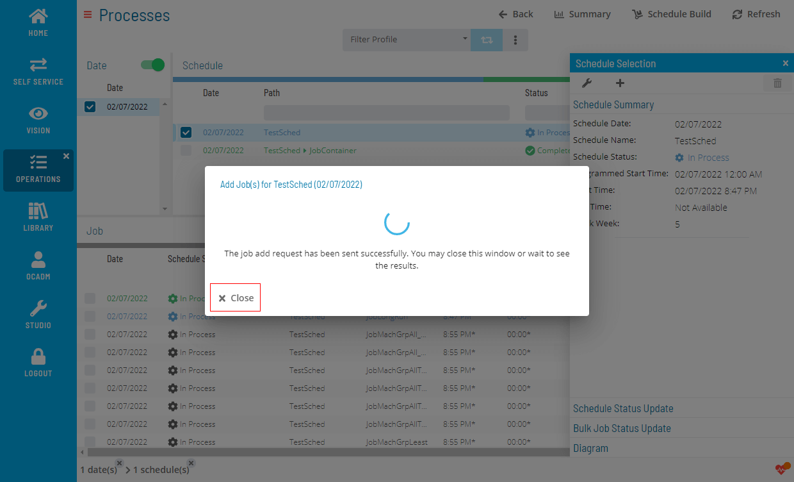

# Adding Jobs to Daily Schedules

The **Operations** module allows you to add jobs to daily schedules using a few simple steps.

To add a job to a Daily Schedule

1. Right-click on a Schedule record and click **+** icon to open a Add Job(s) dialog
    dialog")

2. Find and select job(s) by using the search or browsing
   

3. Configure the selected job(s)
   

4. Review configured job(s) before submitting
   

5. Wait for the results
   

6. Review the results
   

.png "More Info icon")
Related Topics

- [Performing Schedule Checks](Performing-Schedule-Checks.md)
- [Deleting Schedules and Jobs](Deleting-Schedules-and-Jobs.md)