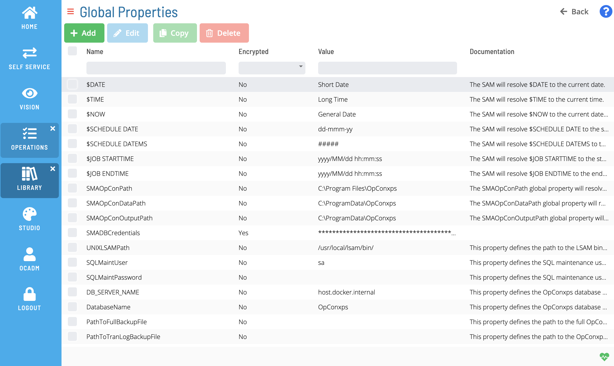

# Managing Global Properties

Available Global Properties in OpCon are shown in the following Grid under Library -> Global Properties. Clicking the add, edit, or copy button will open the Global Property Editor.

