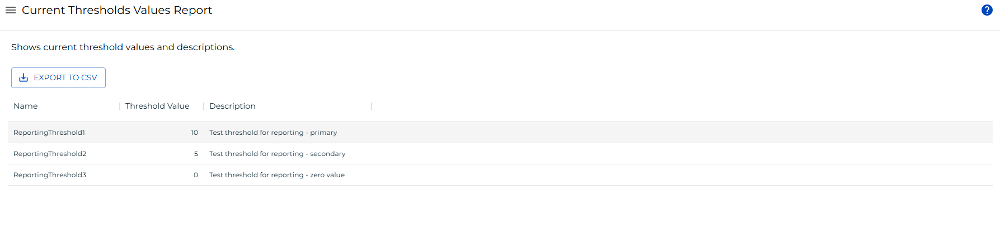

# Current Threshold Values Report

The **Current Threshold Values Report** displays the currently defined thresholds in OpCon.

:::note
This report has a maximum return limit of 100,000 records.
:::

### Filtering & Sorting

This report provides filters for threshold name, value, and description. You can open the filters panel by clicking on the menu (three dots) in the header of any column, and selecting 'Filter'.

 

### Exporting to CSV

Click the export  button to download the report as a CSV. Any active filters will be applied when exporting the report.

