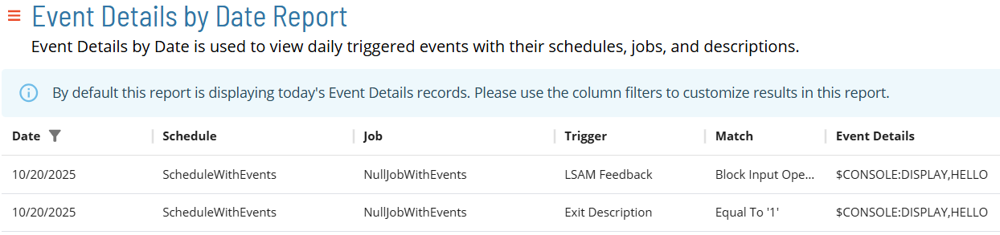
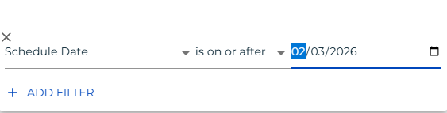
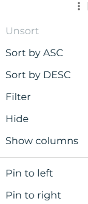

# Event Details by Date Report

The **Event Details by Date Report** shows all daily triggered events with their schedules, jobs, trigger, match, and event details.

:::note
Report data is updated nightly at 2:00 AM.
:::

:::note
This report has a maximum return limit of 100,000 records.
:::

### Filtering & Sorting

Because this report contains large amounts of data, a schedule date filter will be applied by default to only show dates on or after the current date. You can adjust this or add filters to other columns in the filters panel (shown below). You can open the filters panel by either selecting the filter icon in the header or columns that have an active filter, or by clicking on the menu (three dots) in the header of any column, and selecting 'Filter' (also shown below). The default filter can be adjusted.

_Filter Panel showing the default schedule date filter_

_Column menu showing the Filter option_

### Exporting to CSV

Click the export  button to download the report as a CSV. Any active filters will be applied when exporting the report.
