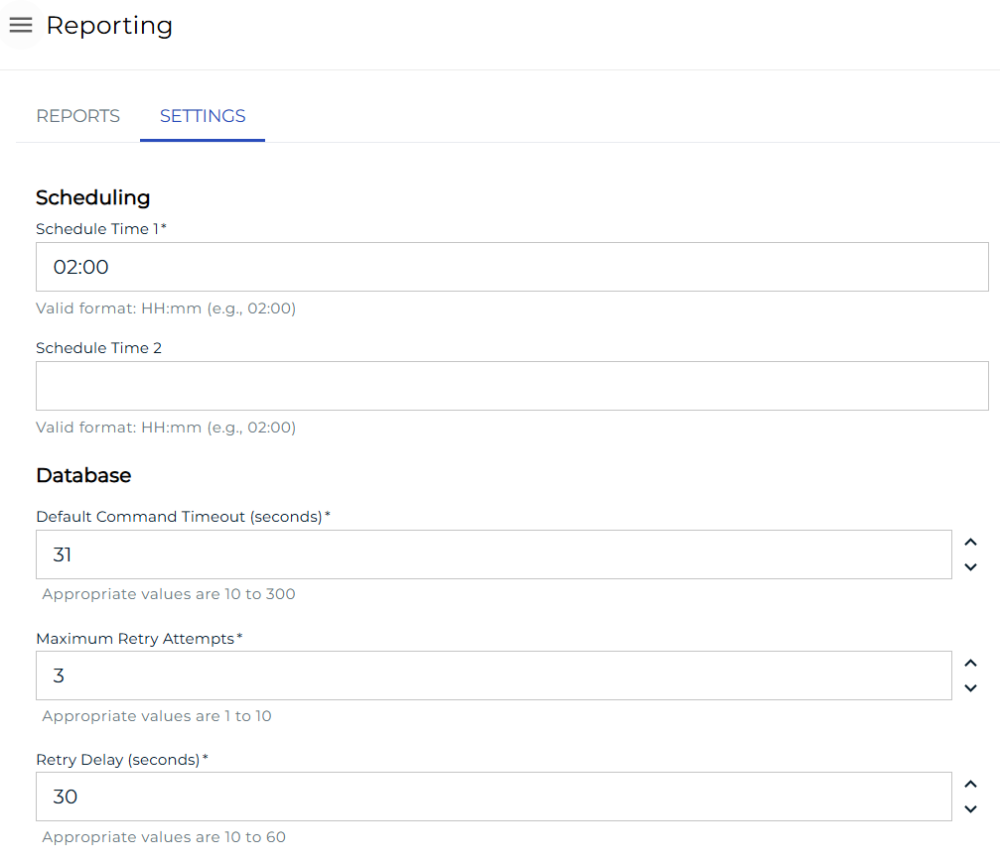
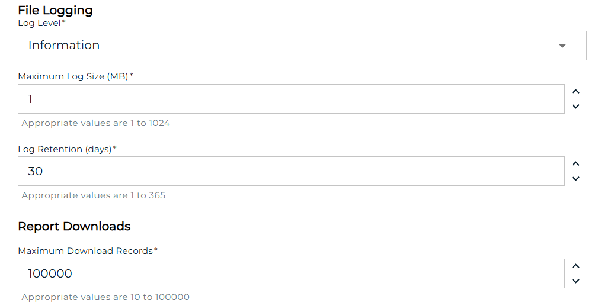

# Reports

The **Reporting** page contains two tabs: **REPORTS** and **SETTINGS**.

## REPORTS Tab

The **REPORTS** tab lists all available reports. User permissions are considered when displaying reports, so users will only see reports they have access to view.

### Report Details

Click on a report to open it and see more detailed information.

## SETTINGS Tab

The **SETTINGS** tab displays configuration settings related to standard report configuration values, including:

- Scheduling configuration for cloud users
- Database, file logging, and maximum download records configuration for all users

:::note
Users must have the [Maintain Reports](../../../../../administration/privileges.md) privilege or be in the ocadm role to view the SETTINGS tab.
:::
