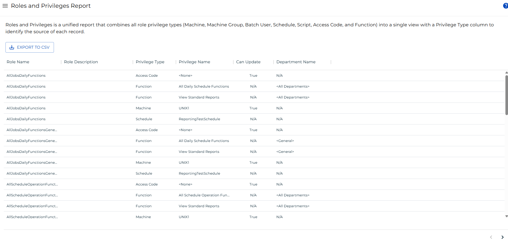

# Roles and Privileges Report

The **Roles and Privileges Report** is a unified report that combines all role privilege types (Machine, Machine Group, Batch User, Schedule, Script, Access Code, and Function) into a single view with a Privilege Type column to identify the source of each record.

:::note
This report has a maximum return limit of 100,000 records.
:::

### Filtering & Sorting

This report provides filters for role name, role description, privilege type, privilege name, can update, and department name. You can open the filters panel by clicking on the menu (three dots) in the header of any column, and selecting 'Filter'.

### Exporting to CSV

Click the export  button to download the report as a CSV. Any active filters will be applied when exporting the report.
