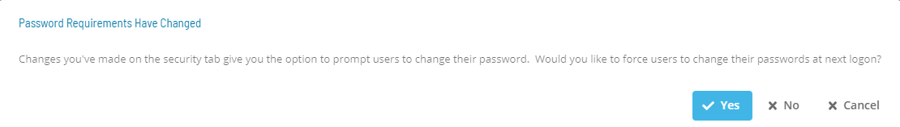
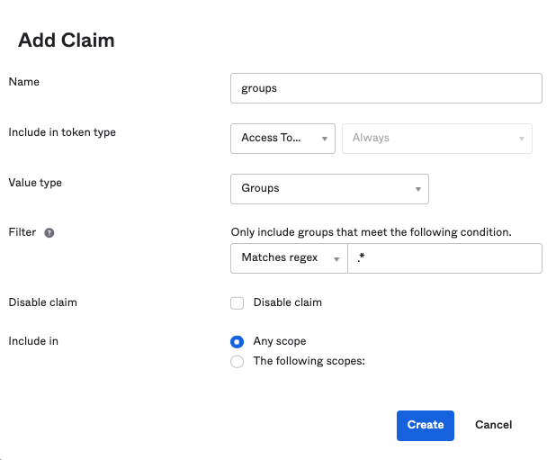
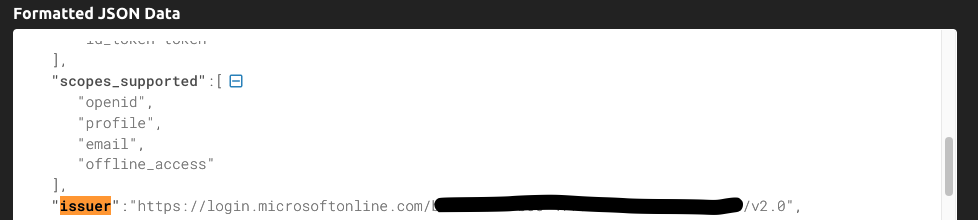

# System Configuration

**The table below shows default values for each settings. If user changes the default value of a setting,  icon will show next to the field.*

## Required Privileges

In order to access the Server Options page you need one of the following:

- **Role**: Role_ocadm.
- **Function Privilege**: View Server Options or Maintian server options.

## Managing General Settings

### Configuration Options

The General category contains default behavior settings for the SAM.

|||||
|--- |--- |--- |--- |
|Job Dependency Offset Type|Calendar Days|Y|This parameter determines if the Job Dependencies with Offset values are calculated with calendar days or with occurrence of the job.If Calendar Days is selected, OpCon will look for the job on the specified number of calendar days offset from the current schedule date.If Occurrence is selected, OpCon will look for the job on the numbered occurrence of the schedule. JobB depends on JobA from yesterday's schedule, or if there were holidays in between - the last time Job A was on the schedule).The Calendar Days option would not meet this need because of the holiday requirement. With calendar days on a 5-day work week, the Tuesday through Friday jobs would resolve properly to the previous calendar day. However, the job on Monday would be looking for JobA on Sunday because it is one Calendar Day back.This customer should choose to use the Occurrence option for job dependency offset calculation. OpCon will look back to the last occurrence of Job A before "today", thus resolving properly for Monday through Friday on a 5-day schedule. Valid values are Calendar Days and Occurrence.|
|Alternate Odd and Even Weeks|False|Y|The alternate to the Odd/Even Weeks frequency is Every Other Week. By setting the Server Option "Alternate Odd and Even Weeks" to "True," jobs using the Odd/Even Weeks frequency will be treated as Every Other Week frequency.|
|Number of Runs Included in Job Average Calculations|10|Y|Defines the number of most recent job history records to use when SAM Calculates Job Averages. Valid values range from 1 to 999.|
|SAM Calculates Job Averages|False|Y|Determines if SAM calculates job start and run time averages after each job run. If this value is set to True:SAM calculates the average times the way the SMA_JOBAVG stored procedure does. For more information, refer to SMA_JOBAVG in the Database Information online help. SAM passes the following parameters for the calculation: SW1: The value from Server Options for Number of Runs Included in Job Average Calculations.SW2: 1SW3: 2SW4: The Schedule Name for the job that just ran.SW5: The Job Name that just ranSpecial: SAM passes a special parameter for the Frequency of the job that just ran.The job start and run time averages will only be recalculated for jobs that are in use in the Daily. This will keep the times more current, but may cause slight processing delays in SAM depending on the job processing load. If this value is set to False, set up the job SMA JOB AVERAGE on the SMAUtility schedule to run once per day. For more information, refer to SMA Job Average. Valid values are True and False.|
|Remove Period in Abbreviated Months and Days|False|Y|SAM will check this setting for resolving Tokens that contain abbreviated months and abbreviated days. If True, SAM strips the period from abbreviated months and days. If False, SAM leaves the period on abbreviated months and days. This setting should only be set to True for customers requiring backward compatibility to older versions of SAM used in the few locales where periods are now included by default with some abbreviations.|
|Allow Wild Cards in Events|False|Y|This parameter indicates whether or not \* (asterisk) and ? (question mark) are treated as wild cards in Schedule, Job, and Machine Names within Events.|
|TLS Certificate Serial Number|*blank*|Y|This parameter is an identifier of the digital certificate that is optionally assigned to the OpCon server's SMANetCom program, required only when TLS Client Validation has been selected by one or more LSAMs. This number can be found in the certificate store of the machine where the OpCon server is installed. When blank, the OpCon server's SMANetCom program will not supply a TLS Client certificate to any LSAM. Note: If an LSAM requires TLS Client validation, but SMANetCom does not provide its certificate, then the communication link with that LSAM will fail to connect.|
|Login Security Message|*blank*|Y|This parameter  configures a security message to display to users after logging into  the application. If a value is specified, then this value is shown in the  security message that is displayed to users after login. Note: This parameter configures the security message to display in both the Enterprise Manager and Solution Manager applications.|
|Incident Management System|*blank*|Y|This parameter identifies the name of the ticketing system that is used for incident management. If a value is specified, then this value  is used  as a label to replace the "Incident Ticket ID" label in the Daily Job Information dialog.|
|Allow Job Events to Restart Schedules|False|Y|This parameter configures the SAM to allow an event to start a completed schedule. If this option is activated, the following events cause the restart of a completed schedule:$JOB:ADD$JOB:RESTART$JOB:RESCHEDULE. By default, the SAM does not restart a completed schedule and logs the event as an error in the Critical.log. When this option is activated, the SAM restarts a schedule to allow events to process if they are received after a schedule is completed. Valid values are True and False.|
|Failed jobs should keep the Schedule "In Process"|False|Y|This parameter configures the SAM to keep schedules In Process that contain Failed jobs and Marked Failed jobs. By default, the SAM closes a schedule when all jobs are in one of the following job status categories: Cancelled, Skipped, Finished OK, or Failed. Refer to Jobs Status Change Commands. Valid values are True and False.|
|Number of Days to Keep a Service Request Execution|7|Y|This parameter defines the number of days to retain service request execution history.|
|Solution Manager URL|*blank*|N|This parameter defines the Solution Manager URL to allow opening Solution Manager within the Enterprise Manager. If a value is specified, a Solution Manager option will appear in the Navigation frame. Note: After defining a URL and saving the value, you must log out then log in to the Enterprise Manager for the Solution Manager option to appear in the Navigation frame.|

## Managing Logging Settings

### Configuration Options

The Logging settings contains log and trace settings for the SAM.

| Setting | Default Value | Required | Description |
| --- | --- | --- | --- |
| Log Critical messages to Notification Trigger Events | False | Y | This parameter enables writing of all SAM critical errors to the Application Log in the Microsoft Event Log. To minimize overhead, the SAM does not write critical messages to the Windows event log by default. Valid values are True and False. |
| Log job dependency errors to Critical.log | True | Y | This parameter enables/disables logging job dependency errors to the critical log. Valid values are True and False.If True, the SAM logs all job dependency errors to Critical.log.If False, the SAM stops logging job dependency errors to the Critical.log. When the SAM Message Logging Level is set to Verbose or Debug, the SAM writes job dependency errors to the SAM.log. Refer to SAM Message Logging Level below. |
| Maximum number of days logs should be kept | 10 | Y | This parameter sets the maximum number of archive folders (i.e., days) for all log archives including Schedule Manager logs. By default, the SAM deletes archived logs older than 10 days. The SAM archives log files once per day. Valid values range from 0 to 365. CAUTION: This number must be less than the ArchiveDaysToKeep setting in the SMAServMan configuration file. Refer to License Types in the Server Programs online help. |
| SAM Message Logging Level | Terse | Y | This parameter determines the amount of SAM processing information written to the SAM log files. Valid values are Terse, Verbose, and Debug.Terse is the default setting providing only job/schedule start and finish information.Verbose provides additional information regarding machine processing.Debug provides verbose messaging plus more detailed information on SAM processing. |

## Managing Security Settings

### Configuration Options

The Security settings allows administrators to enhance the security of their user's accounts with various options to enforce password rules

| Setting                                                | Default Value | Required | Description                                                                                                                                                                       |
| ------------------------------------------------------ | ------------- | -------- | --------------------------------------------------------------------------------------------------------------------------------------------------------------------------------- |
| Number of failed login attempts before account lockout | 5             | Y        | This parameter determines the number of password attempts before an account is locked.                                                                                            |
| Number of passwords to retain in history               | 10            | Y        | This parameter determines the number of passwords for OpCon to retain in history. When a user changes their password, they will not be able to reuse any of the in the history.   |
| Minimum number of days between password changes        | 0             | Y        | This parameter determines frequency of password changes.                                                                                                                          |
| Number of days a password is valid                     | 365           | Y        | This parameter determines the number of days a password is valid from the time users changes their password.                                                                      |
| Number of days warning before password expiration      | 0             | Y        | This parameter determines the number of days in advance of password expiration that the primary graphical user interfaces will warn users that their password is about to expire. |
| Number of times a character can repeat consecutively   | 2             | Y        | This parameter determines the number of times a character can repeat consecutively in a password. For example, if set to 2, the password "jjj" would be invalid.                  |
| Minimum number of characters                           | 8             | Y        | This parameter defines the minimum number of characters allowed for every user's password in OpCon.                                                                               |
| Minimum number of lowercase characters required        | 0             | Y        | This parameter determines if the password must contain lower-case characters.                                                                                                     |
| Minimum number of uppercase characters required        | 0             | Y        | This parameter determines if the password must contain upper-case characters.                                                                                                     |
| Password must contain numberic characters              | True          | Y        | This parameter determines if the password must contain numeric characters.                                                                                                        |
| Password must contain special characters               | True          | Y        | This parameter determines if the password must contain special characters.                                                                                                        |
| Password must contain alpha characters                 | True          | Y        | This parameter determines if the password must contain alphabetical characters.                                                                                                   |

If user changes one of the following settings: Number of times a character can repeat consecutively, Minimum number of characters, Minimum number of lowercase characters required, Minimum number of uppercase characters required, Password must contain numeric characters, Password must contain special characters or Password must contain alpha characters, the following pop up will show up when trying to save:

.

If the user clicks on 'Yes', the changes will be saved and all users will be required to reset their password at next logon.
If the user clicks on 'No', the changes will be saved and all users will not be required to reset their password at next logon.
If the user clicks on 'Cancel', the changes will not be saved and all users will not be required to reset their password at next logon.

## Managing Notification Settings

### Configuration Options

The Notification settings tab includes SPO & SNMP Settings, as well as Automatic License Renewal Notification settings.

| Setting                                                    | Default Value | Required | Description                                                                                                                                                                                                                                                                                                                                                                                                                                                                        |
| ---------------------------------------------------------- | ------------- | -------- | ---------------------------------------------------------------------------------------------------------------------------------------------------------------------------------------------------------------------------------------------------------------------------------------------------------------------------------------------------------------------------------------------------------------------------------------------------------------------------------- |
| Maximum Log File Size                                      | 150000        | Y        | Defines the maximum size in bytes for each log file. Determines when the current log file is closed and a new file is started. When the file reaches this maximum size, it is "rolled over." Valid range: 50000-500000                                                                                                                                                                                                                                                             |
| Trace Level                                                | None          | N        | Determines the detail of debug trace logs. Valid options: "None", "Basic", "Detailed", "Very Detailed"                                                                                                                                                                                                                                                                                                                                                                             |
| Include Labels in Notifications                            | TRUE          | Y        | This parameter enables/disables the inclusion of labels for Machine Name, Schedule Name, Job Name, and so forth in notification messages. This setting applies to all notification types except "Text Message." Valid options: True/False                                                                                                                                                                                                                                          |
| Include Machine Name in Notifications                      | TRUE          | Y        | This parameter enables/disables inclusion of the Machine Name in notification messages. This setting applies to all notification types except "Text Message." Valid options: True, False                                                                                                                                                                                                                                                                                           |
| Notification Delimiter                                     | \|            | Y        | This parameter determines the delimiter used between fields in notification messages. This delimiter allows third-party notification tools to easier read messages. Valid options: tilde (~), "at" symbol (@), exclamation mark (!), pound sign (#), dollar sign ($), caret symbol (^), pipe symbol ( \| )                                                                                                                                                                         |
| Seconds between Checking for New Notifications             | 20            | Y        | This parameter defines the delay in seconds between searches for new events in the NOTIFY table. Valid range: 5-20                                                                                                                                                                                                                                                                                                                                                                 |
| Days to Keep Notification History                          | 14            | Y        | Defines the number of days of Notification history to keep in the database. Valid range: 1-35                                                                                                                                                                                                                                                                                                                                                                                      |
| Event Source for Windows Event Log Messages                | OPCON_ENS     | Y        | This parameter defines the event source that show up in the Source column in the Windows Event Viewer. Valid options: OPCON_ENS, SMANotifyHandler                                                                                                                                                                                                                                                                                                                                  |
| SPO Notifications Enabled                                  | FALSE         | Y        | This parameter enables/disables processing of SPO events by the SMA Notify Handler. Valid options: True/False                                                                                                                                                                                                                                                                                                                                                                      |
| Path and File Name of SPO Executable                       | <blank\>      | N        | This parameter defines the full path to the executable responsible for processing SPO messages. Constraints: max 4000 characters, ' (single quote) invalid character                                                                                                                                                                                                                                                                                                               |
| SPO Default Alarm ID                                       | <None\>       | N        | This parameter is the default machine name for SPO Events. Constraints: max 24 characters, ' (single quote) invalid character                                                                                                                                                                                                                                                                                                                                                      |
| Stack SPO Events                                           | TRUE          | Y        | This parameter enables/disables the SMA Notify Handler to make the ALARM qualifier unique across multiple job states. Valid options: True/False                                                                                                                                                                                                                                                                                                                                    |
| SNMP Notifications Enabled                                 | FALSE         | Y        | This parameter enables/disables processing of SNMP events by the SMA Notify Handler. Valid options: True/False                                                                                                                                                                                                                                                                                                                                                                     |
| Write SPO and SNMP Event Failures to the Windows Event Log | TRUE          | Y        | This parameter enables/disables the SMA Notify Handler to write SNMP or SPO event failures to the Windows Event Log. Valid options: True/False                                                                                                                                                                                                                                                                                                                                     |
| Send Email Cc                                              | <Blank\>      | N        | For all customers, this parameter configures the list of email addresses that will be copied when the SAM automatically sends license expiration notices. For customers with a Task-based license, this parameter also configures the list of email addresses that will be copied when SAM automatically sends the license notification at the beginning of each month to SMA. Enter one or more SMTP email addresses separated by semicolons (;). Constraint: max 4000 characters |
| Encrypt Task License Report                                | FALSE         | Y        | For customers with a Task-based license, this parameter determines if the SAM will encrypt the data for the license reports. Valid options: True/False                                                                                                                                                                                                                                                                                                                             |
| Send Email to SMA Office                                   | Disabled      | N        | This parameter determines if SAM will automatically send email notifications to an SMA office when: The license is expiring -or- At the beginning of the month, the task count report is due for Task Based licensed customers. The value of Disabled will disable the SAM from automatically sending email to SMA. Instead, the SAM will write the information to the SAM.log and Critical.log files. Valid options: "Disabled", "Europe", "USA"                                  |

## Managing SMTP Settings

### Configuration Options

The SMTP settings tab includes configuraiton for SMTP Email and SMS settings. It includes a checkbox to mirror primary and secondary settings.

| Option Parameter                                         | Default            | Dynamic (Y/N) | Valid Options                                          | Description                                                                                                                                                                                                                                                                                                                                                                                                                                                                                                                                                                                                                                                                      |
| -------------------------------------------------------- | ------------------ | ------------- | ------------------------------------------------------ | -------------------------------------------------------------------------------------------------------------------------------------------------------------------------------------------------------------------------------------------------------------------------------------------------------------------------------------------------------------------------------------------------------------------------------------------------------------------------------------------------------------------------------------------------------------------------------------------------------------------------------------------------------------------------------- |
| JORS Attachment Timeout                                  | 120                | Y             | 60-3600                                                | Defines the number of seconds the SMA Notify Handler should wait for an attachment to return from a JORS request.                                                                                                                                                                                                                                                                                                                                                                                                                                                                                                                                                                |
| Authentication User (UNC Access)                         | <blank\>           | Y             | max 4000 characters ' (single quote) invalid character | Defines the Windows user account the SMA Notify Handler will use to gain access to machines and UNC paths on the network. This user is required if the SMA Notify Handler has to send Email attachments from network shares. This user is required if SMA Notify Handler will send Network Message notifications. Refer to Sending Network Messages in the Enterprise Manager online help. The user must have privileges to "Read" all network shares from which the SMA Notify Handler will pick up files. The user must also have "Write" privileges to the <Output Director\>\SAM\Log folder.                                                                                 |
| Authentication Encrypted Password (UNC Access)           | <blank\>           | Y             | max 4000 characters ' (single quote) invalid character | Defines the encrypted password for the Windows user the SMA Notify Handler will use to gain access to machines and UNC paths on the network. This user is required if the SMA Notify Handler has to send Email attachments from network shares. This user is required if SMA Notify Handler will send Network Message notifications. Refer to Sending Network Messages in the Enterprise Manager online help. To encrypt the password manually, use the Password encryption tool in the Enterprise Manager. Then copy and paste the encrypted password for the value of this setting. For more information, refer to Encrypting Passwords in the Enterprise Manager online help. |
| SMTP Server Name (Primary Email)                         | <blank\>           | Y             | max 4000 characters ' (single quote) invalid character | Defines the name of the Primary SMTP server for sending email. If no SMS servers are defined, this server will also send SMS text messages. If the value is blankk, the SMA Notify Handler cannot send email or text notifications.                                                                                                                                                                                                                                                                                                                                                                                                                                              |
| SMTP Server Port (Primary Email)                         | 25                 | Y             | 1-65535                                                | Defines the server port that SMA Notify Handler will use when sending email through the Primary SMTP server.                                                                                                                                                                                                                                                                                                                                                                                                                                                                                                                                                                     |
| SMTP Notification Address (Primary Email)                | noreply@mycorp.com | Y             | max 4000 characters all characters are valid           | Defines the email address the SMA Notify Handler will use as the "From" address when sending E-mail or Text Messages through the Primary Email server. If the SMTP server requires authentication, this setting is ignored and the administrator must configure the SMTP Authentication User and Password for the Primary Email server. Customers should specify an email address consistent with their domain name. The SMA Notify Handler will not validate the email address specified; it will only send the message with that "From" address, leaving the validation up to the SMTP server.                                                                                 |
| SMTP Authentication User (Primary Email)                 | <blank\>           | Y             | max 4000 characters all characters are valid           | Defines an email address for authentication to the Primary Email SMTP server. If the SMTP server requires authentication, a value must specified here. If a value is not specified when required by the SMTP server, the SMA Notify Handler will not be able to send emails or text messages. Customers should specify an email address consistent with their domain name. The SMA Notify Handler will not validate the email address specified; it will only send the message with the user and password specified, leaving the validation up to the SMTP server.                                                                                                               |
| SMTP Authentication Encrypted Password (Primary Email)   | <blank\>           | Y             | max 4000 characters all characters are valid           | Defines the password for the SMTP Authentication User for the Primary Email server. If the SMTP server requires authentication, a value must specified here that provides the encrypted password for the user. To encrypt the password manually, use the Password encryption tool in the Enterprise Manager. Then copy and paste the encrypted password for the value of this setting. For more information, refer to Encrypting Passwords in the Enterprise Manager online help.                                                                                                                                                                                                |
| SMTP Authentication -Enable SSL (Primary Email)          | False              | Y             | True/False                                             | Determines if the SMA Notify Handler will use SSL encryption when connecting to the Primary Email SMTP server. If the SMTP server requires SSL Encryption, the value must be set to True.                                                                                                                                                                                                                                                                                                                                                                                                                                                                                        |
| SMTP Total Attachment Size in MB (Primary Email)         | 10                 | Y             | 0-99                                                   | Determines the maximum total of MB in the attachments for an email attachments notification from the Primary Email SMTP server. This value should match the limit set by the SMTP server.                                                                                                                                                                                                                                                                                                                                                                                                                                                                                        |
| SMTP Maximum Number of Attachments (Primary Email)       | 50                 | Y             | 0-999                                                  | Determines the maximum number of attachments allowed per email on a notification from the Primary Email SMTP server. This value should match the limit set by the SMTP server.                                                                                                                                                                                                                                                                                                                                                                                                                                                                                                   |
| SMTP Server Name (Secondary Email)                       | <blank\>           | Y             | max 4000 characters all characters are valid           | Defines the name of the Secondary SMTP server for sending email. If messages fail to send through the Primary Email server, the SMA Notify Handler will attempt to send the message again through the Secondary Email server. If no SMS servers are defined, this server will also serve as a Secondary server to send SMS text messages. If the value is blankk, the SMA Notify Handler will not attempt messages through a Secondary server.                                                                                                                                                                                                                                   |
| SMTP Server Port (Secondary Email)                       | 25                 | Y             | 1-65535                                                | Defines the server port that SMA Notify Handler will use when sending email through the Secondary SMTP server. The user can set the value for this option.                                                                                                                                                                                                                                                                                                                                                                                                                                                                                                                       |
| SMTP Notification Address (Secondary Email)              | noreply@mycorp.com | Y             | max 4000 characters all characters are valid           | Defines the email address the SMA Notify Handler will use as the "From" address when sending E-mail or Text Messages through the Secondary Email server. If the SMTP server requires authentication, this setting is ignored and the administrator must configure the SMTP Authentication User and Password for the Secondary Email server. Customers should specify an email address consistent with their domain name. The SMA Notify Handler will not validate the email address specified; it will only send the message with that "From" address, leaving the validation up to the SMTP server.                                                                             |
| SMTP Authentication User (Secondary Email)               | <blank\>           | Y             | max 4000 characters all characters are valid           | Defines an email address for authentication to the Secondary Email SMTP server. If the SMTP server requires authentication, a value must specified here. If a value is not specified when required by the SMTP server, the SMA Notify Handler will not be able to send emails or text messages through the Secondary server. Customers should specify an email address consistent with their domain name. The SMA Notify Handler will not validate the email address specified; it will only send the message with the user and password specified, leaving the validation up to the SMTP server.                                                                                |
| SMTP Authentication Encrypted Password (Secondary Email) | <blank\>           | Y             | max 4000 characters all characters are valid           | Defines the password for the SMTP Authentication User for the Secondary Email server. If the SMTP server requires authentication, a value must specified here that provides the encrypted password for the user. To encrypt the password manually, use the Password encryption tool in the Enterprise Manager. Then copy and paste the encrypted password for the value of this setting. For more information, refer to Encrypting Passwords in the Enterprise Manager online help.                                                                                                                                                                                              |
| SMTP Authentication -Enable SSL (Secondary Email)        | False              | Y             | True/False                                             | Determines if the SMA Notify Handler will use SSL encryption when connecting to the Secondary Email SMTP server. If the SMTP server requires SSL Encryption, the value must be set to True.                                                                                                                                                                                                                                                                                                                                                                                                                                                                                      |
| SMTP Total Attachment Size in MB (Secondary Email)       | 10                 | Y             | 0-99                                                   | Determines the maximum total of MB in the attachments for an email attachments notification from the Secondary Email SMTP server. This value should match the limit set by the SMTP Server.                                                                                                                                                                                                                                                                                                                                                                                                                                                                                      |
| SMTP Maximum Number of Attachments (Secondary Email)     | 50                 | Y             | 0-999                                                  | Determines the maximum number of attachments allowed per email on a notification from the Secondary Email SMTP server. This value should match the limit set by the SMTP server.                                                                                                                                                                                                                                                                                                                                                                                                                                                                                                 |
| SMTP Server Name (Primary SMS)                           | <blank\>           | Y             | max 4000 characters all characters are valid           | Defines the name of the Primary SMTP server for sending SMS text messages. If this server is defined, the SMA Notify Handler will not only attempt SMS messages through the defined SMS server(s) (the email servers will only be used for email messages). If the value is blankk, the SMA Notify Handler will try to use the Primary Email SMTP server for SMS text messages.                                                                                                                                                                                                                                                                                                  |
| SMTP Server Port Number (Primary SMS)                    | 25                 | Y             | 1-65535                                                | Defines the server port that SMA Notify Handler will use when sending SMS text messages through the Primary SMS server.                                                                                                                                                                                                                                                                                                                                                                                                                                                                                                                                                          |
| SMTP Notification Address (Primary SMS)                  | noreply@mycorp.com | Y             | max 4000 characters all characters are valid           | Defines the email address the SMA Notify Handler will use as the "From" address when sending SMS Text Messages through the Primary SMS server. If the SMTP server requires authentication, this setting is ignored and the administrator must configure the SMTP Authentication User and Password for the Primary SMS server. Customers should specify an email address consistent with their domain name. The SMA Notify Handler will not validate the email address specified; it will only send the message with that "From" address, leaving the validation up to the SMTP server.                                                                                           |
| SMTP Authentication User (Primary SMS)                   | <blank\>           | Y             | max 4000 characters all characters are valid           | Defines an email address for authentication to the Primary SMS SMTP server. If the SMTP server requires authentication, a value must specified here. If a value is not specified when required by the SMTP server, the SMA Notify Handler will not be able to send SMS text messages. Customers should specify an email address consistent with their domain name. The SMA Notify Handler will not validate the email address specified; it will only send the message with the user and password specified, leaving the validation up to the SMTP server.                                                                                                                       |
| SMTP Authentication Encrypted Password (Primary SMS)     | <blank\>           | Y             | max 4000 characters all characters are valid           | Defines the password for the SMTP Authentication User for the Primary SMS server. If the SMTP server requires authentication, a value must specified here that provides the encrypted password for the user. To encrypt the password manually, use the Password encryption tool in the Enterprise Manager. Then copy and paste the encrypted password for the value of this setting. For more information, refer Encrypting Passwords in the Enterprise Manager online help.                                                                                                                                                                                                     |
| SMTP Authentication -Enable SSL (Primary SMS)            | False              | Y             | True/False                                             | Determines if the SMA Notify Handler will use SSL encryption when connecting to the Primary SMS SMTP server. If the SMTP server requires SSL Encryption, the value must be set to True.                                                                                                                                                                                                                                                                                                                                                                                                                                                                                          |
| SMTP Server Name (Secondary SMS)                         | <blank\>           | Y             | max 4000 characters all characters are valid           | Defines the name of the Secondary SMTP server for sending SMS text messages. If messages fail to send through the Primary SMS server, the SMA Notify Handler will attempt to send the message again through the Secondary SMS server. If the Primary SMS server is not defined, this server will send SMS text messages. If the value is blankk, the SMA Notify Handler will not attempt messages through a Secondary server.                                                                                                                                                                                                                                                    |
| SMTP Server Port Number (Secondary SMS)                  | 25                 | Y             | 1-65535                                                | Defines the server port that SMA Notify Handler will use when sending SMS text messages through the Secondary SMS server.                                                                                                                                                                                                                                                                                                                                                                                                                                                                                                                                                        |
| SMTP Notification Address (Secondary SMS)                | noreply@mycorp.com | Y             | max 4000 characters all characters are valid           | Defines the email address the SMA Notify Handler will use as the "From" address when sending Text Messages through the Secondary SMS server. If the SMTP server requires authentication, this setting is ignored and the administrator must configure the SMTP Authentication User and Password for the Secondary SMS server. Customers should specify an email address consistent with their domain name. The SMA Notify Handler will not validate the email address specified; it will only send the message with that "From" address, leaving the validation up to the SMTP server.                                                                                           |
| SMTP Authentication User (Secondary SMS)                 | <blank\>           | Y             | max 4000 characters all characters are valid           | Defines an email address for authentication to the Secondary SMS SMTP server. If the SMTP server requires authentication, a value must specified here. If a value is not specified when required by the SMTP server, the SMA Notify Handler will not be able to send text messages through a secondary server. Customers should specify an email address consistent with their domain name. The SMA Notify Handler will not validate the email address specified; it will only send the message with the user and password specified, leaving the validation up to the SMTP server.                                                                                              |
| SMTP Authentication Encrypted Password (Secondary SMS)   | <blank\>           | Y             | max 4000 characters all characters are valid           | Defines the password for the SMTP Authentication User for the Secondary SMS server. If the SMTP server requires authentication, a value must specified here that provides the encrypted password for the user. To encrypt the password manually, use the Password encryption tool in the Enterprise Manager. Then copy and paste the encrypted password for the value of this setting. For more information, refer to Encrypting Passwords in the Enterprise Manager online help.                                                                                                                                                                                                |
| SMTP Authentication -Enable SSL (Secondary SMS)          | False              | Y             | True/False                                             | Determines if the SMA Notify Handler will use SSL encryption when connecting to the Secondary SMS SMTP server. If the SMTP server requires SSL Encryption, the value must be set to True.                                                                                                                                                                                                                                                                                                                                                                                                                                                                                        |
## Managing Vision Settings

### Configuration Options

| Setting                                  | Default Value | Required | Description                                                                                   |
| ---------------------------------------- | ------------- | -------- | --------------------------------------------------------------------------------------------- |
| Days of Vision history to keep           | 3650          | Y        | This parameter defines the number of days Vision data will be retained.                       |
| Days in past to trigger Vision actions   | 1             | Y        | This parameter defines the number of days in the past to use for triggering Vision Actions.   |
| Days in future to trigger Vision actions | 1             | Y        | This parameter defines the number of days in the future to use for triggering Vision Actions. |

## Managing Time Settings

### Configuration Options

The Time settings tab configures intervals that SAM will poll on statuses.

| Setting                                               | Default | Range   | Description                                                                                                                                                                                                                                                                                                                                                                                                                                                                                                                                                                         |
| ----------------------------------------------------- | ------- | ------- | ----------------------------------------------------------------------------------------------------------------------------------------------------------------------------------------------------------------------------------------------------------------------------------------------------------------------------------------------------------------------------------------------------------------------------------------------------------------------------------------------------------------------------------------------------------------------------------- |
| Hour of each day SAM should detect Schedules to build | 0       | 0-23    | By default, at midnight the SAM detects schedules to build. The hours are based on a 24-hour format starting from 0 (midnight) to 23 (11 p.m.). The SAM only processes the builds once per day. If this hour changes after the build process, SAM does not consider this parameter until the next day. Set specific times for individual schedules to build on the schedule definitions. For more information, refer to Schedule Maintenance. Note: To enable notification for failed schedule build processes, define OpCon events on the SMA_SKD_BUILD job on the AdHoc schedule. |
| Minutes between checking running jobs                 | 5       | 1-1440  | This parameter determines the maximum time period for the SAM to wait before inquiring about job status.                                                                                                                                                                                                                                                                                                                                                                                                                                                                            |
| Seconds SAM should wait between PreRun attempts       | 180     | 0-32000 | This parameter determines the amount of time in seconds between prerun attempts. By default, the SAM re-attempts prerun jobs every 180 seconds (3 minutes) until the job succeeds.                                                                                                                                                                                                                                                                                                                                                                                                  |
## Managing SSO Configurations

### Configuring SSO

To configure SSO Settings, go to **Library** > **Server Options** > click on the **SSO** tab.

#### SSO Configuration Fields

1. Click on the **Switch** to enable access to the SSO login button.

1. Enter a **Provider**. The identity provider (IdP) for the client should be selected from the **Provider** dropdown. Options include **Okta**, **Azure AD**, and **Other**.

1. Enter an **Authority**. **Authority** is the URL of the OIDC/OAuth2 provider.

1. Enter a **Client ID**. This is your client application's identifier as registered with the OIDC/OAuth2.

1. Enter a **Redirect URI**. A **Redirect URI**, is the location where the authorization server sends the user once the app has been successfully authorized and granted an authorization code or access token. Adding **/login/callback** is **required** for SSO to function. For example, **https://host:80443/login/callback**.

1. Enter a **Scope**. The **Scopes** being requested from the OIDC/OAuth2 provider (default: **openid**). You can enter various scopes separated by an empty space.

\* OpenID Connect (OIDC) is an open authentication protocol that works on top of the OAuth 2.0 (OAuth2) framework.

#### Test Connection Button

The **test connection button** retrieves metadata from the identity provider (IdP) by using the value specified in the **Authority** field. The **Authority** field is vital to establish a proper configuration with the IdP and enable successful communication with the OpenID Connect application.

#### Group Mappings

1. Enter a **Group Name**: this should match the group name used in your IdP.

1. Enter a **Role**: this value represents a valid **OpCon** role.

1. Select **Save**.

:::note

1.  If the switch is in the **On** position, the user must input values in all fields including values for **Group Mappings**.
1.  Examples of how to gather these requirements will be posted below (for the [**Okta Application**](#okta-application) and the [**Azure AD Application**](#azure-ad-application)).
1.  SSO can be implemented with any identity provider as long as the required values are provided and they follow the OpenID Connect authentication protocol.
1.  The IdP must return a token with a **groups** claim that contains the authenticated user's group memberships. It must also return an **opconid** claim, that should be composed of the authenticated user's email.

:::

:::caution

1. Once a user has successfully accessed **Solution Manager** through **SSO**, the user's current **password** will automatically change to a random value. This is done to ensure that the user only uses **SSO** as the preferred means of authentication.

:::

The following are a list of actions that will take place when a user logs in through Single Sign-On.

| Exists in IdP Group | Exists in OpCon | Member of OpCon Role | Can access application in IdP | Enabled in OpCon | Action Taken                                              |
| ------------------- | --------------- | -------------------- | ----------------------------- | ---------------- | --------------------------------------------------------- |
| Y                   | Y               | Y                    | Y                             | Y                | No action user is already in sync                         |
| Y                   | N               | N/A                  | Y                             | N/A              | User created and added to role                            |
| Y                   | Y               | N                    | Y                             | Y                | User added to role                                        |
| Y                   | Y               | Y                    | Y                             | N                | User enabled in OpCon                                     |
| Y                   | Y               | Y                    | N                             | Y                | No action since user cannot access the application        |
| Y                   | Y               | Y                    | N                             | N                | No action since user cannot access the application        |
| N                   | Y               | Y                    | N/A                           | Y                | No action since user does not belong to an existing group |
| N                   | Y               | Y                    | N/A                           | N                | No action since user does not belong to an existing group |
| N                   | N               | N/A                  | N/A                           | N/A              | No action                                                 |

:::tip Group Mappings

- Group name values should be unique.
- Group names can be linked to many roles.
- Roles can be linked to many group names.

:::

:::tip Example
The following is an example of filling out the required fields:

1. SSO Settings:
   
1. Group Mappings:
   

:::

---

### Creating an applications that are OpenID Connect Compatible

#### Okta Application

This document will describe the steps needed to create a custom application in Okta to return custom optional claims in a access token that will be used by SMAOpConRestApi. Ensure the user following these steps has enough privileges to create an application, assign users to that application, and create custom claims.

1.  After you’ve logged in to Okta, click "Admin" in the upper right corner to go to the administration dashboard
    
1.  Once on the administration dashboard, click “Applications” from the left navigation to go to Applications
    
1.  Click the "Create App Integration" button
    
    1.  Inside the modal, select the following options:
        1. Sign-in method: OIDC - OpenID Connect
        1. Application type: Single-Page Application
           
    1.  Click on "Next"
    1.  Set the following options:
        1.  Grant type: Authorization Code
        1.  Sign-in redirects URIs:(sample) `https://<hostname:443>/login/callback`
            1. The **Redirect URI** will be used on the SSO configuration tab in Solution Manager.
            1. Make sure to include **/login/callback**.
        1.  The value for the URL to access Solution Manager will be used in the SSO configuration tab
        1.  Sign-out redirects URIs: This value is not necessary
        1.  Controlled access: Allow everyone in your organization access (for this example)
        1.  If an option was not listed, you may select the one that is more convenient for your organization
        1.  Set controlled access based on your organizations needs
            
    1.  Click on "Save".
    1.  Note down the **Client ID** value, this will be used to configure SSO in Solution Manager
        1.  The **Client ID** value can be found inside the "Applications" page, in case you need to find it.
1.  After creating the application, go the newly created application and go to "Assignments"
    1. Assign the users from your organization to the new application
       
1.  Go to the "Security" section in the main menu and select "API"
    1. In the "Authorization Server" tab select the "default" server
       1. Note down the Issuer URI for the “default” row, this value will be the **Authority** which will be used in the configuration screen for SSO
    1. Inside the "default" authorization server select the "Claims" tab
       
    1. Click on "Add Claim"
       1. The following is an example on how to add a custom claim
          
       1. Make sure the token type is Access Token and that you enter **`.*`** for the regex logic
       1. Make sure to name claims “**groups**”
       1. Repeat the process to add an “**opconid**” claim
          1. Make sure to add **appuser.email** in the **Value** text field
             
    1. Click on the “Settings” tab and take notes of the following values:
       1. Issuer, this will be used as the **Authority** value in the SSO configuration tab
          
    1. Go to the "Token Preview" tab
       1. Type the name your newly created application
       1. Select **Authorization Code** for the "Grant Type"
       1. Select a user that has access to this application
       1. Type "**openid**" in the "Scopes" textbox. These scopes are required for SSO implementation in Solution Manager
       1. Click on "Preview Token" then click on the "token" tab to view the access token. Make sure the **“groups”** and **“opconid”** claims are displayed
          
1.  Then click on the "Access Policies" tab
    
    1.  Click on "Edit" in the "Default Policy Rule" row. Make sure that the "Authorization Code" option is selected, the rest are optional:
        

:::note

- Make sure to the values of “**openid**“ in the Scope textbox inside the SSO configuration tab inside Solution Manager.
- Make sure the **email** for the users allowed to access the application matches their username. This value will be used to pair with an existing OpCon user or it will be used to create a new user in the OpCon environment.

:::

#### Azure AD Application

This document describes the steps needed to create a custom application in Azure AD that will grant SMAOpConRestApi access to Microsoft Graph API to retrieve user information. Ensure the user following these steps has enough privileges to create an application, assign users to that application, and assign permissions to Microsoft Graph API.

1. Go to "Azure Active Directory"
1. Go to "App registrations"
   1. Select new registrations
      1. Add a name to the new application
      1. Select who can access the application
         1. For example: Single tenant
      1. Select Single-page application (SPA)
      1. Set the Redirect URI
         1. For example, `https://<yourhostname>:8080/login/callback`
      1. The **Redirect URI** value will be used on the SSO configuration tab in Solution Manager.
         1. Make sure to include **/login/callback** as part of the URI.
            
   1. Register Application
1. Select the newly created application
   1. From the “Home” menu go to Azure Active Directory => App registrations => Select your new application
1. Go to "Authentication" on the side menu
   1. Ensure there is a redirect value in the single-page application area. For example, `https://<yourhostname>:8080/login/callback`
      
1. Go to “Overview” in the left navigation menu
   1. Note down the following information, you will need it later:
   1. The application (client) ID will be used as the **Client ID** in the SSO configuration tab inside Solution Manager
   1. Click on “Endpoints” and note down the OpenID Connect value
   1. Copy this value and paste it on a browser and find the issuer value inside the JSON
      1. It is highly recommended that you copy this text from the browser and paste it into an application that can format the JSON value
         
      1. Note down the Issuer URI, this value will be used in the **Authority** field in the SSO configuration tab inside Solution Manager
1. Go to “API permissions” which is found on the left navigation menu
   1. Select Add a permission
   1. Click on “Add a permission” and select Microsoft Graph
      
   1. Select “Delegated permissions” and type **groupmember** in the search textbox. Select the **GroupMember.Read.All** permission:
      
   1. Next type **user.read** in the search textbox and select **User.Read** permission
   1. Click on “Add permissions” to save and then click on “Grant admin consent”
      
1. Go to “Manifest” on the left navigation menu
   1. Search for “**accessTokenAcceptedVersion**” and set the value to **2**
      
1. Restrict access to the application (optional).
   1. Go to Azure Active Directory -> Enterprise Applications > All applications and select the application you want to configure
   1. Select Properties and set "Yes" in the Assignment Required field and save the changes
      
   1. Make sure to assign users and groups which need to grant access to the application. Go to Under Manage, select the Users and groups > Add user/group
   1. Select the users or groups you want to allow and assign them access to your application. Confirm that the users and groups you added are showing up in the updated Users and groups list
   1. Now only those users/groups are allowed to access to the application

:::note

- Make sure to add the “**openid**” Scope in the SSO configuration tab inside Solution Manager
- The token retrieve from this application will be used to make calls to Microsoft Graph Api
  - The calls include:
    - https://graph.microsoft.com/v1.0/me : From this call, we will retrieve the property **userPrincipalName** which is the value of the authenticated user's username (email). This will be used as the opcon identifier inside Solution Manager.
    - https://graph.microsoft.com/v1.0/me/getMemberGroups : From this call, we will be able to retrieve a list of IDs of groups that the authenticated user belongs to.
    - https://graph.microsoft.com/v1.0/groups/{group-guid} : From this call, we will retrieve the **displayName** property which will be mapped against an existing group.

:::

:::note
Common errors when connection to your identity provider (IdP) OpenID Connection (OIDC) applications:

- Invalid Redirect URI: Ensure that the redirect URI specified in the SSO configuration matches the redirect URI configured in the OIDC application for your IdP provider. Mismatched or incorrect redirect URIs can prevent successful authentication.

- Incorrect Authority: Validate that the authority (OIDC provider URL) is specified in your application's configuration for your IdP. Any mismatch in the authority value will result in connection errors and authentication failures.

- Invalid Client ID: Verify that the client ID assigned in the SSO configuration is correct and matches the client ID expected by your IdP. Using an incorrect client ID will lead to authentication errors and prevent successful interaction with the OIDC application.

By addressing these common errors related to redirect URI, authority, and client ID, you can enhance the connectivity and authentication experience with your OIDC application.

:::

---

## Reset Settings

To access reset options click on the vertical ellipsis icon

**Reset all to default**: Reset all changes in server options to system defaut settings  
**Reset current tab to default**: Reset all changes in current tab to system default settings

  
**Save**: Save current changes  
**Undo**: Undo changes made in current session, before saving
