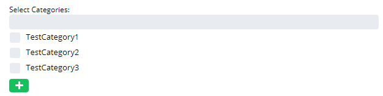
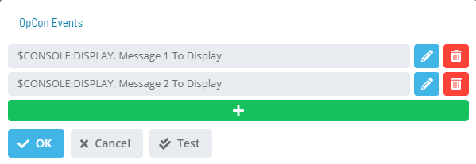

# Notification Categories

Available Notification Categories in OpCon are shown in the following Grid under Library -> Notification Triggers -> Manage Categories.

Clicking the **Add** and **Selecting a record in the grid** will enable the bottom panel:

:::note
The **Name** field must be unique when adding or editing a notification category.
:::

# Notification Groups

Available Notification Groups in OpCon are shown in the following Grid under Library -> Triggers -> Manage Notification Groups.

Clicking the **Add** button or **Selecting a record in the grid** will enable the bottom panel:

:::note
The **Name** field must be unique when adding a notification group.
:::

When Included is selected all items selected in the list will be included in the notification as well as all new Jobs, Machines and Schedules depending on the type on group selected. 

When Excluded is selected all items selected in the list will be included in the notification and  all new Jobs, Machines and Schedules depending on the type on group selected will be excluded from the notification. 

If the group type is **Job** or **Machine**, a tree view will show all items available for the notification group.

If the group type is **Schedule**, a check list will show all schedules available for the notification group.

The **Categories** check list shows all categories available for the Notification Group.

Click on the **Add** button to quickly add a new category to the list.

---
lang: en-us
title: Notification Triggers
viewport: width=device-width, initial-scale=1.0
---

# Notification Triggers

Available Notification Triggers in OpCon are shown in the following Grid under Library -> Notification Triggers.

Clicking the **Add** button or **Selecting a record in the grid** will enable the bottom panel:

:::note
The **Group Name** - **Trigger Name** combination must be unique when adding a notification trigger.
:::

**Description**: This option allows you to provide a description and
purpose for the notification triggers to be sent.

**Include Internal Job Number in Job Name frame**: This option
    determines whether the job name included in the Prefix Information
    for the notification message will be unique each time a notification
    is processed. The unique job name comprises the original job name
    and a unique SAM-generated job number.

**Escalation Rule**: This option specifies the optional escalation rule to apply to an email notification. By default, this drop-down list and search function are hidden and only become visible if the trigger has an email notification checkbox is selected.

The bottom panel provides options for configuring notification types. The following **Notification Types** are provided: Email, Text Notification, OpCon Events, Windows Event Log, Network Notification, SNMP Trap, Run Command and SPO Event Report.

The **Add** button will allow you to a new notification for the selected trigger.

The **Edit** button will allow you to edit an existing notification for the selected trigger.

The **Delete** will allow you to remove an existing notification.

**Active/Inactive Notification Status**: The toggle button to the left of each notification type indicates the *Active*  or
    *Inactive*  status for each type of notification. By default,
    the toggle button is not visible. You can click toggle button to toggle
    the status from *Active* to *Inactive*.

:::note
    Modifications will take effect only after clicking on the Save button.
:::

Click on any of the following quick links to access the instructions on
how to define and send that notification type:

- [Send Email (SMTP)](./NotificationTypes/Email)
- [Send Short Text Message](./NotificationTypes/Text-Message)
- [Send OpCon Events](./NotificationTypes/OpCon-Events)
- [Send Windows Event Log](./NotificationTypes/Windows-Event-Log)
- [Send Network Message](./NotificationTypes/Network-Message)
- [Send SNMP Trap](./NotificationTypes/SNMP-Trap)
- [Send SPO Event Report](./NotificationTypes/SPO-Event-Report)
- [Run Command](./NotificationTypes/Run-Command)

**Lookup Dialog** To conduct the reverse look up of an event, you will need to have the Notification ID. You can obtain the Notification ID (when available) from a notification message or retrieve the Notification ID from the SMANotifyHandler.log.

Clicking on the  button will open the Lookup dialog 

- [Lookup Dialog](./NotificationTypes/Look-up-Notification-Sources)

Clicking on the  button will open the copy dialog
- [Copy Dialog](./NotificationTypes/Copy-Notification-Trigger)

**Advanced Filtering** To perform advanced filtering of the notification triggers, use the Advanced Filters located at the top right of the screen.

Filtering by **Contents** will filter by showing the notification triggers which contain the specified text in any of the notifications.

Filtering by **Notification Type** will filter by showing the notification triggers that have all of the selected notification types from the selection drop down configured.

Filtering by **Categories** will filter by showing the notification triggers that are associated with all of the selected categories in the selection drop down.

:::note
For customers who migrated from versions previous to 21.6, the way to reach a specific notification group using Enterprise Manager is by selecting the main parent group and then each subsequent group in the tree until the desired group was found. After the migration and using Solution Manager, the user will need to use the categories filter and select the categories corresponding to the parent group name, this migration is backwards compatible so users will still be able to use Notification Manager in EM
:::

**Using Enterprise Manager**

**Using Solution Manager**

# Copy Notification Trigger

 
 The copy dialog will allow you to copy the notification trigger definition with all the notifications to other groups of the same type.

 You can select any groups available, if no groups are available for this trigger configuration the following  message will appear:
 

# Look up Notification Sources

To look up a notification source:

1. Enter the *Notification ID* number.
2. Click **Lookup** to search for the notification source record.
3. View the **Results** table that contains the Notification ID,
    Notification Type, Group Type, Group Name, and Trigger information.
4. Click **Close** to close the dialog.

# Email (SMTP) dialog

The **Email** dialog provides the following fields for defining an SMTP
email notification:

- **To** (Required): Defines the SMTP email address(es) separated by a
    semi-colon (;). The maximum for this field is 3,000 characters.
- **Cc** (Optional): Defines additional SMTP email address(es)
    separated by a semi-colon (;) for sending carbon copies. Separate
    email address(es) with a semi-colon (;). The maximum for this field
    is 3,000 characters.
- **Bcc** (Optional): Defines additional SMTP email address(es) for
    sending blind carbon copies. Separate email address(es) with a
    semi-colon (;). The maximum for this field is 3,000 characters.
- **Subject** (Optional): Defines the message's subject.
- **JORS Output**: Select this checkbox to include JORS output files
    as attachments to the email for job triggers.
- **Exclude Prefix Information**: Select this checkbox to exclude the
    prefix information from the email message (e.g., Schedule Date,
    Machine Name, Schedule Name, Job Name \[and Internal Job Number\],
    trigger type, and triggering status change event).
- **Message**: Defines a user-defined message.
- **Attachments**: Contains the attachments to be included with the
    message. Wild cards are not allowed for filenames.

# OpCon Events

The **OpCon Events** dialog provides the a list of existing events, in this dialog the user has the options for editing or deleting existing events or adding a new event

- **Test**: Sends a test for the activated notification of the
    trigger.

The **OpCon Event** dialog provides fields for defining an event

Select the **event** in the **Event Template** drop-down list.

Select an OpCon **Event Template** to start
defining event details. Once you choose a template, the screen
dynamically changes to provide UI assistance for filling out the event
details.

Insert *variable(s)* into any part of the Event using the following
notation: **${variable}**

- You can use the same variable multiple times in the same Event, as
    well as in other Events for the same Service Request. If you do
    this, the variable will appear as only one User Input. This means
    that the one value the user supplies will be used for every instance
    of that variable.

- You have the option to use the following system     variables specifically in Solution Manager:

  - **${SM.USER.LOGIN}** - Resolves to the Name defined for the
        OpCon user who clicked the Service
        Request button.
  - **${SM.USER.NAME}** - Resolves to the Full User Name defined
        for the OpCon user who clicked the
        Service Request button.
  - **${SM.USER.EMAIL}** - Resolves to the Email Address defined
        for the OpCon user who clicked the
        Service Request button.
  - **${SM.USER.COMMENTS}** - Resolves to the Comments defined for
        the OpCon user who clicked the
        Service Request button.

The variable(s) will be resolved before the Event is sent to
OpCon.

- A preview of the defined Event displays below the **Event Template**
    drop-down list, as shown in the example graphic.

Complete the *Event definition*.

Click the **OK** button to apply your changes and return to the
**OpCon Events** page. You can also select the **Cancel**
button to discard the Event changes.

# Text Message

The **Text Message** dialog provides the following fields for defining a
notification to a pager, phone, or other SMS-capable device.

- **To** (Required): Defines the SMTP email address(es) or an
    address(es) for an SMS-capable device. Separate addresses with
    semicolons (;). The maximum for this field is 3,000 characters. Some
    examples of SMS-capable devices may include:
  - AT&T Wireless - phonenumber@txt.att.net
  - T-Mobile - phonenumber@tmomail.net
  - Sprint - phonenumber@messaging.sprintpcs.com
  - Verizon - phonenumber@vtext.com
- **Message** (Required): Defines a user-defined message up to 160
    characters.

:::note
The SMA Notify Handler will insert a Notification ID using the format ID=nnn before any other information in the message so users can look up the source of a notification. For more information, refer to [Looking up Notification Sources](Look-up-Notification-Sources).
:::

The resulting message contains only the user-defined message.

---
lang: en-us
title: Managing Escalation Manager
viewport: width=device-width, initial-scale=1.0
---

# Overview

Escalation Manager has options related to Escalations.

:::note
Use the bar on the left side of the screen
:::

Please check back for more content.

# Managing Escalation Groups

The **Escalation Manager** module allows you to add, edit, delete, and check cross-references for escalation groups.

### Creating Escalation Group

Click the Add button above the list and fill out the Escalation Group form

:::note
Escalation group must have at least one user or token user.
:::

### Editing Escalation Group
Select an Escalation Group and click the Edit button above the list and fill out the Escalation Group form

### Deleting Escalation Group

Select an Escalation Group and click the Delete button above the list

:::note
Delete operation is not allowed if Escalation Group has any cross-references.
:::

### Checking Cross References

Select an Escalation Group and click the Cross References button above the list

.png "More Info icon")
Related Topics

- [Managing Escalation Rules](Managing-Escalation-Rules.md)

# Managing Escalation Rules

The **Escalation Manager** module allows you to add, edit, delete, and check cross-references for escalation rules.

### Creating Escalation Rule

:::note
At least one Escalation Group must be available before creating a new Escalation Rule.
:::

1. Click the Add button above the list and fill out the Escalation Rule form
   

2. Click the Add Sequence button inside the Rule Sequences section and fill out the Sequence form.
   

   :::note
   You can repeat this step if you need to add more than 1 sequence.
   :::

### Editing Escalation Rule
Select an Escalation Rule and click the Edit button above the list and fill out the Escalation Rule form

### Deleting Escalation Rule

Select an Escalation Rule and click the Delete button above the list

:::note
Delete operation is not allowed if Escalation Rule has any cross-references.
:::

### Checking Cross References

Select an Escalation Rule and click the Cross References button above the list

.png "More Info icon")
Related Topics

- [Managing Escalation Groups](Managing-Escalation-Groups.md)