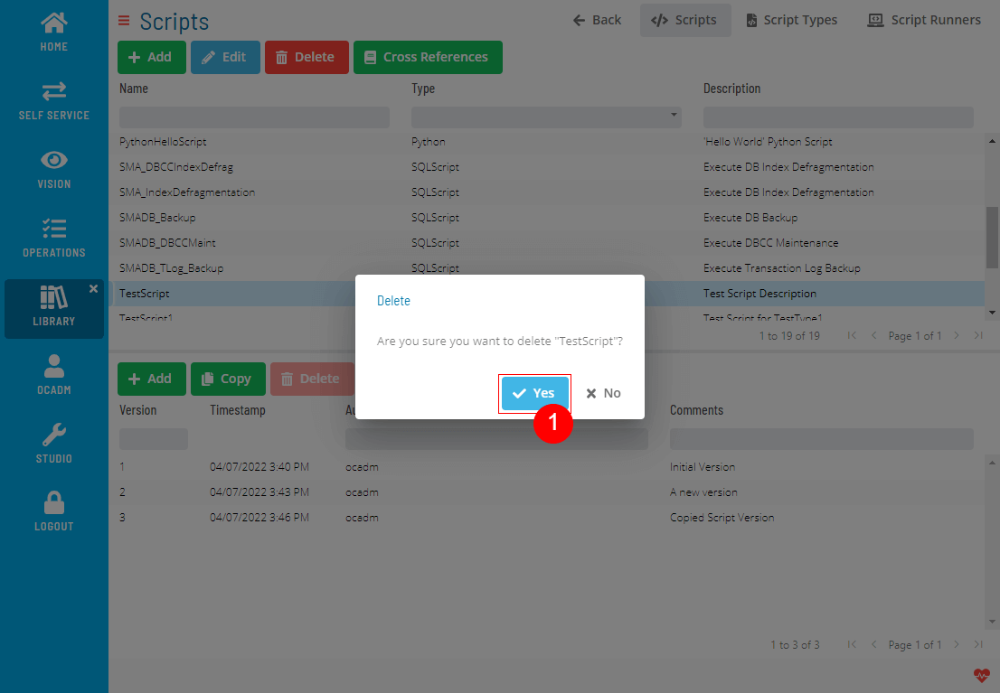
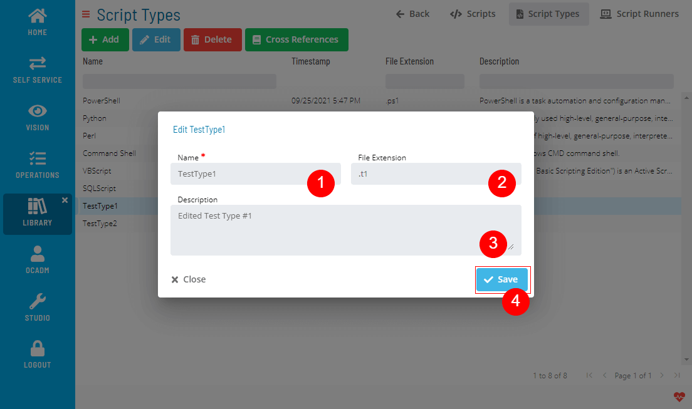
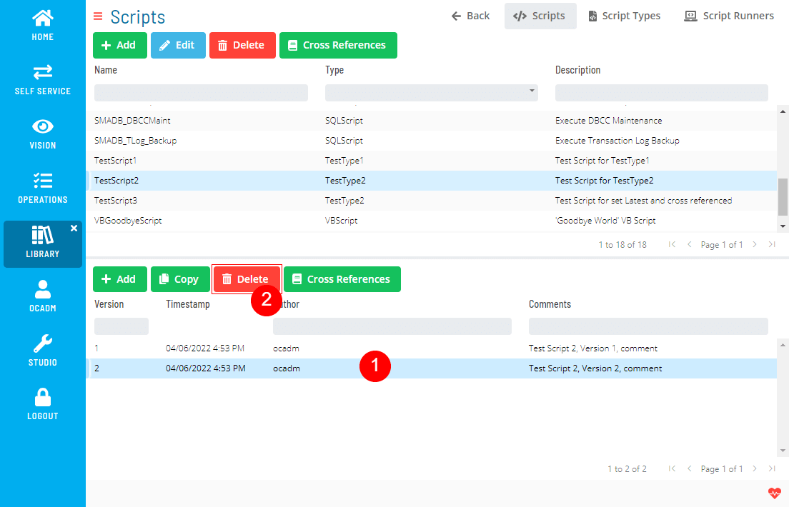
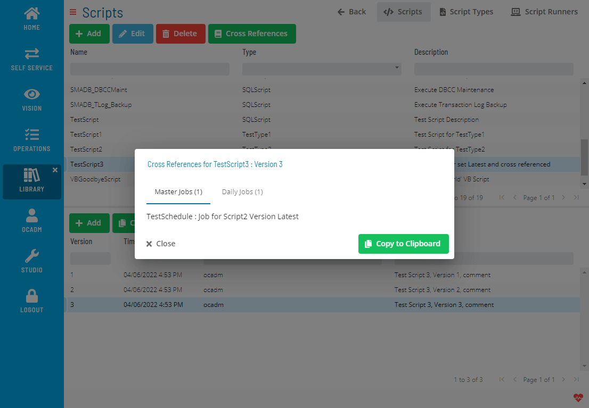

# Embedded Scripts

Embedded Scripts in OpCon provides a way for users to centrally manage
scripts for distribution to Agents. Centralized script storage is
important because it:

- Eliminates script maintenance across multiple machines
- Provides a way to run different versions of a script across
    different machines
- Secures script access and makes it possible to audit script changes
- Provides version control

Embedded Scripts Overview

## Understanding the Process Flow

The process flow for using Embedded Scripts with OpCon begins with
defining scripts in the database. Each script is associated with a
script type. The script type is associated with one or more runners. The
runner is the local program configuration responsible for executing a
script of a specific type on remote machines. At runtime, the runner,
type, and script information are all passed to the Agent for execution.

## Reasons to Use Embedded Scripts

The use of Embedded Scripts reduces administration and increases
security in the automation environment. The following scenarios
demonstrate how Embedded Scripts can provide benefits to a business:

- Maintaining the script inside OpCon means that you no longer have to
    edit the script in different environments. Without this feature, the
    process is more complex because you would have to edit the same
    script on many machines or copy a source script to those machines
    before it could be executed.
- With one account in OpCon, you can maintain all of your automation
    scripts. This means that less people have to have direct logins to
    the Agent machines.
- The built-in auditing in OpCon automatically tracks every change to
    the script whether it is versioned or not. This is especially
    beneficial in an environment without version control software.
- Having the ability to select a script version for a job provides
    these benefits:
  - Assigning a specific version ensures the job always uses that
        approved version of the script.
  - Selecting LATEST instead of a specific version ties a job to the
        highest version of a script. This is useful for test jobs to
        make sure new versions of the script work well before assigning
        the version to a production job.

The **Scripts** module allows you to add, edit, delete, deploy, and check cross-references for scripts.

### Creating Scripts

1. Click the Add button above the list
   
2. Fill out the Script form
   
   :::note
    1. Editor Language is only for formatting the syntax highlighter. It won't have any effect on the Script itself.
    2. Script content will be created as a new Version.
   :::

### Editing Scripts

1. Select a Script and click the Edit button above the list
   
2. Fill out the Script form
   
   :::note
    You cannot edit the Script content with this function. If you want to edit the Script content, you need to create a new Version.
   :::

### Deleting Scripts

1. Select a Script and click the Delete button above the list
   

2. Click Yes to confirm the delete operation
   

Delete operation is not allowed if Script has any cross-references.

### Deploying Scripts

1. Select a Script and click the Deploy button above the list
   
2. Fill out the Script deploy form
   

### Checking Cross References

1. Select a Script and click the Cross References button above the list
   
2. A dialog will show the Cross References
   

## Managing Script Types

The **Script Types** module allows you to add, edit, delete, and check cross-references for script types.

### Creating Script Types

1. Click the Add button above the list
   
2. Fill out the Script Type form
   

### Editing Script Types

1. Select a Script Type and click the Edit button above the list
   
2. Fill out the Script Type form
   

### Deleting Script Types

1. Select a Script Type and click the Delete button above the list
   

2. Click Yes to confirm the delete operation
   

Delete operation is not allowed if Script Type has any cross-references.

### Checking Cross References

1. Select a Script Type and click the Cross References button above the list
   
2. A dialog will show the Cross References
   

## Managing Script Runners

The **Script Runners** module allows you to add, edit, delete, and check cross-references for script runners.

### Creating Script Runners

1. Click the Add button above the list
   
2. Fill out the Script Runner form
   
   :::note
    You can create a new Script Type directly from this form by clicking the Add button next to Type field.
   :::

### Editing Script Runners

1. Select a Script Runner and click the Edit button above the list
   
2. Fill out the Script Runner form
   

### Deleting Script Runners

1. Select a Script Runner and click the Delete button above the list
   

2. Click Yes to confirm the delete operation
   

Delete operation is not allowed if Script Runner has any cross-references.

### Checking Cross References

1. Select a Script Runner and click the Cross References button above the list
   
2. A dialog will show the Cross References
   

## Managing Script Versions

The **Script Versions** module allows you to add, edit, delete, deploy, and check cross-references for script versions.

### Creating Script Versions

1. Select a Script and click the Add button above the Script Version list
   
2. Fill out the Script Version form
   
   :::note
    Editor Language is only for formatting the syntax highlighter. It won't have any effect on the Script itself.
   :::

### Copying Script Versions

You can create a new script version based on an existing version.

1. Select a Script, select a Script Version and click the Copy button above the Script Version list
   
2. Fill out the Script Version form
   

### Deleting Script Versions

1. Select a Script, select a Script Version and click the Delete button above the Script Version list
   

2. Click Yes to confirm the delete operation
   

   :::note
    The delete operation is not allowed;
      - If the script version has cross-references,
      - If the script version is the only version for the script,
   :::

   :::note
    If you are deleting the Latest Version of a deployed Script, the version before the latest will become a new Latest version.
    
   :::

### Deploying Script Versions

1. Select a Script, select a Script Version and click the Deploy button above the Script Version list
2. Repeat the 2nd step in [Deploying a Script](Managing-Scripts#deploying-a-script)

### Checking Cross References

1. Select a Script, select a Script Version and click the Cross References button above the Script Version list
   
2. A dialog will show the Cross References
   
