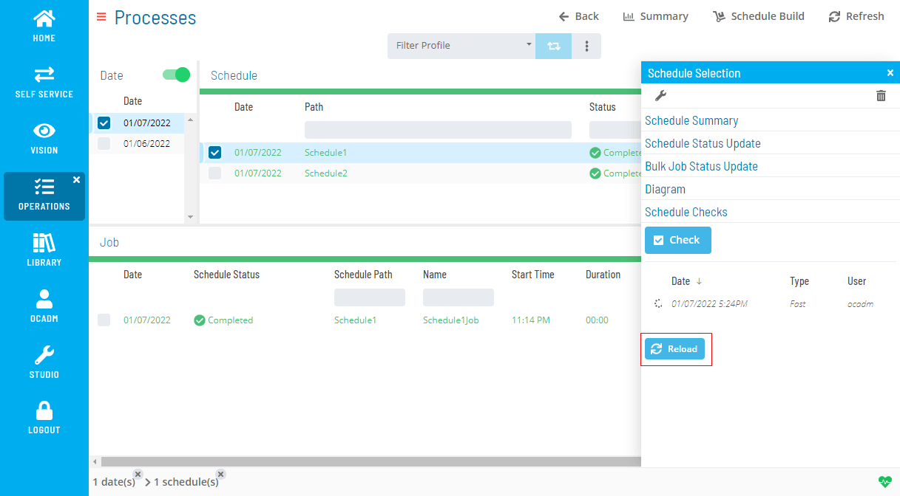

# Checking Daily Schedules

Checking Daily Schedules is a process for validating the job dependencies in the Daily tables. The process can:

- Detect Circular dependencies
- Determine if a Requires dependency cannot be resolved
- Determine if Conflict or After dependencies are not satisfied

SMA Technologies recommends running the schedule check process against every new schedule created or after major revisions have been made to schedules. The check process can run against a date for all schedules or against specific schedules.

- When checking specific schedules, the process does not check the subschedules that may be involved with the specified schedule(s).
- To check a subschedule, define the subschedule as a specific schedule to check.
- Specify a date to check all schedules and their subschedules on that date.

Schedule check processing is managed by the SMASchedMan program on the OpCon server for all applications. For additional information, refer to [SMASchedMan](../server-programs/request-router.md#smasched) in the **Server Programs** online help.

If the Schedule Check process fails and was started through an OpCon Event, the SAM will process the events on the SMA_SKD_CHECK job. For additional information, refer to [SMA_SKD Jobs on the AdHoc Schedule](../objects/schedules.md#adhoc-schedule).

Checking Daily schedules can be managed using the following methods:

- Schedule checks can be automated using:
  - OpCon events (refer to [Schedule-Related Events](../events/types.md#schedule) in the **OpCon Events** online help)
  - The DoBatch utility (refer to [DoBatch](../utilities/Command-line-Utilities/DoBatch.md) in the in the **Utilities** online help)
- Schedule checks can be requested through the graphical interfaces.

# Performing Schedule Checks

The **Operations** module allows you to perform schedule checks using a few simple steps.

To perform schedule check:

1. Right-click on Date or a Schedule record

2. On the right-side panel click the **Schedule Check** section

   

3. Click the **Check** button to open a Schedule Check dialog

   

4. Select a type of check you want to perform and click OK

   
:::note
Please be aware that the Slow (Circular) option activates a very intensive process to check for circular dependencies and depending on the number of jobs, schedules, and schedule dates to be checked, this process may take hours.
:::

5. You will see a list of Schedule Checks inside the Schedule Check section on the right-side panel. You can click **Reload** button to refresh the status of Schedule Checks

   

6. After the Schedule Check is completed, the processing icon will change to **✓**

   

7. Double click the **Schedule Check** to see the Schedule Check details

   

.png "More Info icon")
Related Topics

- [Deleting Schedules and Jobs](Deleting-Schedules-and-Jobs.md)
- [Adding Jobs to Daily Schedules](Adding-Jobs-to-Daily-Schedules.md)