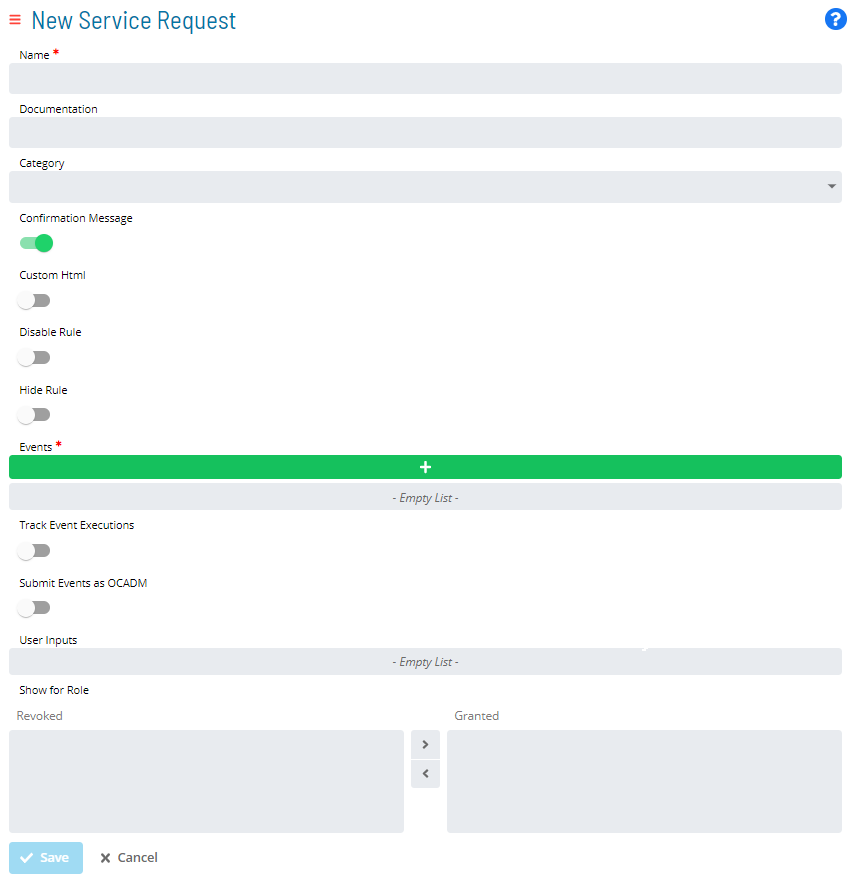

# Working in Admin Mode

Users in the «ocadm» role or a role with the «Maintain Service Request» privilege will see a Self Service page that is similar to the example graphic here.

:::note
For more information about Function Privileges including those pertaining to the Maintaining Service Requests, refer to [Function Privileges](../reference/privileges.md#function-privileges) in the **Concepts** online help.
:::

## Enabling Admin Mode Editing

To enable creating new Service Requests or editing existing Service Requests, click the **Admin Mode** button at the top-right corner:

The **Lock** button will switch to unlocked, and the Self Service page will display with editing privileges, as shown in the example graphic.

The **Admin Mode** button will not be visible to users who are not in the «ocadm» role or a role with the «Maintain Service Request» privilege.

## Creating Categories

You can group the Service Requests into defined categories. For example, a specific department or user group can be defined as a category and allthe Service Requests for which that department or user group must perform can be associated with that category.

To create and associate a category:

1. Click the **+ Create** button, as shown in the example graphic.

2. Enter a unique name for the new category. As a best practice, when naming the category, choose a naming convention that helps refine the Service Request filtering query. For example, you could name the category: *Important/Saturday*. In doing so, "Saturday" could be used as the Category filter.

3. Select a background color for the new category. There are no restrictions on the multi-use of background colors. As a visual indicator, any color swatch reduced in size simply indicates that that particular color is currently in use for an existing category.

4. *(Optional)* Select the Service Request(s) that you wish to assign to the new category. Keep in mind that any Service Request can only be assigned to one category at a time.

5. Click **Save**. The new category should now display.

    

Besides modifying the settings of the category directly, you can also edit a Service Request to change or set the category to which it belongs, as such:

## Creating Service Requests

To create a new service request and its definition:

Click the **Create** button.

The **New Service Request** page will display, as shown in the example graphic.

Enter in the **Name** field the *Service Request Name* to specify the name to display on the Service Request button.

*(Optional)* Enter in the **Documentation** field the *instructions* about what the Service Request does when users click the button. This text appears as a tooltip on the button.

*(Optional)* Select a **Category** with which to associate the Service Request. Refer to the [Creating Categories](Creating-Categories.md) section for instructions on how to create categories.

*(Optional)* Toggle the **Confirmation Message** switch to show the «Documentation» as part of confirmation page when users click the Service Request button. This allows users to cancel the request.

*(Optional)* Toggle the **Custom Html** switch to embed custom HTML code to personalize the Service Request button display. Refer to the [Stylizing Service Request Buttons](Stylizing-Service-Requests.md#_Setting_Up_OpCon) section for more detail.

*(Optional)* Toggle the **Disable Rule** switch to define a rule for disabling the Service Request button. Refer to the [Disabling or Hiding Service Request Buttons](Disabling_Hiding-Service-Requests.md) section for instructions on how to define rules.

*(Optional)* Toggle the **Hide Rule** switch to define a rule for hiding the Service Request button. Refer to the [Disabling or Hiding Service Request Buttons](Disabling_Hiding-Service-Requests.md) section for instructions on how to define rules.

Click the green add button in the **Events** frame to manage the OpCon Events that will be sent to OpCon when users click this Service Request button. Refer to the [Setting up OpCon Events](Setting-up-OpCon-Events.md#_Setting_Up_OpCon) section for more detail.

*(Optional)* Toggle the **Track Event Executions** switch to monitor execution on any job dynamically added as part of the Service Request. If the Service Request is defined with any $JOB:ADD events, this option will track the added jobs so that users can see if they finished successfully.

- If you select this option, the Service Request will be completed only when all added jobs are finished. If a job fails, then the Service Request will fail as well.

*(Optional)* Toggle the **Submit Events as OCADM** switch if you are in the ocadm role to send OpCon Events using «ocadm».

- If you select this option, events will always proceed without any privilege issues.
- If you do not select this option, SAM will check the privileges for the OpCon user who clicks the button before processing the events.

*(Optional)* Use the **User Inputs** field, as needed. If you define variables in the OpCon Events, they are automatically picked up and used as User Inputs. These User Input fields are displayed when users click the button for the Service Request. This provides a way for users to provide values that are going to replace the variables in the OpCon Events. Refer to the [Setting up User Inputs](Setting-up-User-Inputs.md#_Setting_Up_User) section for more detail.

Use the **Show for Role** option to assign the Service Request to one or more OpCon Roles. Only users under the granted Role(s) will be able to see and trigger the Service Request. Refer to the [Setting up Privileges](Setting-up-Privileges.md#_Setting_Up_Privileges) section for more detail.

Click **Save**. The new Service Request should now display.

## Managing Service Requests

Click on one of the buttons at top-right corner of each Service Request to edit, copy, or delete that Service Request.

