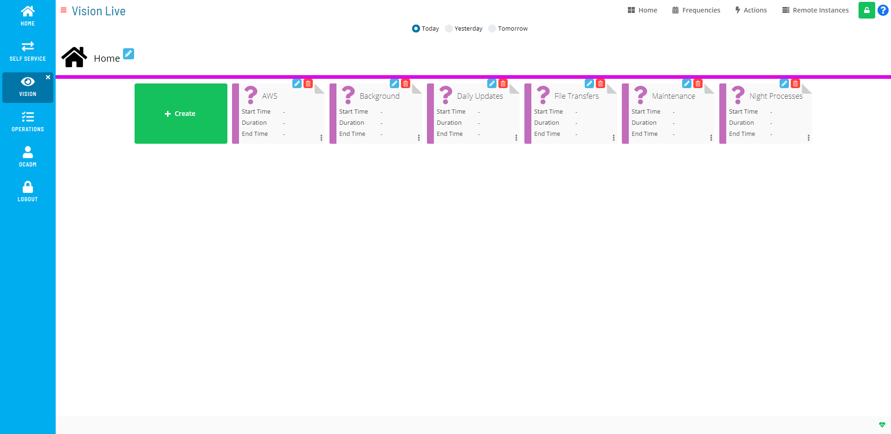

# Working in Admin Mode

Users in the «ocadm» role will see a Vision Live page that is similar to the example graphic here.

Users in the «ocadm» role will have access to the Vision Frequencies, Vision Actions, and Vision Remote Instances pages. Only users in the «ocadm» role will have access to Vision Remote Instances.

Users not in the «ocadm» role must be granted the appropriate Vision privileges to view or perform functions:

- Maintain Vision Actions
- Maintain Vision Frequencies
- Maintain Vision Workspaces
- View Vision Workspaces

# Enabling Admin Mode Editing

To enable creating or editing Vision cards, frequencies, actions, or remote instances, click the **Admin Mode** button at the top-right corner:

The **Lock** button will switch to unlocked, and the Vision Live page will display with editing privileges, as shown in the example graphic.

The **Admin Mode** button will not be visible to users who are not in the «ocadm» role or a role with the «Maintain Vision Workspaces» privilege.

# Managing Vision Settings

Vision Settings allows you to create, edit, and delete cards. It also provides a view of the hierarchy of existing cards.

The following fields apply for setting Vision Settings:

**Parent Card**: This field allows you to select the parent card for the tag. Group and tag cards can be defined at the root (/) level.

**Type**: This field allows you to define the card as a group card or a tag card.

- **Group**: This option allows you to create a parent card, and this
    card can be defined at the root level or as the child of an existing
    group.
- **Tag**: This option allows you to create a card for a tag (pattern)
    defined in the Enterprise Manager, and this card can be defined at
    the root level or as a child card of an existing group.

**Name**: This field allows you to define the card name.

**Instance**: This option allows you to select a remote instance the
card will monitor. For more information on Vision remote instances,
refer to [Managing Vision Remote Instances](Managing-Vision-Remote-Instances.md) in
the **Solution Manager** online help.

**Pattern**: This option allows you to select which tag defined in the
Enterprise Manager the card will monitor.

**Job Offset**: This field allows you to specify an offset on the
schedule date on which Vision has to look for jobs, using the following
options:

- **-5 Frequency Days**: This option specifies the frequency offset
    will apply five days before the current day.
- **-4**Frequency Days****: This option specifies the frequency
    offset will apply four days before the current day.
- **-3**Frequency Days****: This option specifies the frequency
    offset will apply three days before the current day.
- **-2**Frequency Days****: This option specifies the frequency
    offset will apply two days before the current day.
- **Previous Frequency Day**: This option specifies the frequency
    offset will apply one day before the current day.
- **Current Frequency Day**: This option specifies the frequency
    offset will apply the current day.
- **Next Frequency Day**: This option specifies the frequency offset
    will apply one day after the current day.
- **+2**Frequency Days****: This option specifies the frequency
    offset will apply two days after the current day.
- **+3**Frequency Days****: This option specifies the frequency
    offset will apply three days after the current day.
- **+4**Frequency Days****: This option specifies the frequency
    offset will apply four days after the current day.
- **+5**Frequency Days****: This option specifies the frequency
    offset will apply five days after the current day.

**Roles**: This frame allows you to assign roles to the tag.

- **All granted**: This switch allows you to select whether all roles
    are granted.
- **Revoked**: This option allows you to define which roles are
    revoked privileges.
- **Granted**: This option allows you to define which roles are
    granted privileges.

**Thresholds**: This frame allows you to define the numerical range for the QoS or SLA success rate.

- **QoS**: Defines a measure of the number of times jobs have
    completed successfully.
  - **Critical**: Defines the value to indicate the critical level.
  - **Tolerable**: Defines the value to indicate the tolerable
        level.
- **SLA**: Defines a measure of the number of times jobs have
    completed within the defined SLAs.
  - **Critical**: Defines the value to indicate the critical level.
  - **Tolerable**: Defines the value to indicate the tolerable
        level.

**Frequency(ies)**: This field allows you to select an existing
frequency or define a new frequency. For more information on
frequencies, refer to [Managing Vision Frequencies](Managing-Vision-Frequencies.md) in the
**Solution Manager** online help.

:::note
This field is optional for Group cards.
:::

.png "More Info icon")
Related Topics

- [Creating Cards](Creating-Cards.md)
- [Editing Cards](Editing-Cards.md)
- [Deleting Cards](Deleting-Cards.md)

# Managing Vision Frequencies

Vision Frequencies define which days cards are displayed for monitoring in the Vision module. At least one frequency must be defined for tag cards while frequency definition is optional for group cards as they inherit them from children cards. Multiple frequencies can be associated with a card. The first matching frequency in the priority order will be used to apply SLAs and Triggers in case multiple match a particular day.

The following fields apply for setting Vision Frequencies:

**Frequency**: This field allows you to select an existing frequency or define a new frequency. If creating a new frequency, the Vision Frequency page will display where you can define the new frequency.

- **Name**: This field allows you to define the frequency name.
- **Description**: *(Optional)* This field allows you to enter a description for the frequency.
- **Date Policy**: This field allows you to select the whether to include or exclude dates, using the following options:
  - **Include Selected Dates**: This option allows you to specify which dates the Vision card will be displayed. These dates will show up with a green highlight on the calendar(s).
    - Use the  button to add dates to the calendar(s).
    - Use the  button to remove dates from the calendar(s).
  - **Exclude Selected Dates**: This option allows you to specify which dates the Vision card will not be displayed. These dates will show up with a red highlight on the calendar(s).
    - Use the  button to add dates to the calendar(s).
    - Use the  button to remove dates from the calendar(s).

**SLA**: This frame allows you to define the SLA (service level
agreement) for a frequency. The SLA specifies which days to monitor the
expected start time and/or expected end time. When a card has an SLA
requirement defined, a triangular icon may appear next to the Start Time
or End Time on a card to tell the user that the SLA is broken or is
about to break based on current estimations. For more information on the
SLA icon, refer to [Vision Card Colors](Viewing-Cards-in-Vision-Live.md#Vision)
in the **Solution Manager** online help.

- **Requirement**: This field allows you to select the time
    expectation requirement, using the following options:
  - **Expected Start Time**: This option specifies the time defined
        for the SLA is the expected start time.
  - **Expected End Time**: This option specifies the time defined
        for the SLA is the expected end time.

**Time**: This field allows you to set the time the SLA will monitor.

**Day**: This field allows you to select the day offset the SLA will
monitor, using the following options:

**-5**: This option specifies the SLA time defined to be verified will
apply five days before the current day.

**-4**: This option specifies the SLA time defined to be verified will
apply four days before the current day.

**-3**: This option specifies the SLA time defined to be verified will
apply three days before the current day.

**-2**: This option specifies the SLA time defined to be verified will
apply two days before the current day.

**Previous**: This option specifies the SLA time defined to be verified
will apply one day before the current day.

**Current**: This option specifies the SLA time defined to be verified
will apply the current day.

**Next**: This option specifies the SLA time defined to be verified will
apply one day after the current day.

**+2**: This option specifies the SLA time defined to be verified will
apply two days after the current day.

**+3**: This option specifies the SLA time defined to be verified will
apply three days after the current day.

**+4**: This option specifies the SLA time defined to be verified will
apply four days after the current day.

**+5**: This option specifies the SLA time defined to be verified will
apply five days after the current day.

While the frequency defines what day a card is visible, the SLA Day
determines which day should be monitored for the SLA to run.

:::tip Example
You want to monitor the instance of a card that is set to start at 8:00 a.m. one day and finish at 1:00 a.m. the next day.

You will need to define two SLAs:

- One SLA with the following settings:
  - **Requirement**: Expected Start Time
  - **Time**: 08:00
  - **Day**: Current
- Another SLA with the following settings:
  - **Requirement**: Expected End Time
  - **Time**: 01:00
  - **Day**: Next
:::

**Trigger(s)**: This frame allows you to define settings for triggering
the action(s) to be run.

- **Status**: This field defines the state of the card(s) required to
    cause the triggering of the action(s), using the following options:
  - **Unknown**: This option triggers the action(s) when the card
        status is unknown.
  - **Calculating**: This option triggers the action(s) when the
        card status is calculating.
  - **Failed**: This option triggers running the action(s) when the
        completed card status is failed.
  - **Partial Failed**: This option triggers running the action(s)
        when the card is running but at least one child card is failed.
  - **Finished OK**: This option triggers running the action(s) when
        the completed card status is Finished OK.
  - **Started Late (SLA)**: This option triggers running the
        action(s) when the card has started late based on the SLA Start
        Time Requirement defined for the frequency.
  - **Finished Late (SLA)**: This option triggers running the
        action(s) when the card has finished late based on the SLA End
        Time Requirement defined for the frequency.
  - **Estimated Late to Start (SLA)**: This option triggers running
        the action(s) when Vision estimates that the card will be late
        to start based on the SLA Start Time Requirement defined for the
        frequency. Estimation is based on the exact same mechanism as
        the Estimated Start Time calculation of jobs.
  - **Estimated Late to Finish (SLA)**: This option triggers running
        the action(s) when Vision estimates that the card will be late
        to finish based on the SLA End Time Requirement defined for the
        frequency. Estimation is based on the exact same mechanism as
        the Estimated Start Time and Estimated Run Time calculation of
        jobs.
- **Runnable(s)**: This frame allows you to define the action to
    perform when the trigger is launched.
  - **Action**: This field allow you to select an existing action or
        define a new action for the trigger. For more information on
        actions, refer to [Managing Vision         Actions](Managing-Vision-Actions.md) in the
        **Solution Manager** online help.
  - **Repeat After**: *(Optional)* This field allows
        you to select the number of minutes between running the action
        until the problem is resolved, using the following options:
    - **1 min**
    - **2 min**
    - **3 min**
    - **4 min**
    - **5 min**
    - **10 min**
    - **15 min**
    - **20 min**
    - **30 min**
    - **45 min**
    - **60 min**
  - **Instance**: This field allows you to select the remote
        instance to be used when triggering the action. The action will
        be submitted using the Vision Action User. For more information
        on Vision Action User, refer to [Managing Vision Remote         Instances](Managing-Vision-Remote-Instances.md)
         in the **Solution Manager** online help.

## Using the Vision Frequencies Admin Page

The **Vision Frequencies** page allows you to view all existing
frequencies as well as provide a central location for adding, editing,
and deleting frequencies.

Vision Frequencies Admin Page

The following procedures cover how to add, edit, and delete frequencies
from the Vision Frequencies page. For steps on how to add, edit and
delete frequencies at the card level, refer to the [Related Topics](#Related_Topics) at the bottom of this page.

**To add a Vision Frequency:**

1. Click the **Frequencies** button on the **Vision Live** page or the
    **Vision Settings** page.
2. Click the **Add** button.
3. Enter a *Name* for the frequency.
4. *(Optional)* Enter a *Description* for the
    frequency.
5. Select a *dates option* from the **Date Policy** drop-down.
6. Click the **+** button or the **−** button to define which dates to
    include or exclude. You can also select individual dates by clicking
    directly on the calendars.
7. Click the **Save** button.

**To edit a Vision Frequency:**

1. Click the **Frequencies** button on the **Vision Live** page or the
    **Vision Settings** page.
2. Select the existing **Frequency** you wish to edit.
3. Click the **Edit** button.
4. Modify any of the existing information or settings.
5. Click the **Save** button.

**To delete a Vision Frequency:**

1. Click the **Frequencies** button.
2. Select the existing **Frequency** you wish to delete.
3. Click the **Delete** button.
4. Click the **Yes** button.

.png "More Info icon")

Related Topics

- [Adding Vision     Frequencies](Adding-Vision-Frequencies.md)
- [Editing Vision     Frequencies](Editing-Vision-Frequencies.md)
- [Deleting Vision     Frequencies](Deleting-Vision-Frequencies.md)
:::

# Managing Vision Actions

Vision Actions are OpCon Events defined for a Vision Frequency Trigger.

The following fields apply for setting Vision Actions:

- **Name**: This field allows you to define the event name.
- **Events:** This field displays a list of Events defined for the
    Action and allows you to add, edit, or delete an Action. Clicking
    the Add button will open the Create new Event window containing the
    Event Template drop-down.
  - **Event Template**: This drop-down allows you to select an event
        template. Once you choose a template, the screen dynamically
        changes to provide UI assistance for filling out the event
        details.

## Using the Vision Action Admin Page

The **Vision Actions** page is the central location where you can view
all existing actions as well as add, edit, and delete actions.

Vision Actions Admin Page

:::note
A Vision license is required to define Actions. For more information, refer to [License File Request and Storing](Working-with-Vision.md#License) in the **Solution Manager** online help.
:::

:::note
A user must be in the «ocadm» role or be granted the «Maintain Vision Actions» privilege to define Actions. For more information about Function Privileges including those pertaining to Vision, refer to [Function Privileges](../../../administration/privileges.md#function-privileges) in the **Concepts** online help.
:::

.png "More Info icon")
Related Topics

- [Adding Vision Actions](Adding-Vision-Actions.md)
- [Editing Vision Actions](Editing-Vision-Actions.md)
- [Deleting Vision Actions](Deleting-Vision-Actions.md)

# Managing Vision Remote Instances

Vision Remote Instances provide the ability to define instances of OpCon
to be monitored that run and are accessed on a remote server. For more
information on remote instances, refer to [Remote Instances](../../../objects/remote-instances.md) in the
**Concepts** online help.

The following fields apply for setting Vision Remote Instances:

- **Name**: This field allows you to define the remote instance name.
- **Badge(Auto Gen.)**: This auto-generated field displays a
    two-character description based on the Name field. The badge icon
    will appear on cards defined to a remote instance.
- **Description**: *(Optional)* This field allows you
    to enter descriptions, explanations, and notes that can be updated
    for the defined remote instance.
- **Vision Instance Connection**: These fields define the API and
    Solution Manager credentials for the remote OpCon instance to be
    monitored.
  - **Api URL**: This field defines the API URL for the remote
        instance.
  - **Api User**: This field defines the API username for connecting
        to the database.
  - **Api Password**: This field defines the corresponding API
        password for the API user.
  - **Solution Manager URL**: This field defines the Solution
        Manager URL for the remote instance.
  - **Vision Action User**: This field defines the user for
        submitting Vision actions.
- **Complex Expression Connection**: These fields define the
    connection information that will enable the remote instance to be
    used in OpCon properties since OpCon expressions, by default, point
    to local properties.
  - **SQL Server**: This field defines the name of the server that
        the database resides.
  - **Database**: This field defines the name of the database to
        which to connect.
  - **Windows Auth**: This button specifies to use Windows
        Authentication as the authentication method to connect to the
        database.
    - If you want to use Windows Authentication, then you must
            make sure that the SMA Service Manager runs as a user that
            has privileges to the OpCon database. For more information,
            refer to [Add the OpConxps Active Directory Group to the SQL             Server](../../../installation/configuration.md#Add_the_OpConxps_Active_Directory_Group_to_the_SQL_Server)
             in the **OpCon Installation** online help.
  - **User**: This field defines the authorized SQL Server username
        for connecting to the database.
  - **Password**: This field defines the corresponding password for
        the authorized SQL Server user.
  - **Mirroring**: This button allows you to select whether
        mirroring, which indicates that the instance uses mirroring so
        that the proper connection string is used, is enabled or
        disabled.
  - **Transparent Network Ip Resolution**: This drop-down specifies
        how to resolve the IP address in cases where there are issues.
        Available options are:
    - **Disabled**: This option specifies that there should not be
            transparent Network IP resolution.
    - **Enabled**: This option specifies that there should be
            transparent Network IP resolution.
    - **Auto**: This option specifies that the Network IP
            resolution will be automatically detected. This is the
            default setting.

## Using the Vision Remote Instances Admin Page

The **Vision Remote Instances** page is the central location where you can view all existing remote instances as well as add, edit, and delete remote instances.

:::note
A user must be in the «ocadm» role to define remote instances. For more information about Function Privileges including those pertaining to Vision, refer to [Function Privileges](../administration/privileges.md#function-privileges) in the **Concepts** online help.
:::

.png "More Info icon")
Related Topics

- [Adding Vision Remote Instances](Adding-Vision-Remote-Instances.md)
- [Editing Vision Remote Instances](Editing-Vision-Remote-Instances.md)
- [Deleting Vision Remote Instances](Deleting-Vision-Remote-Instances.md)
